# SecureVault — Bugs & Pending Tasks

Track known issues and work not yet done. Update **Status** and **Progress** as items are fixed.

**Last updated:** 2026-06-14 (BUG-015 Create vault button + BUG-016 biometric switch regressions fixed)  
**Open:** 4 · **In progress:** 0 · **Done:** 57

> **Status (2026-06-14, Run 5):** No bug/task items changed — the 4 open items remain backend-gated
> (out of scope for offline-first v1). This run verified the ROADMAP Phase 2 Dashboard and Vault
> UI tasks (10 of them) against the shipped, data-wired screens and checked them off in
> `ROADMAP.md` (Phase 2 → 61%, overall → 56%). See the ROADMAP Progress log for details.
>
> **Status (2026-06-13, Run 4):** Credentials are encrypted at rest with AES-256-GCM
> (PBKDF2-SHA256, 120k iterations via `@noble/ciphers` / `@noble/hashes`). Legacy plaintext
> vaults migrate on first unlock. The Generator tab is live. Categories are centralized in
> `constants/categories.ts`. Biometric unlock uses SecureStore for the derived key.

---

## Progress tracker

| Status | Count |
|--------|-------|
| Open | 4 |
| In progress | 0 |
| Blocked | 0 |
| Done | 57 |
| **Total** | **61** |

```
[███████████████████░] 93% resolved
```

| Priority | Open |
|----------|------|
| P0 — Critical | 0 |
| P1 — High | 0 |
| P2 — Medium | 0 |
| P3 — Low / Optional | 4 |

The 4 remaining open items (TASK-017 backend/cloud sync, TASK-018 sharing, TASK-019 browser
extension, TASK-022 Google login) all depend on a backend that is **out of scope** for the
offline-first v1 (Open decision D1 = *Offline only*).

---

## Recommended Fix Order

✅ done: TASK-009 → … → TASK-036 → TASK-037 → TASK-038 → TASK-039 → TASK-040 → TASK-041 → TASK-042 → TASK-043 → TASK-044 → TASK-045 → TASK-046
⏳ remaining (backend-gated): TASK-017 → TASK-022 → TASK-018 → TASK-019

---

## How to use this file

1. Pick items **P0 first** (they block core flows).
2. Set status to `in_progress` when you start work.
3. When fixed, set status to `done` and add a row under **Resolution log**.
4. Link PRs or commits in the resolution notes.

**Status values:** `open` · `in_progress` · `blocked` · `done` · `wont_fix`

---

## Active Bug Index

_No open bugs._

## Completed Bug Index

| ID | Title | Priority | Status |
|----|-------|----------|--------|
| [BUG-016](#bug-016) | Biometric unlock switch not working (setup + settings) | P1 | done |
| [BUG-015](#bug-015) | Create Vault button does not work on setup screen | P0 | done |
| [BUG-012](#bug-012) | Biometric enable switch cannot be toggled | P1 | done |
| [BUG-007](#bug-007) | Home menu icon locks app with master password | P1 | done |
| [BUG-002](#bug-002) | No master password after onboarding | P0 | done |
| [BUG-003](#bug-003) | No close (X) on Add Credential | P1 | done |
| [BUG-004](#bug-004) | Website suggestion buttons don’t update URL | P2 | done |
| [BUG-005](#bug-005) | Save credential fails | P0 | done |
| [BUG-006](#bug-006) | Create vault fails | P0 | done |
| [BUG-008](#bug-008) | Vault header icon is on wrong side | P2 | done |
| [BUG-009](#bug-009) | Security alerts are not clickable | P2 | done |
| [BUG-010](#bug-010) | Multiple Edit Credential dialogs open | P1 | done |
| [BUG-011](#bug-011) | Health score does not update after add/delete | P1 | done |
| [BUG-013](#bug-013) | Onboarding back swipe exposes SecureVault before setup | P1 | done |
| [BUG-014](#bug-014) | White screen flash when switching tabs | P2 | done |

## Potential Bug Backlog

Track suspected issues before they are fully reproduced and converted into formal `BUG-xxx` items.

| ID | Potential bug | Risk | Trigger area | Status | Related item |
|----|---------------|------|--------------|--------|--------------|
| POT-001 | Auto-lock timer may race with active save and force unlock flow unexpectedly | High | App lifecycle / vault lock | potential_open | TASK-027 |
| POT-002 | CSV export may create duplicate entries when imported back without stronger identity checks | Medium | Vault import/export | mitigated | TASK-012 |
| POT-003 | Search + rapid tap on grouped credentials may open stale account after filter updates | High | Home/Vault grouped list | mitigated | BUG-010 |
| POT-004 | Password health counts may drift after bulk import and not refresh badges instantly | Medium | Health metrics | mitigated | BUG-011 |
| POT-005 | Theme override from settings may not apply consistently after cold app restart | Medium | App preferences/theme | potential_open | TASK-026 |
| POT-006 | Copy password action in nested dialogs may copy wrong account when dialog list rerenders | High | Credential picker dialog | potential_open | TASK-003 |
| POT-007 | Generated password passed to new entry may be lost if route params are trimmed by navigation replace | Medium | Generator to entry flow | potential_open | TASK-024 |
| POT-008 | Site logo cache fallback may show wrong brand icon for uncommon domains | Low | Site branding/cache | mitigated | TASK-006 |

## Pending Tasks Index

| ID | Title | Priority | Status |
|----|-------|----------|--------|
| [TASK-017](#task-017) | Backend and cloud sync | P3 | open |
| [TASK-018](#task-018) | Credential sharing | P3 | open |
| [TASK-019](#task-019) | Browser extension | P3 | open |
| [TASK-022](#task-022) | Google login for account creation | P3 | open |

<details closed>
<summary>Completed Tasks</summary>

| ID | Title | Priority | Status |
|----|-------|----------|--------|
| [TASK-037](#task-037) | PBKDF2-SHA256 key derivation | P0 | done |
| [TASK-038](#task-038) | AES-GCM encrypt vault at rest | P0 | done |
| [TASK-039](#task-039) | Encrypted blob + salt storage | P0 | done |
| [TASK-040](#task-040) | In-memory decrypted cache while unlocked | P1 | done |
| [TASK-041](#task-041) | Categories enum/map | P2 | done |
| [TASK-042](#task-042) | Wire category chips to filter state | P2 | done |
| [TASK-043](#task-043) | Generator screen + bottom nav | P1 | done |
| [TASK-044](#task-044) | Wire password generator service to screen | P1 | done |
| [TASK-045](#task-045) | Save generated password to vault entry | P1 | done |
| [TASK-046](#task-046) | Vault error handling (wrong password, corrupt, storage full) | P1 | done |
| [TASK-001](#task-001) | Onboarding same image/content on all 3 steps | P1 | done |
| [TASK-002](#task-002) | Password inputs missing show/hide (eye) | P1 | done |
| [TASK-003](#task-003) | Support multiple credentials for the same account | P1 | done |
| [TASK-008](#task-008) | Vault metadata and last unlocked timestamp | P1 | done |
| [TASK-013](#task-013) | UX feedback polish | P1 | done |
| [TASK-021](#task-021) | Favorite and archive accounts on SecureVault page | P2 | done |
| [TASK-023](#task-023) | Modify edit credential page | P2 | done |
| [TASK-024](#task-024) | Copy passwords and show usernames on Home/Vault | P2 | done |
| [TASK-025](#task-025) | Delete all local data and master password from storage | P1 | done |
| [TASK-026](#task-026) | Settings page for vault and app controls | P1 | done |
| [TASK-027](#task-027) | App lock controls and configurable auto-lock | P1 | done |
| [TASK-029](#task-029) | Advanced vault search improvements | P1 | done |
| [TASK-030](#task-030) | Credential password history | P2 | done |
| [TASK-004](#task-004) | Reference UI for Password Health | P2 | done |
| [TASK-005](#task-005) | Foundation docs and project process | P2 | done |
| [TASK-009](#task-009) | Unit tests for generator and crypto | P1 | done |
| [TASK-010](#task-010) | Password age warnings and notifications | P2 | done |
| [TASK-012](#task-012) | Import/export and encrypted backups | P2 | done |
| [TASK-014](#task-014) | Accessibility and dynamic type pass | P1 | done |
| [TASK-015](#task-015) | Security hardening pass | P1 | done |
| [TASK-016](#task-016) | Release readiness and store assets | P1 | done |
| [TASK-028](#task-028) | AI-assisted vault folders and tags | P2 | done |
| [TASK-031](#task-031) | Stronger duplicate password warnings | P2 | done |
| [TASK-006](#task-006) | Cache site logos offline | P3 | done |
| [TASK-007](#task-007) | Custom logo upload per credential | P3 | done |
| [TASK-011](#task-011) | Breach monitoring via HIBP | P3 | done |
| [TASK-020](#task-020) | Optional fingerprint unlock for vault access | P1 | done |
| [TASK-032](#task-032) | Inline weak/reused/old badges on credential rows | P2 | done |
| [TASK-033](#task-033) | Auto-lock on background / inactivity | P1 | done |
| [TASK-034](#task-034) | Master password change flow | P1 | done |
| [TASK-035](#task-035) | Screenshot / screen-capture protection | P2 | done |
| [TASK-036](#task-036) | Loading and empty-state polish | P2 | done |

</details>

---

<a id="task-001"></a>

## TASK-001: Onboarding same content on all 3 steps

| Field | Value |
|-------|--------|
| **ID** | TASK-001 |
| **Type** | Pending task |
| **Priority** | P1 — High |
| **Status** | done |
| **Area** | Onboarding / UX |
| **Reported** | 2026-05-16 |

### Description

The starting (onboarding) flow shows the **same hero image and copy** on every step. Only the step dots and button label change (`Continue` → `Get started`). Users expect **different display info** per step (e.g. security, vault, sync).

### Steps to reproduce

1. Fresh install or reset onboarding.
2. Open app → onboarding.
3. Tap **Continue** twice.
4. Observe: same Unsplash image, title *“Enhance safety with Total security”*, and subtitle each time.

### Expected

- Step 1–3 each show **unique** illustration and/or title + body text aligned with the feature being introduced.

### Actual

- One image (`ONBOARDING_IMAGE`) and one text block for all steps; `step` state only updates dot indicators.

### Likely cause

- `app/(auth)/onboarding.tsx` — no per-step content map; single `Image` + static strings.

### Related files

- `app/(auth)/onboarding.tsx`

### Suggested fix

- Add `ONBOARDING_STEPS: { title, subtitle, image? }[]` and render by `step` index.

### Resolution

1. `OnboardingScreen` uses a `SLIDES` array with three distinct icons, badges, titles, and descriptions (`src/components/screens/onboarding.tsx`).

---

<a id="bug-002"></a>

## BUG-002: No master password after onboarding

| Field | Value |
|-------|--------|
| **ID** | BUG-002 |
| **Type** | Bug |
| **Priority** | P0 — Critical |
| **Status** | done |
| **Area** | Auth / Vault setup |
| **Reported** | 2026-05-16 |
| **Blocks** | BUG-005, BUG-006 (downstream) |

### Description

After completing onboarding, the app **does not show** the **Create master password** screen. User lands in the main app without setting up or unlocking the vault.

### Steps to reproduce

1. Complete onboarding (3 steps → **Get started**).
2. Observe navigation goes straight to tabs/home.
3. Master password setup screen never appears.

### Expected

1. Onboarding complete → redirect to `/(auth)/setup-master-password` (or `index` routes there).
2. User creates master password, then enters the app.

### Actual

- Onboarding calls `router.replace('/(tabs)')` and skips vault setup.

### Likely cause

```31:31:app/(auth)/onboarding.tsx
    router.replace('/(tabs)');
```

Should use `router.replace('/')` so `app/index.tsx` can route to `setup-master-password` when `!isInitialized`, **or** navigate directly to `/(auth)/setup-master-password`.

`app/index.tsx` already has correct logic when hit:

```25:27:app/index.tsx
  if (!isInitialized) {
    return <Redirect href="/(auth)/setup-master-password" />;
  }
```

### Related files

- `app/(auth)/onboarding.tsx`
- `app/index.tsx`
- `app/(auth)/setup-master-password.tsx`

### Suggested fix

- Replace `router.replace('/(tabs)')` with `router.replace('/')` or `router.replace('/(auth)/setup-master-password')`.

---

<a id="bug-003"></a>

## BUG-003: No close button on Add Credential screen

| Field | Value |
|-------|--------|
| **ID** | BUG-003 |
| **Type** | Bug |
| **Priority** | P1 — High |
| **Status** | done |
| **Area** | Entry / UX |
| **Reported** | 2026-05-16 |

### Description

The **Add Credential** modal/screen has no **close (X)** or cancel control. User must use system back gesture only.

### Steps to reproduce

1. Unlock vault → Vault → **+** or **Add credential**.
2. Modal opens (`entry/new`).
3. Look for close/dismiss control in header.

### Expected

- Header with **X** (or “Cancel”) that calls `router.back()` without saving.

### Actual

- No header close button; only scroll content and **Save credential** at bottom.

### Likely cause

- `app/entry/[id].tsx` — modal presentation in `app/_layout.tsx` but no header UI component.

### Related files

- `app/entry/[id].tsx`
- `app/_layout.tsx` (`entry/[id]` modal options)

### Suggested fix

- Add top row: `X` button + title; optional `headerShown: true` with custom header on stack screen.

---

<a id="bug-004"></a>

## BUG-004: Website suggestion buttons don’t update URL

| Field | Value |
|-------|--------|
| **ID** | BUG-004 |
| **Type** | Bug |
| **Priority** | P2 — Medium |
| **Status** | done |
| **Area** | Add credential / UX |
| **Reported** | 2026-05-16 |

### Description

Tapping website suggestion buttons/chips (**Google**, **Instagram**, etc.) sets the **Website** name but often **does not update** the **Website URL** field after clicking, especially when URL already has text.

### Steps to reproduce

1. Open Add credential.
2. Enter any text in **Website URL** (or complete onboarding flow that pre-fills URL).
3. Tap **Google** (or another website suggestion button/chip).
4. **Website** updates; **Website URL** may stay unchanged.

### Expected

- Selecting a chip updates **both** website name and the correct URL (e.g. `https://google.com`).

### Actual

- URL only set when field is empty:

```131:135:app/entry/[id].tsx
  function applyQuickSite(site: string) {
    setWebsite(site);
    if (!url.trim()) {
      setUrl(`https://${site.toLowerCase().replace(/\s+/g, '')}.com`);
```

### Likely cause

- Conditional `if (!url.trim())` prevents overwriting existing URL.

### Related files

- `app/entry/[id].tsx`
- `services/site-branding.ts` (`KNOWN_DOMAINS` for accurate URLs)

### Suggested fix

- Always set URL from chip using `resolveSiteDomain` / known-domain map; or ask confirm before overwrite.

---

<a id="bug-005"></a>

## BUG-005: Save credential fails with error

| Field | Value |
|-------|--------|
| **ID** | BUG-005 |
| **Type** | Bug |
| **Priority** | P0 — Critical |
| **Status** | done |
| **Area** | Vault / CRUD |
| **Reported** | 2026-05-16 |
| **Related** | BUG-002, BUG-006 |

### Description

On **Add credential**, tapping **Save credential** shows alert: **“Could not save credential.”**

### Steps to reproduce

1. Open app (especially if onboarding skipped master password — see BUG-002).
2. Add credential → fill Website, Username, Password.
3. Tap **Save credential**.

### Expected

- Credential saved, modal closes, appears in Vault list.

### Actual

- `Alert.alert('Error', 'Could not save credential.')` from catch block in `handleSave`.

### Likely cause

- **Vault locked** — `addCredential` → `persist` throws `Vault is locked` if `encryptionKeyRef` is null (no successful setup/unlock).
- Chain from **BUG-002** / **BUG-006**: user never has unlocked vault.
- Other: validation, encrypt/persist failure (less common if vault unlocked).

### Related files

- `app/entry/[id].tsx` (`handleSave` catch)
- `contexts/vault-context.tsx` (`addCredential`, `persist`)
- `services/vault-storage.ts`

### Suggested fix

1. Fix **BUG-002** and **BUG-006** first.
2. Surface real error message in alert (e.g. `error.message`) for debugging.
3. Guard: disable Save or redirect to unlock if `!isUnlocked`.

---

<a id="bug-006"></a>

## BUG-006: Create vault / master password fails

| Field | Value |
|-------|--------|
| **ID** | BUG-006 |
| **Type** | Bug |
| **Priority** | P0 — Critical |
| **Status** | done |
| **Area** | Vault setup / Crypto |
| **Reported** | 2026-05-16 |
| **Related** | BUG-002, BUG-005 |

### Description

On **Create master password**, after entering password + confirm and tapping **Create vault**, setup **fails** (generic or secure-storage error). User cannot initialize vault.

### Steps to reproduce

1. Reach `/(auth)/setup-master-password` (may require manual navigation if BUG-002 unfixed).
2. Enter master password (≥ 8 chars) + confirm.
3. Tap **Create vault**.
4. Observe error message or no navigation to app.

### Expected

- Vault created, user navigated to main app, vault unlocked.

### Actual

- Error shown (e.g. “Could not create vault” / secure storage message) or hang then failure.

### Likely cause (investigate)

- `expo-secure-store` / native module mismatch (mitigated in recent fix — verify Expo Go after `npx expo install expo-secure-store`).
- PBKDF2 blocking UI / timeout on slow devices.
- Partial vault state from failed prior attempt.
- Device secure storage permissions.

### Related files

- `app/(auth)/setup-master-password.tsx`
- `services/vault-storage.ts`
- `services/crypto/vault-crypto.ts`
- `contexts/vault-context.tsx` (`setup`)

### Suggested fix

- Confirm SDK 54-compatible `expo-secure-store` installed; clear app data and retest.
- Log and display `error.message` from `setup()`.
- Add dev-only “Reset vault” if corrupted state.

---

<a id="bug-007"></a>

## BUG-007: Home menu icon locks app with master password

| Field | Value |
|-------|--------|
| **ID** | BUG-007 |
| **Type** | Bug |
| **Priority** | P1 — High |
| **Status** | done |
| **Area** | Home / Navigation / Auth |
| **Reported** | 2026-05-17 |

### Description

On the Home page, tapping the menu icon currently locks the app and sends the user back to master password unlock. The icon/action should be changed so users do not accidentally lock the app when trying to open the menu.

### Steps to reproduce

1. Unlock SecureVault.
2. Open the Home page.
3. Tap the menu icon.
4. App locks and requires the master password again.

### Expected

- The Home menu icon opens the intended menu/profile/actions UI, or uses a different icon if the action is lock.
- Locking the app should be explicit and clearly labeled.

### Actual

- Tapping the menu icon locks the app unexpectedly.

### Related files

- `app/(tabs)/index.tsx`
- `contexts/vault-context.tsx`
- `components/ui/button.tsx`

### Suggested fix

1. Replace the Home menu icon/action with the correct menu behavior.
2. If lock remains available, move it to an explicit **Lock vault** action with a matching icon.
3. Confirm the Home header icon matches the intended UI.

### Resolution

1. Dashboard menu icon and avatar now navigate to `/settings` instead of locking the vault (`src/components/screens/dashboard.tsx`).

---

<a id="bug-008"></a>

## BUG-008: Vault header icon is on wrong side

| Field | Value |
|-------|--------|
| **ID** | BUG-008 |
| **Type** | Bug |
| **Priority** | P2 — Medium |
| **Status** | done |
| **Area** | Vault / Header UI |
| **Reported** | 2026-05-17 |

### Description

On the My Vault page, the right-most Vault header icon should be moved to the left side and updated to match the intended UI.

### Steps to reproduce

1. Open SecureVault.
2. Go to the My Vault page.
3. Check the header icon placement.
4. Notice the Vault icon is on the right side instead of the left.

### Expected

- Vault header icon appears on the left side.
- Header spacing, icon style, and alignment match the reference UI.

### Actual

- The Vault header icon appears at the right-most side and does not match the desired UI.

### Related files

- `app/(tabs)/vault.tsx`
- `components/vault/credential-list-item.tsx`
- `constants/securevault-theme.ts`

### Suggested fix

1. Move the Vault header icon to the left side of the header.
2. Adjust spacing and typography to match the reference UI.
3. Verify the header still works in light and dark mode.

### Resolution

1. Rebuilt the Main Vault header so a shield icon tile + **Main Vault** title + password count sit on the **left** (`src/components/screens/main-vault.tsx`), matching the screenshot. The right side keeps the Sort-by control only.

---

<a id="bug-009"></a>

## BUG-009: Security alerts are not clickable

| Field | Value |
|-------|--------|
| **ID** | BUG-009 |
| **Type** | Bug |
| **Priority** | P2 — Medium |
| **Status** | done |
| **Area** | Home / Vault / Password Health |
| **Reported** | 2026-05-17 |

### Description

Security alerts are visible but not clickable. When a user taps an alert, the app should show the affected accounts and allow the user to open the relevant credential details.

### Steps to reproduce

1. Unlock SecureVault.
2. Open a page that shows security alerts.
3. Tap a weak/reused/compromised password alert.
4. Nothing useful happens, or the affected accounts are not shown.

### Expected

- Tapping a security alert opens a list/dialog/screen of affected accounts.
- Each affected account can be tapped to redirect to its credential detail page.
- Alert behavior is consistent between Home, Vault, and Health where applicable.

### Actual

- Security alerts are not clickable and do not guide the user to affected accounts.

### Related files

- `app/(tabs)/index.tsx`
- `app/(tabs)/vault.tsx`
- `app/(tabs)/health.tsx`
- `services/health-checks.ts`
- `components/vault/credential-list-item.tsx`

### Suggested fix

1. Wrap security alert rows/cards in pressable controls.
2. Pass affected credential IDs from health metrics to the alert UI.
3. Show affected accounts on tap.
4. Navigate selected account to `app/entry/[id].tsx`.
5. Add accessible labels for each alert action.

### Resolution

1. Dashboard "Security Health" banner is a single accessible `Pressable` → `/health` (`src/components/screens/dashboard.tsx`).
2. Main Vault "Security Pulse" alert card is now a `Pressable` → `/health` with an accessibility label (`src/components/screens/main-vault.tsx`); the Health screen lists the affected weak/reused/old accounts and links to each credential.

---

<a id="bug-010"></a>

## BUG-010: Multiple Edit Credential dialogs open

| Field | Value |
|-------|--------|
| **ID** | BUG-010 |
| **Type** | Bug |
| **Priority** | P1 — High |
| **Status** | done |
| **Area** | Entry / Edit credential / Navigation |
| **Reported** | 2026-05-17 |

### Description

Multiple Edit Credential dialogs/screens can open at the same time. This can confuse users and risks editing or saving the wrong credential state.

### Steps to reproduce

1. Unlock SecureVault.
2. Open a credential edit flow.
3. Tap edit/open actions repeatedly or from multiple credential rows.
4. Observe more than one Edit Credential dialog/screen opening.

### Expected

- Only one Edit Credential dialog/screen can be open at a time.
- Repeated taps are ignored while navigation/dialog opening is in progress.
- Opening a different credential closes or replaces the current edit dialog cleanly.

### Actual

- Multiple Edit Credential dialogs/screens can stack or appear together.

### Related files

- `app/entry/[id].tsx`
- `app/(tabs)/vault.tsx`
- `app/(tabs)/index.tsx`
- `components/vault/credential-list-item.tsx`

### Suggested fix

1. Debounce or disable edit/open actions while navigation is pending.
2. Keep a single active edit route/dialog state.
3. Ensure grouped account pickers close before navigating to edit.
4. Add guards against duplicate `router.push` / modal open calls.

### Resolution

1. Added `useNavigationLock()` (`src/hooks/use-navigation-lock.ts`) — blocks duplicate navigation for 800ms and resets on focus.
2. Both Dashboard and Main Vault rows open the editor through `runLocked(() => router.push({ pathname: '/edit-credential', params: { id } }))`, so rapid taps can no longer stack edit screens, and edit now targets the correct credential by `id`.

---

<a id="bug-011"></a>

## BUG-011: Health score does not update after add/delete

| Field | Value |
|-------|--------|
| **ID** | BUG-011 |
| **Type** | Bug |
| **Priority** | P1 — High |
| **Status** | done |
| **Area** | Password Health / Vault state |
| **Reported** | 2026-05-17 |
| **Related** | POT-004 |

### Description

The Health score is not working reliably and does not update instantly when an account is added or deleted. Password Health should react immediately to vault changes so the score, counts, alerts, and affected-account lists stay accurate.

### Steps to reproduce

1. Unlock SecureVault.
2. Check the current Health score.
3. Add a new account/credential, or delete an existing account.
4. Return to the Health page or dashboard health widgets.
5. Observe the score/counts do not update immediately.

### Expected

- Health score recalculates immediately after adding, editing, importing, or deleting credentials.
- Weak/reused/safe counts update instantly.
- Home, Vault, and Health screens all show the same fresh health state.
- No app restart or manual refresh is required.

### Actual

- Health score or related health counts can stay stale after account add/delete.

### Related files

- `contexts/vault-context.tsx`
- `services/health-checks.ts`
- `app/(tabs)/health.tsx`
- `app/(tabs)/index.tsx`
- `app/(tabs)/vault.tsx`

### Suggested fix

1. Ensure health metrics derive from the latest `credentials` state.
2. Recompute health synchronously whenever credentials change.
3. Verify add, edit, delete, import, and reset flows all trigger updated health state.
4. Avoid separate cached health state unless it is invalidated on every vault mutation.

---

<a id="bug-012"></a>

## BUG-012: Biometric enable switch cannot be toggled

| Field | Value |
|-------|--------|
| **ID** | BUG-012 |
| **Type** | Bug |
| **Priority** | P1 — High |
| **Status** | done |
| **Area** | Auth / Setup / Biometric UX |
| **Reported** | 2026-05-17 |
| **Related** | TASK-020 |

### Description

On Create master password, users reported the biometric enable switch was not clickable (or appeared permanently disabled), so they could not enable biometric unlock during setup.

### Steps to reproduce

1. Open `/(auth)/setup-master-password`.
2. Reach the biometric option row.
3. Try to toggle the switch.
4. Observe the control appears unresponsive on unsupported/misconfigured devices.

### Expected

- Biometric option is interactive and understandable.
- If unavailable, user receives a clear reason instead of a silent dead toggle.
- On supported devices, the toggle can be enabled and defaults to on.

### Actual

- Switch felt unclickable in some states due to strict disabled gating.

### Related files

- `app/(auth)/setup-master-password.tsx`
- `services/biometric-unlock.ts`
- `contexts/vault-context.tsx`

### Resolution (Run 3)

1. `setup-master-password.tsx` now calls `getBiometricAvailability()` (real `expo-local-authentication`) on mount and shows a context-aware subtitle (`Use Face ID` / `No biometrics enrolled` / `Not available on this device`).
2. The biometric card is fully pressable; tapping it when unsupported shows a clear explanation instead of a silent dead toggle.
3. The opt-in defaults **on** only when hardware exists **and** is enrolled (`canUseBiometrics`); otherwise it stays off and the track renders disabled.
4. Settings biometric toggle is also gated on availability with matching messaging.

---

<a id="bug-013"></a>

## BUG-013: Onboarding back swipe exposes SecureVault before setup

| Field | Value |
|-------|--------|
| **ID** | BUG-013 |
| **Type** | Bug |
| **Priority** | P1 — High |
| **Status** | done |
| **Area** | Onboarding / Auth gate / Vault setup |
| **Reported** | 2026-05-17 |
| **Related** | BUG-002, BUG-005 |

### Description

During onboarding, swiping back can reveal the SecureVault app page before onboarding and master-password setup are complete. If the app becomes inactive/deactivated and opens again before setup is complete, it should start from onboarding/auth setup, not from SecureVault.

No credentials should be addable until the master password has been created and the vault is initialized/unlocked.

### Steps to reproduce

1. Fresh install or reset local app data.
2. Start onboarding.
3. Swipe back during onboarding or background/deactivate the app and reopen it.
4. Observe SecureVault/main app content can appear before setup is finished.
5. Try to add a credential before creating the master password.

### Expected

- Onboarding cannot be bypassed with swipe-back/navigation history.
- If onboarding/setup is incomplete, reopening the app returns to onboarding or master-password setup.
- Tabs, Vault, Home, and Add Credential routes are blocked until master password setup is complete.
- No credential can be added until the master password exists and the vault is unlocked.

### Actual

- SecureVault/main app page can appear before onboarding/master-password setup is complete.
- Credential entry may be reachable before the vault is initialized.

### Related files

- `app/_layout.tsx`
- `app/index.tsx`
- `app/(auth)/onboarding.tsx`
- `app/(auth)/setup-master-password.tsx`
- `app/(tabs)/_layout.tsx`
- `app/entry/[id].tsx`
- `contexts/auth-context.tsx`
- `contexts/vault-context.tsx`

### Suggested fix

1. Make the root auth gate the single source of truth for onboarding, initialization, and unlock routing.
2. Replace onboarding navigation so completed/incomplete flows cannot leave stale main-app routes in history.
3. Guard tab and entry routes when `!isInitialized` or `!isUnlocked`.
4. Disable Add Credential actions until master-password setup is complete.
5. Test fresh launch, swipe-back, app inactive/active resume, and direct route access.

---

<a id="bug-014"></a>

## BUG-014: White screen flash when switching tabs

| Field | Value |
|-------|--------|
| **ID** | BUG-014 |
| **Type** | Bug |
| **Priority** | P2 — Medium |
| **Status** | done |
| **Area** | Navigation / Bottom nav / UX |
| **Reported** | 2026-06-13 |

### Description

Switching between the bottom-nav tabs (Dashboard / Vault / Health / Settings) shows a brief **white screen flash** during the transition, breaking the dark glassmorphic feel.

### Steps to reproduce

1. Unlock the vault.
2. Tap between the Dashboard, Vault, Health, and Settings tabs.
3. Observe a white flash as each screen transitions in.

### Expected

- Tab switches are instant with no white flash; the dark aubergine background is continuous.

### Actual

- A white frame appears mid-transition.

### Root cause

- `BottomNav` navigates with `router.replace()` while the root `Stack` applies `animation: 'slide_from_right'` to every route. The slide animation momentarily reveals the white native window root behind the incoming screen.
- The route guards (`app/dashboard.tsx`, `vault.tsx`, `health.tsx`, `settings.tsx`) render a bare `<View />` with no background while `isLoading`, which can also flash white.

### Related files

- `src/app/_layout.tsx`
- `src/components/vault/bottom-nav.tsx`
- `src/app/{dashboard,vault,health,settings}.tsx`

### Resolution

1. Declared explicit `Stack.Screen` entries for the four tab routes in `src/app/_layout.tsx` with `animation: 'none'`, so tab swaps are instant and never reveal the white window root.
2. Added a shared dark `RouteFallback` (background `#190e27`) replacing the bare `<View />` loading placeholders in all tab route guards.

---

<a id="bug-015"></a>

## BUG-015: Create Vault button does not work on setup screen

| Field | Value |
|-------|--------|
| **ID** | BUG-015 |
| **Type** | Bug (regression) |
| **Priority** | P0 — Critical |
| **Status** | done |
| **Area** | Vault setup / UX |
| **Reported** | 2026-06-14 |
| **Related** | BUG-006 |

### Description

On the **Initialize Your Vault** setup screen, tapping **CREATE VAULT** after entering matching passwords appears to do nothing. Users cannot complete vault initialization.

### Steps to reproduce

1. Complete onboarding → reach setup screen.
2. Enter master password (≥ 12 chars) and confirm.
3. Tap **CREATE VAULT** while the keyboard is still open (or immediately after typing).
4. Observe no action on first tap, or no feedback during the ~3s PBKDF2 derivation.

### Expected

- Button responds on first tap even with keyboard open.
- Loading feedback while vault is being created.
- Navigate to Dashboard on success; show alert on failure.

### Actual

- First tap often dismissed the keyboard instead of firing the button (`ScrollView` default `keyboardShouldPersistTaps`).
- Custom gradient `Pressable` could fail to receive touches on some Android builds.
- No loading state during async vault creation.

### Root cause

1. `ScrollView` missing `keyboardShouldPersistTaps` — classic RN tap-swallow bug.
2. Setup screen used a bespoke gradient button instead of the shared `PrimaryButton`.
3. `onCreate` was fire-and-forget with no `isCreating` guard.
4. **Regression (2026-06-14):** `setupMasterPassword` **awaited** `storeBiometricKey()` (expo-secure-store) after vault creation. On Android Expo Go this call can **hang indefinitely** when biometric unlock is enabled, leaving the screen stuck on "CREATING VAULT…" and never navigating away.

### Resolution

1. Added `keyboardShouldPersistTaps="always"` to setup `ScrollView`.
2. Replaced bespoke button with shared `PrimaryButton` (+ `pointerEvents="none"` on gradient child, `width: '100%'`).
3. Await async `onCreate`, show **CREATING VAULT…** label, disable button while creating.
4. **Do not await** `storeBiometricKey` during setup/unlock — run in background so SecureStore cannot block vault creation.
5. Navigate via `useEffect` after `isInitialized && isUnlocked` flush (avoids router race with React state).

### Related files

- `src/components/setup-master-password.tsx`
- `src/components/vault/primary-button.tsx`
- `src/app/setup.tsx`

---

<a id="bug-016"></a>

## BUG-016: Biometric unlock switch not working (setup + settings)

| Field | Value |
|-------|--------|
| **ID** | BUG-016 |
| **Type** | Bug (regression) |
| **Priority** | P1 — High |
| **Status** | done |
| **Area** | Auth / Setup / Settings / Biometric UX |
| **Reported** | 2026-06-14 |
| **Related** | BUG-012, TASK-020 |

### Description

The **Enable Biometric Unlock** switch on the setup screen and the **Biometric Unlock** toggle in Settings do not respond to taps.

### Steps to reproduce

1. Open setup screen → try toggling biometric switch.
2. Or unlock vault → Settings → Security → try toggling Biometric Unlock.
3. Observe switch does not change state.

### Expected

- Toggle responds immediately on supported devices.
- Clear alert when biometrics unavailable.
- Settings toggle persists via `updateSettings`.

### Actual

- Setup: whole-card `Pressable` with decorative toggle `View` — taps lost when keyboard open (same `ScrollView` issue as BUG-015).
- Settings: `SettingsRow` wrapped trailing `Toggle` in an outer `Pressable` even when `onPress` was undefined, blocking nested switch presses.

### Resolution

1. Setup: replaced card-level `Pressable` + fake toggle with shared `Toggle` component; added `keyboardShouldPersistTaps`.
2. Settings: `SettingsRow` renders a plain `View` when no `onPress` is provided so trailing toggles receive touches.
3. Added `disabled` prop to shared `Toggle` for unsupported devices.

### Related files

- `src/components/setup-master-password.tsx`
- `src/components/screens/settings.tsx`
- `src/components/vault/toggle.tsx`

---

<a id="task-002"></a>

## TASK-002: Password inputs missing show/hide toggle

| Field | Value |
|-------|--------|
| **ID** | TASK-002 |
| **Type** | Pending task / UI improvement |
| **Priority** | P1 — High |
| **Status** | done |
| **Area** | UI components / Forms |
| **Reported** | 2026-05-16 |

### Description

Password fields across the app use plain `Input` with `secureTextEntry` only. There is **no consistent “show password” (eye) control** to reveal or hide text. Users expect a **see password** button on every password input (master password, unlock, confirm password, credential password, etc.).

### Steps to reproduce

1. Open **Create master password** — Master password and Confirm fields: masked only, no eye icon.
2. Open **Unlock SecureVault** — Master password field: masked only, no eye icon.
3. Open **Add credential** — Password field has eye toggle (partial); other screens do not.
4. Compare: only `app/entry/[id].tsx` implements manual `Eye` / `EyeOff` via `rightIcon`; setup/unlock do not.

### Expected

- All password inputs use the **same UI pattern**: text field + **eye button** to toggle visibility.
- Accessible label (e.g. “Show password” / “Hide password”).
- Works in light and dark theme.

### Actual

- Most password boxes are always hidden with no toggle.
- `components/ui/input.tsx` supports `rightIcon` but has no built-in password mode.
- Inconsistent UX: Add credential has custom toggle; auth screens do not.

### Affected screens

| Screen | File | Has eye toggle? |
|--------|------|-----------------|
| Create master password | `app/(auth)/setup-master-password.tsx` | No |
| Confirm master password | `app/(auth)/setup-master-password.tsx` | No |
| Unlock vault | `app/(auth)/unlock.tsx` | No |
| Add / edit credential password | `app/entry/[id].tsx` | Yes (custom `rightIcon`) |
| Generator (display) | `app/(tabs)/generator.tsx` | N/A (plain `Text`, always visible) |

### Likely cause

- No shared `PasswordInput` component; each screen wires `secureTextEntry` ad hoc.
- Base `Input` does not expose `isPassword` / `showToggle` prop.

### Related files

- `components/ui/input.tsx`
- `app/(auth)/setup-master-password.tsx`
- `app/(auth)/unlock.tsx`
- `app/entry/[id].tsx` (refactor to use shared component)

### Suggested fix

1. Add `components/ui/password-input.tsx` (or extend `Input` with `variant="password"`):
   - Internal `showPassword` state
   - `secureTextEntry={!showPassword}`
   - `Pressable` with `Eye` / `EyeOff` from `lucide-react-native`
2. Replace all master/password fields with `PasswordInput`.
3. Remove duplicated toggle logic from `entry/[id].tsx`.

---

<a id="task-003"></a>

## TASK-003: Support multiple credentials for the same account

| Field | Value |
|-------|--------|
| **ID** | TASK-003 |
| **Type** | Pending task / Feature |
| **Priority** | P1 — High |
| **Status** | done |
| **Area** | Vault / Data model / UX |
| **Reported** | 2026-05-17 |

### Description

Users should be able to save **multiple credentials for the same account or website**. For example, Instagram can have two saved passwords/logins, such as personal and business accounts, without overwriting or hiding either entry.

### Expected

- Vault supports more than one credential with the same `website` / domain.
- Entries are distinguishable by username, label, notes, or account name.
- Search, category filters, Dashboard, and Health treat each saved credential as a separate vault item.

### Current risk

- Current UI may make duplicate website entries look identical if they share the same logo/title.
- Any future duplicate detection should not block legitimate multi-account saves.

### Related files

- `types/credential.ts`
- `contexts/vault-context.tsx`
- `app/entry/[id].tsx`
- `app/(tabs)/vault.tsx`
- `components/vault/credential-list-item.tsx`

### Suggested fix

1. Add an optional display label or account label to credentials.
2. Ensure add/update logic uses unique credential IDs, not website/domain uniqueness.
3. Update list rows and search to show enough context for duplicate websites.
4. Add tests or manual QA for two Instagram entries with different usernames/passwords.

---

<a id="task-004"></a>

## TASK-004: Reference UI for Password Health

| Field | Value |
|-------|--------|
| **ID** | TASK-004 |
| **Type** | Pending task / UI improvement |
| **Priority** | P2 — Medium |
| **Status** | done |
| **Area** | Password Health / Dashboard / UI |
| **Reported** | 2026-05-17 |

### Description

Update the **Password Health** experience to better match the provided reference UI: bold card-based layout, strong visual hierarchy, rounded panels, category chips, password strength/health summary, and a polished mobile-first dashboard feel.

### Reference

- User-provided reference image in chat (2026-05-17): three mobile screens showing dashboard, password generator, and password detail styling.

### Expected

- Password Health screen has a richer visual layout inspired by the reference design.
- Health summary cards clearly show total passwords, safe/reused/weak/compromised counts, or equivalent app-supported metrics.
- Styling remains consistent with SecureVault theme colors, dark/light mode, typography, and safe-area behavior.
- UI is responsive on common mobile screen sizes.

### Current risk

- Existing health screen may feel visually inconsistent with the desired app direction.
- Metrics should not imply security checks that are not implemented yet; any unavailable checks should be labeled clearly or omitted.

### Related files

- `app/(tabs)/health.tsx`
- `components/ui/card.tsx`
- `components/ui/badge.tsx`
- `constants/securevault-theme.ts`
- `services/health-checks.ts`
- `types/credential.ts`

### Suggested fix

1. Audit the current Password Health screen and available health metrics.
2. Create a reference-inspired layout using existing theme tokens and reusable UI components.
3. Add summary cards/chips for supported metrics only.
4. Verify light/dark mode and small-screen behavior.

---

<a id="task-005"></a>

## TASK-005: Foundation docs and project process

| Field | Value |
|-------|--------|
| **ID** | TASK-005 |
| **Type** | Pending task / Project setup |
| **Priority** | P2 — Medium |
| **Status** | done |
| **Area** | Foundation / Docs / Process |
| **Reported** | 2026-05-17 |
| **Roadmap** | 0.4, 0.5, 0.6 |

### Description

Finish the remaining Phase 0 foundation work from `ROADMAP.md`: extract the design reference safely, document v1 scope, and define a lightweight branch / issue-label strategy if GitHub is used.

### Expected

- `securevault.zip` is extracted locally as a read-only reference without committing generated or dependency files.
- V1 must-have vs nice-to-have scope is documented in project docs.
- Branch naming and issue labels are documented for future work.

### Related files

- `ROADMAP.md`
- `README.md`
- `securevault.zip`

### Suggested fix

1. Extract only useful reference assets/screens and ignore dependency/build artifacts.
2. Add a concise v1 scope section to docs.
3. Document branch names and label conventions in `README.md` or a contributor note.

---

<a id="task-006"></a>

## TASK-006: Cache site logos offline

| Field | Value |
|-------|--------|
| **ID** | TASK-006 |
| **Type** | Pending task / Enhancement |
| **Priority** | P3 — Low / Optional |
| **Status** | done |
| **Area** | Website branding / Performance |
| **Reported** | 2026-05-17 |
| **Roadmap** | W.7 |

### Description

Cache fetched website logos/favicons so credential lists load faster and remain useful offline.

### Expected

- Site logo lookups avoid unnecessary repeated network requests.
- Cached logos survive app restarts where practical.
- Failure to fetch a logo falls back gracefully to initials or category styling.

### Related files

- `services/site-branding.ts`
- `components/vault/credential-avatar.tsx`
- `components/vault/credential-list-item.tsx`

### Suggested fix

1. Choose a cache mechanism compatible with Expo.
2. Cache logos by resolved domain.
3. Keep fallback rendering for cache misses and offline mode.

### Resolution (Run 3)

1. New `services/site-branding.ts` resolves a credential's website/URL to a domain (with a `KNOWN_DOMAINS` brand map) and a Google favicon URL.
2. New `components/vault/credential-avatar.tsx` renders favicons via `expo-image` with `cachePolicy="disk"` (offline-friendly, survives restarts) and falls back to the category icon on error.
3. A persisted per-domain status map (`getLogoStatus` / `setLogoStatus` in AsyncStorage) means known-bad domains skip the network and render the icon immediately with no flicker.

---

<a id="task-007"></a>

## TASK-007: Custom logo upload per credential

| Field | Value |
|-------|--------|
| **ID** | TASK-007 |
| **Type** | Pending task / Enhancement |
| **Priority** | P3 — Low / Optional |
| **Status** | done |
| **Area** | Credential branding / Entry form |
| **Reported** | 2026-05-17 |
| **Roadmap** | W.8 |

### Description

Allow users to attach a custom logo/image to a credential when the automatic favicon is missing or inaccurate.

### Expected

- Credential model can reference an optional custom logo asset.
- Entry form lets the user pick, replace, or remove the logo.
- Vault rows prefer custom logo over fetched favicon.

### Related files

- `types/credential.ts`
- `app/entry/[id].tsx`
- `components/vault/credential-avatar.tsx`
- `services/vault-storage.ts`

### Suggested fix

1. Add optional logo metadata to credentials.
2. Use Expo image picker / file APIs if this moves into active scope.
3. Store local asset references safely and handle missing files.

### Resolution (Run 3)

1. Added optional `customLogoUri` to the `Credential` type (migration-safe default in `vault-storage.ts`) and a `setCredentialLogo(id, uri?)` action in `vault-context`.
2. Edit Credential shows a pressable avatar with an edit badge; tapping opens a Choose Photo / Remove Logo sheet via `expo-image-picker` (`launchImageLibraryAsync`, square crop) with permission handling.
3. `CredentialAvatar` prefers `customLogoUri` over the fetched favicon across Dashboard, Vault, and Edit rows.

---

<a id="task-008"></a>

## TASK-008: Vault metadata and last unlocked timestamp

| Field | Value |
|-------|--------|
| **ID** | TASK-008 |
| **Type** | Pending task / Data model |
| **Priority** | P1 — High |
| **Status** | done |
| **Area** | Vault / Storage / Security |
| **Reported** | 2026-05-17 |
| **Roadmap** | 3.3 |

### Description

Add explicit vault metadata, including encrypted blob versioning and `lastUnlockedAt`, so future migrations and security UI have stable data to read.

### Expected

- Vault blob includes a schema/version field.
- Unlock flow records `lastUnlockedAt`.
- Existing vault data migrates safely.

### Related files

- `types/credential.ts`
- `contexts/vault-context.tsx`
- `services/vault-storage.ts`
- `services/crypto/vault-crypto.ts`

### Suggested fix

1. Define a versioned vault payload interface.
2. Add migration logic for existing unversioned payloads.
3. Update setup/unlock paths to persist `lastUnlockedAt`.

### Resolution

1. `VaultMetadata` includes `version`, `createdAt`, `updatedAt`, and `lastUnlockedAt`; setup/unlock persist `lastUnlockedAt` via `vault-storage.ts` (v2 blob with migration).

---

<a id="task-009"></a>

## TASK-009: Unit tests for generator and crypto

| Field | Value |
|-------|--------|
| **ID** | TASK-009 |
| **Type** | Pending task / Testing |
| **Priority** | P1 — High |
| **Status** | done |
| **Area** | Quality / Crypto / Generator |
| **Reported** | 2026-05-17 |
| **Roadmap** | 3.17 |

### Description

Add focused unit tests for password generation and crypto helpers to reduce risk around security-critical behavior.

### Expected

- Generator tests cover length, character options, and edge cases.
- Crypto tests cover key derivation, encrypt/decrypt roundtrip, wrong password behavior, and malformed payload handling.
- Test command is documented and runnable locally.

### Related files

- `services/password-generator.ts`
- `services/crypto/vault-crypto.ts`
- `package.json`

### Suggested fix

1. Confirm the project test runner setup or add Jest for Expo.
2. Mock Expo randomness where deterministic tests need it.
3. Keep tests small and deterministic.

---

<a id="task-010"></a>

## TASK-010: Password age warnings and notifications

| Field | Value |
|-------|--------|
| **ID** | TASK-010 |
| **Type** | Pending task / Health enhancement |
| **Priority** | P2 — Medium |
| **Status** | done |
| **Area** | Password Health |
| **Reported** | 2026-05-17 |
| **Roadmap** | 4.4 |

### Description

Add an “old password” heuristic so Password Health can warn when a credential has not been updated recently, including optional user notifications/reminders.

### Expected

- Health metrics can identify old credentials using `updatedAt`.
- Threshold is documented and easy to tune.
- UI labels avoid overstating risk; age should be a recommendation, not a breach signal.
- Health page shows old-password warnings clearly.
- Optional notification/reminder behavior is configurable and not spammy.

### Related files

- `services/health-checks.ts`
- `app/(tabs)/health.tsx`
- `types/credential.ts`

### Suggested fix

1. Add an age threshold constant.
2. Extend health metrics with old-password counts/items.
3. Surface the recommendation in Health and affected credential rows if appropriate.
4. Add optional reminder/notification behavior for old credentials.

---

<a id="task-011"></a>

## TASK-011: Breach monitoring via HIBP

| Field | Value |
|-------|--------|
| **ID** | TASK-011 |
| **Type** | Pending task / Optional security feature |
| **Priority** | P3 — Low / Optional |
| **Status** | done |
| **Area** | Password Health / Privacy |
| **Reported** | 2026-05-17 |
| **Roadmap** | Phase 0 nice-to-have, Phase 4+ future |

### Description

Investigate and optionally implement breach checking using the Have I Been Pwned k-anonymity API.

### Expected

- Privacy review documents exactly what leaves the device.
- Checks use k-anonymity, never raw passwords.
- UI clearly distinguishes breach findings from local weak/reused password checks.

### Related files

- `services/health-checks.ts`
- `app/(tabs)/health.tsx`
- `ROADMAP.md`

### Suggested fix

1. Resolve the roadmap decision for breach API in v1.
2. Add a small service for k-anonymity hash-prefix lookup if approved.
3. Add clear loading/error/offline states.

### Resolution (Run 3)

1. New `services/breach-check.ts` implements the HIBP "Pwned Passwords" range API using k-anonymity — only the first 5 chars of the SHA-1 hash (via `expo-crypto`) leave the device; the raw password never does. `Add-Padding` header is sent to mask response size.
2. `scanCredentialsForBreaches` de-duplicates by password so a reused password is queried once.
3. Password Health gained a **Breach Monitor** card with idle / scanning (spinner) / error / done states; breached accounts are listed and tap through to Edit Credential. Privacy note documented inline and resolves Open decision D6 (k-anonymity only).

---

<a id="task-012"></a>

## TASK-012: Import/export and encrypted backups

| Field | Value |
|-------|--------|
| **ID** | TASK-012 |
| **Type** | Pending task / Data portability |
| **Priority** | P2 — Medium |
| **Status** | done |
| **Area** | Import / Export / Backups |
| **Reported** | 2026-05-17 |
| **Roadmap** | Phase 0 nice-to-have, 5.10, 5.11 |

### Description

Add import/export support for encrypted backups, with CSV import considered separately if it remains in scope.

### Expected

- Users can export an encrypted backup file.
- Users can import a compatible encrypted backup.
- CSV import, if added, validates fields and warns about plaintext handling.

### Related files

- `services/vault-storage.ts`
- `contexts/vault-context.tsx`
- `types/credential.ts`
- `app/(tabs)/vault.tsx`

### Suggested fix

1. Define a backup file format and version.
2. Reuse existing encryption primitives.
3. Add restore validation and conflict/overwrite UX.

---

<a id="task-013"></a>

## TASK-013: UX feedback polish

| Field | Value |
|-------|--------|
| **ID** | TASK-013 |
| **Type** | Pending task / Polish |
| **Priority** | P1 — High |
| **Status** | done |
| **Area** | UX / Feedback |
| **Reported** | 2026-05-17 |
| **Roadmap** | 5.2, 5.3, 5.4, 5.6 |

### Description

Improve production polish with haptics, loading/skeleton states, toast/snackbar feedback, and complete empty / skip / logout flows.

### Expected

- Copy, save, delete, and key success/error actions provide consistent feedback.
- Long-running screens show loading or skeleton states.
- Empty states are useful across Dashboard, Vault, Health, and Search.
- Onboarding skip/logout flows behave intentionally.

### Related files

- `app/(tabs)/index.tsx`
- `app/(tabs)/vault.tsx`
- `app/(tabs)/health.tsx`
- `app/entry/[id].tsx`
- `contexts/auth-context.tsx`

### Suggested fix

1. Add a shared feedback pattern before duplicating alerts.
2. Use `expo-haptics` where available and safe.
3. Audit empty/loading/error states screen by screen.

### Resolution

1. Added `ToastProvider` + `useToast()`, `feedback.ts` (clipboard + haptics), and wired copy/save/delete feedback across Dashboard, Main Vault, Edit Credential, and Add Credential screens.

---

<a id="task-014"></a>

## TASK-014: Accessibility and dynamic type pass

| Field | Value |
|-------|--------|
| **ID** | TASK-014 |
| **Type** | Pending task / Accessibility |
| **Priority** | P1 — High |
| **Status** | done |
| **Area** | Accessibility / UI |
| **Reported** | 2026-05-17 |
| **Roadmap** | 5.5 |

### Description

Run an accessibility pass for labels, contrast, touch targets, screen-reader behavior, and dynamic type support where possible.

### Expected

- Interactive controls have useful accessibility labels and roles.
- Touch targets meet mobile accessibility expectations.
- Text remains readable with larger system font settings.
- Light/dark mode contrast is checked.

### Related files

- `components/ui/*`
- `components/navigation/pill-tab-bar.tsx`
- `app/(tabs)/*`
- `app/(auth)/*`
- `app/entry/[id].tsx`

### Suggested fix

1. Start with shared UI primitives.
2. Audit every main screen with screen-reader semantics in mind.
3. Fix contrast and text scaling issues using existing theme tokens.

---

<a id="task-015"></a>

## TASK-015: Security hardening pass

| Field | Value |
|-------|--------|
| **ID** | TASK-015 |
| **Type** | Pending task / Security |
| **Priority** | P1 — High |
| **Status** | done |
| **Area** | Security / Privacy |
| **Reported** | 2026-05-17 |
| **Roadmap** | 5.7, 5.8, 5.9 |

### Description

Complete a security hardening pass before beta, including screenshot policy, clipboard auto-clear, and a documented review checklist.

### Expected

- Copied passwords are cleared after a short timeout where platform APIs allow it.
- Screenshot / screen-capture policy is decided and implemented if in scope.
- Security review checklist covers crypto, storage, logging, clipboard, and network behavior.

### Related files

- `app/entry/[id].tsx`
- `app/(tabs)/generator.tsx`
- `services/crypto/vault-crypto.ts`
- `services/vault-storage.ts`
- `README.md`

### Suggested fix

1. Implement clipboard auto-clear first because passwords are copied today.
2. Decide whether to add `expo-screen-capture`.
3. Document the security checklist and mark known tradeoffs.

---

<a id="task-016"></a>

## TASK-016: Release readiness and store assets

| Field | Value |
|-------|--------|
| **ID** | TASK-016 |
| **Type** | Pending task / Release |
| **Priority** | P1 — High |
| **Status** | done |
| **Area** | Release / Store prep |
| **Reported** | 2026-05-17 |
| **Roadmap** | 5.12, 5.13, 5.14, 5.15, 5.16 |

### Description

Prepare the app for internal/beta distribution with assets, legal docs, EAS profiles, testing tracks, and store listing copy.

### Expected

- App icon, splash screen, and store screenshots are ready.
- Privacy policy and terms exist.
- EAS build profiles support development, preview, and production.
- TestFlight / internal testing track setup is documented.
- Store listing copy is drafted.

### Related files

- `app.json`
- `README.md`
- `assets/*`
- `package.json`

### Suggested fix

1. Update Expo config for final assets.
2. Add EAS configuration if missing.
3. Document release commands and beta checklist.

---

<a id="task-017"></a>

## TASK-017: Backend and cloud sync (optional)

| Field | Value |
|-------|--------|
| **ID** | TASK-017 |
| **Type** | Pending task / Optional backend |
| **Priority** | P3 — Low / Optional |
| **Status** | open |
| **Area** | Backend / Sync |
| **Reported** | 2026-05-17 |
| **Roadmap** | 6.1–6.8 |

### Description

Plan and implement optional multi-device cloud sync only if the product moves beyond offline-first v1.

### Expected

- API structure follows project backend rules.
- Auth model is documented.
- Server stores encrypted vault blobs, preferably zero-knowledge.
- Conflict strategy is documented.
- Mobile app uses a clear sync status and offline queue.

### Related files

- `.cursor/rules/backend-mongodb.mdc`
- `contexts/vault-context.tsx`
- `services/vault-storage.ts`
- `ROADMAP.md`

### Suggested fix

1. Resolve whether cloud sync is in scope.
2. Document auth/session and conflict strategy before coding.
3. Keep local encrypted vault behavior working offline.

---

<a id="task-018"></a>

## TASK-018: Credential sharing (optional)

| Field | Value |
|-------|--------|
| **ID** | TASK-018 |
| **Type** | Pending task / Optional feature |
| **Priority** | P3 — Low / Optional |
| **Status** | open |
| **Area** | Sharing / Security |
| **Reported** | 2026-05-17 |
| **Roadmap** | Phase 0 nice-to-have |

### Description

Explore secure credential sharing for a future release.

### Expected

- Sharing model is designed before implementation.
- Permissions, expiration, revocation, and audit behavior are documented.
- No plaintext credential sharing is introduced.

### Related files

- `ROADMAP.md`
- `types/credential.ts`
- `services/crypto/vault-crypto.ts`

### Suggested fix

1. Defer until cloud/account model is decided.
2. Write a threat model before adding UI.
3. Prototype only after encryption and revocation approach is clear.

---

<a id="task-019"></a>

## TASK-019: Browser extension (optional)

| Field | Value |
|-------|--------|
| **ID** | TASK-019 |
| **Type** | Pending task / Optional platform |
| **Priority** | P3 — Low / Optional |
| **Status** | open |
| **Area** | Browser extension / Autofill |
| **Reported** | 2026-05-17 |
| **Roadmap** | Phase 0 nice-to-have |

### Description

Track a future browser extension for autofill and desktop workflows.

### Expected

- Extension is scoped separately from the mobile v1 app.
- Security model covers vault unlock, local storage, and page injection risks.
- Sync dependency is understood before implementation.

### Related files

- `ROADMAP.md`

### Suggested fix

1. Keep deferred until backend/sync direction is clear.
2. Define supported browsers and autofill UX.
3. Build a separate implementation plan before coding.

---

<a id="task-020"></a>

## TASK-020: Optional fingerprint unlock for vault access

| Field | Value |
|-------|--------|
| **ID** | TASK-020 |
| **Type** | Pending task / Security feature |
| **Priority** | P1 — High |
| **Status** | done |
| **Area** | Auth / Vault unlock / Biometrics |
| **Reported** | 2026-05-17 |
| **Roadmap** | Phase 5 security hardening |

### Description

Add a fingerprint/biometric unlock option so users do not need to enter the master password every time they open the app. This should only be available when the user explicitly enables fingerprint unlock while creating the master password.

### Expected

- Master password setup includes an optional **Enable fingerprint unlock** choice.
- If enabled, the unlock screen lets the user open the vault with fingerprint/biometric authentication.
- If not enabled, the app continues to require the master password.
- Biometric unlock never bypasses initial master password creation.
- Users can disable fingerprint unlock later from settings/security.

### Current risk

- Adding biometrics without an explicit opt-in could weaken user trust.
- The app must still handle devices without biometric hardware, disabled biometrics, or changed biometric enrollment.
- The encrypted vault key handling needs a security review before implementation.

### Current state (diagnosed 2026-06-13)

Fingerprint/Face ID unlock **does not work because it was never implemented** — it is only a UI placeholder:

- The fingerprint button on `src/components/screens/unlock-vault.tsx` (lines ~50–56) only fires `Alert.alert('Biometrics unavailable', 'Use your master password for now.')`. It never calls any biometric API.
- `expo-local-authentication` is **not installed** (absent from `package.json`), so there is no native biometric capability wired up at all.
- The Settings "biometric" toggle and `setupMasterPassword(password, biometricEnabled)` only persist a `biometricEnabled` flag via `updateSettings`/storage. Nothing ever reads that flag to trigger a scan.

### Related files

- `src/components/screens/unlock-vault.tsx` (button is a stub)
- `src/components/setup-master-password.tsx`
- `src/components/screens/settings.tsx` (toggle stores flag only)
- `src/contexts/vault-context.tsx`
- `src/services/vault-storage.ts`
- `package.json` (missing `expo-local-authentication`)

### Suggested fix

1. Install `expo-local-authentication` and add a persisted opt-in flag during master password setup (the flag already exists; wire it to real behavior).
2. On the unlock screen, check `hasHardwareAsync()` + `isEnrolledAsync()`; when `settings.biometricEnabled` is on, call `authenticateAsync()` to unlock the vault (auto-prompt on mount and on button tap).
3. Store any biometric unlock metadata securely and never store the raw master password.
4. Show/enable the fingerprint button only when the user opted in and the device supports it; hide/disable it otherwise, and gate the Settings toggle on hardware availability.
5. Add fallback to master password when biometric auth fails or is unavailable.

### Resolution (Run 3)

1. Installed `expo-local-authentication`; new `services/biometric.ts` wraps `hasHardwareAsync` / `isEnrolledAsync` / `supportedAuthenticationTypesAsync` / `authenticateAsync` with safe web + error fallbacks and a friendly method label.
2. Setup screen opt-in (BUG-012) persists `settings.biometricEnabled`. The unlock screen now auto-prompts the scanner on mount when enabled+available, and the fingerprint button calls `authenticateWithBiometrics` → `unlockWithBiometrics()`.
3. `unlockWithBiometrics` uses `touchVaultUnlock()` (records `lastUnlockedAt` without re-entering the password); raw master password is never stored.
4. The fingerprint button is shown only when the user opted in and the device supports it; master-password entry always remains as fallback.

---

<a id="task-021"></a>

## TASK-021: Favorite and archive accounts on SecureVault page

| Field | Value |
|-------|--------|
| **ID** | TASK-021 |
| **Type** | Pending task / Feature |
| **Priority** | P2 — Medium |
| **Status** | done |
| **Area** | Vault / Account organization / UX |
| **Reported** | 2026-05-17 |

### Description

Add favorite and archive actions for saved accounts on the SecureVault/Vault page so users can keep important credentials easy to find and hide old or inactive accounts without deleting them.

### Expected

- Users can mark/unmark a credential as **favorite** from the Vault account row or detail screen.
- Users can **archive** a credential without deleting it.
- Archived credentials are hidden from the default Vault list but remain recoverable from an archive filter/view.
- Favorite credentials are visually marked and can be filtered or sorted near the top.
- Dashboard and Health behavior for archived credentials is defined before implementation.

### Current risk

- Archiving should not be confused with deleting; the UI needs clear labels and confirmation where appropriate.
- Health metrics may become confusing if archived credentials still count as weak/reused.
- Data model changes should remain backward-compatible with existing vault entries.

### Related files

- `types/credential.ts`
- `contexts/vault-context.tsx`
- `app/(tabs)/vault.tsx`
- `app/entry/[id].tsx`
- `components/vault/credential-list-item.tsx`

### Suggested fix

1. Add `isFavorite` and `isArchived` fields to credentials with safe defaults.
2. Add favorite/archive actions to Vault rows and/or credential detail.
3. Add Vault filters for **Favorites** and **Archived**.
4. Decide whether archived credentials count in Dashboard and Health metrics.
5. Add manual QA for favorite, archive, unarchive, search, and category filtering.

### Resolution

1. `isFavorite`/`isArchived` fields + `toggleFavorite`/`toggleArchive` already exist in `vault-context`; Edit Credential exposes both toggles.
2. Main Vault now has primary **Active / Favorites / Archived** view pills plus the existing category chips (`src/components/screens/main-vault.tsx`). Active hides archived, Favorites shows starred non-archived, Archived recovers hidden items.
3. Each row shows a star toggle (`onToggleFavorite`) with toast feedback; favorites are visually marked via the filled star in `CredentialRow`.
4. Archived credentials are excluded from Dashboard counts/recents and the security-pulse alert is hidden in the Archived view.

---

<a id="task-022"></a>

## TASK-022: Google login for account creation

| Field | Value |
|-------|--------|
| **ID** | TASK-022 |
| **Type** | Pending task / Auth feature |
| **Priority** | P3 — Low / Optional |
| **Status** | open |
| **Area** | Auth / Account creation / Backend |
| **Reported** | 2026-05-17 |
| **Roadmap** | Phase 6 backend & sync |

### Description

Add **Continue with Google** support so users can create a SecureVault account using their Google account instead of entering email/password manually.

### Expected

- Account creation screen includes a **Continue with Google** option.
- Google login creates or links a SecureVault user account.
- Existing local vault security still requires the master password / vault unlock flow.
- Auth state is persisted safely and supports logout.
- Google auth setup works for Android, iOS, and Expo development builds.

### Current risk

- Google login requires backend account/session handling and OAuth configuration.
- Account login must not weaken vault encryption or replace the master password by default.
- Cloud account identity and encrypted vault sync need clear separation.

### Related files

- `app/(auth)/onboarding.tsx`
- `app/(auth)/setup-master-password.tsx`
- `contexts/auth-context.tsx`
- `contexts/vault-context.tsx`
- `ROADMAP.md`

### Suggested fix

1. Choose the auth provider flow for Expo Google sign-in.
2. Add backend account creation/linking before enabling Google login in production.
3. Add a Google sign-in button to the auth/account creation flow.
4. Keep master password setup required for vault encryption after account creation.
5. Add logout and account unlinking behavior.

---

<a id="task-023"></a>

## TASK-023: Modify edit credential page

| Field | Value |
|-------|--------|
| **ID** | TASK-023 |
| **Type** | Pending task / UX improvement |
| **Priority** | P2 — Medium |
| **Status** | done |
| **Area** | Entry / Edit credential / UX |
| **Reported** | 2026-05-17 |

### Description

Improve the edit credential page so updating saved accounts feels clearer, safer, and easier to use.

### Expected

- Edit mode has a clear page title, close/cancel action, and save action.
- Existing credential details are easy to review and modify.
- Important actions like copy password, show/hide password, favorite/archive, and delete are placed consistently.
- Validation errors are visible near the relevant fields.
- Unsaved changes are handled safely before closing.

### Current risk

- The add/edit flow can become crowded as more account actions are added.
- Users may accidentally lose changes if navigation or close behavior is unclear.
- Favorite/archive work should fit this page without duplicating Vault row actions.

### Related files

- `app/entry/[id].tsx`
- `components/ui/input.tsx`
- `components/ui/password-input.tsx`
- `contexts/vault-context.tsx`
- `types/credential.ts`

### Suggested fix

1. Review current add/edit layout and separate create vs edit-specific actions where needed.
2. Improve header, save/cancel placement, and destructive action grouping.
3. Add unsaved-change handling before dismissing edited credentials.
4. Ensure the page supports upcoming favorite/archive fields cleanly.
5. Test editing website, URL, username, password, category, and notes.

### Resolution

1. Full rewrite of `edit-credential.tsx`: loads credential by `id`, sectioned form, favorite/archive toggles, password history (reveal/copy/restore), save/delete with toast + haptic feedback.

---

<a id="task-024"></a>

## TASK-024: Copy passwords and show usernames on Home/Vault

| Field | Value |
|-------|--------|
| **ID** | TASK-024 |
| **Type** | Pending task / UX improvement |
| **Priority** | P2 — Medium |
| **Status** | done |
| **Area** | Home / Vault / Credential actions |
| **Reported** | 2026-05-17 |

### Description

Add a clear way to copy saved passwords, and remove the blur from usernames on the Home and Vault pages so users can identify accounts without opening each credential.

### Expected

- Users can copy a credential password from the relevant row/detail action.
- Copy action gives visible feedback, such as toast/snackbar or button state.
- Usernames are readable on Home and Vault pages.
- Passwords remain masked/blurred by default unless explicitly revealed or copied.
- Copy behavior works for grouped multiple-account entries.

### Current risk

- Copy actions can expose sensitive data through the clipboard if not paired with clear feedback and future clipboard auto-clear.
- Removing username blur should not accidentally reveal passwords.
- Grouped duplicate-site rows need a clear account selection before copying.

### Related files

- `app/(tabs)/index.tsx`
- `app/(tabs)/vault.tsx`
- `app/entry/[id].tsx`
- `components/vault/credential-list-item.tsx`
- `contexts/vault-context.tsx`

### Suggested fix

1. Add password copy affordance to credential rows or detail actions.
2. Use platform clipboard APIs with success feedback.
3. Remove username blur styling on Home and Vault list rows.
4. Keep password masking intact by default.
5. Verify behavior for single credentials and grouped same-site credentials.

### Resolution

1. `CredentialRow` shows a copy button (`onCopy`) wired on both Dashboard and Main Vault to `copyToClipboard` (`expo-clipboard`) + haptic + a toast ("&lt;site&gt; password copied").
2. Usernames render in clear text (`detail={credential.username || 'No username'}`); passwords are never shown in rows, only copied to clipboard.

---

<a id="task-025"></a>

## TASK-025: Delete all local data and master password from storage

| Field | Value |
|-------|--------|
| **ID** | TASK-025 |
| **Type** | Pending task / Security feature |
| **Priority** | P1 — High |
| **Status** | done |
| **Area** | Settings / Vault storage / Auth reset |
| **Reported** | 2026-05-17 |

### Description

Add a destructive reset option that deletes all local vault data, local app data, stored vault metadata, and any master-password-related storage so the app returns to a fresh setup state.

### Expected

- User can choose a **Delete all local data** / **Reset SecureVault** action.
- Action clears encrypted vault data, local credential cache, onboarding/auth state if needed, vault metadata, biometric opt-in, and master-password-derived storage.
- App locks/logs out immediately and returns to onboarding or master password setup.
- User must confirm the destructive action before deletion.
- The reset action is clearly labeled as irreversible for local data.

### Current risk

- Partial deletion could leave the app in a broken initialized-but-unusable state.
- Accidentally exposing this action without confirmation could cause data loss.
- Secure storage and AsyncStorage keys must be cleared together.

### Related files

- `contexts/auth-context.tsx`
- `contexts/vault-context.tsx`
- `services/vault-storage.ts`
- `services/crypto/vault-crypto.ts`
- `app/(auth)/setup-master-password.tsx`
- `app/(auth)/unlock.tsx`

### Suggested fix

1. Add a single reset helper that clears all vault/auth storage keys.
2. Wire a guarded UI action behind confirmation.
3. Clear in-memory vault state after storage deletion.
4. Redirect user to the fresh app setup flow.
5. Manually test reset after setup, unlock, imported data, and failed setup states.

### Resolution

1. Settings **Delete Everything** button calls `resetVault()` behind a destructive `Alert`, clears AsyncStorage, and routes to `/` with toast feedback (`src/components/screens/settings.tsx`).

---

<a id="task-026"></a>

## TASK-026: Settings page for vault and app controls

| Field | Value |
|-------|--------|
| **ID** | TASK-026 |
| **Type** | Pending task / Feature |
| **Priority** | P1 — High |
| **Status** | done |
| **Area** | Settings / Security / Preferences |
| **Reported** | 2026-05-17 |
| **Roadmap** | Phase 5 polish & release prep |

### Description

Add a Settings page that centralizes important vault and app controls, including changing the master password, disabling biometrics, resetting local data, selecting app theme, and configuring auto-lock timeout.

### Expected

- Settings page is reachable from the app shell or Home menu.
- User can change master password after confirming the current password.
- User can disable biometric unlock if it is enabled.
- User can reset local data from a clearly destructive action.
- User can choose app theme preference if app-level theme override is supported.
- User can configure auto-lock timeout.

### Current risk

- Settings will gather security-sensitive actions and needs careful confirmation UX.
- Master password change must re-encrypt the vault without data loss.
- Theme and lock settings need safe defaults and persistence.

### Related files

- `app/(tabs)/index.tsx`
- `app/(auth)/unlock.tsx`
- `contexts/auth-context.tsx`
- `contexts/vault-context.tsx`
- `contexts/securevault-theme-context.tsx`
- `services/vault-storage.ts`

### Suggested fix

1. Add a Settings route/screen.
2. Group actions into Security, Appearance, and Data sections.
3. Reuse existing biometric disable and reset-local-data helpers.
4. Add master-password-change flow with vault re-encryption.
5. Persist theme and auto-lock preferences.

### Resolution

1. Settings screen wired to `useVault()` settings: biometric toggle, dark mode, password history recording, export/import stubs, and destructive reset — all persisted via `updateSettings()`.

---

<a id="task-027"></a>

## TASK-027: App lock controls and configurable auto-lock

| Field | Value |
|-------|--------|
| **ID** | TASK-027 |
| **Type** | Pending task / Security feature |
| **Priority** | P1 — High |
| **Status** | done |
| **Area** | App lock / Security / Settings |
| **Reported** | 2026-05-17 |
| **Roadmap** | Phase 5 security hardening |

### Description

Add explicit app lock controls, including a manual lock button and configurable auto-lock timeout, so users can decide when SecureVault requires re-authentication.

### Expected

- User can manually lock the vault from a clear **Lock vault** action.
- Auto-lock timeout can be configured from Settings.
- Timeout options use safe presets, such as immediately, 1 minute, 5 minutes, 15 minutes, and never only if allowed.
- App consistently locks after background/inactivity according to the selected timeout.

### Current risk

- Lock controls can conflict with the current Home menu icon behavior.
- Too-long timeout options may weaken security.
- Configurable lock state must work with biometric unlock fallback.

### Related files

- `contexts/vault-context.tsx`
- `app/(tabs)/index.tsx`
- `app/(auth)/unlock.tsx`
- `services/vault-storage.ts`

### Suggested fix

1. Replace ambiguous lock/menu actions with an explicit lock control.
2. Move auto-lock duration to persisted settings.
3. Use configured timeout in app-state lock logic.
4. Validate manual lock behavior with master password and biometric unlock.

### Resolution

1. Added **Lock Vault Now** action (calls `lockVault()` → `/unlock`) and expandable auto-lock preset chips using `AUTO_LOCK_PRESETS`, persisted via `updateSettings()`.

---

<a id="task-028"></a>

## TASK-028: AI-assisted vault folders and tags

| Field | Value |
|-------|--------|
| **ID** | TASK-028 |
| **Type** | Pending task / Organization feature |
| **Priority** | P2 — Medium |
| **Status** | done |
| **Area** | Vault organization / AI / Tags |
| **Reported** | 2026-05-17 |
| **Roadmap** | Phase 3 local vault & security |

### Description

Add folders/tags beyond fixed categories, with optional AI-assisted suggestions to help organize credentials automatically.

### Expected

- Credentials can have user-managed folders and tags.
- Vault can filter/search by folder and tag.
- AI suggestions can propose tags/folders from website/domain/account label.
- User approves suggested organization before it is applied.
- Local/offline behavior remains usable even if AI is unavailable.

### Current risk

- AI features may require network access and privacy review.
- Tags/folders must not leak sensitive vault data.
- Data model changes need migrations for existing credentials.

### Related files

- `types/credential.ts`
- `contexts/vault-context.tsx`
- `app/(tabs)/vault.tsx`
- `app/entry/[id].tsx`

### Suggested fix

1. Add folder/tag fields to credential model.
2. Build manual folder/tag management first.
3. Add AI suggestions as an optional layer with explicit user confirmation.
4. Document what data, if any, leaves the device.

---

<a id="task-029"></a>

## TASK-029: Advanced vault search improvements

| Field | Value |
|-------|--------|
| **ID** | TASK-029 |
| **Type** | Pending task / UX improvement |
| **Priority** | P1 — High |
| **Status** | done |
| **Area** | Vault / Search / Filtering |
| **Reported** | 2026-05-17 |
| **Roadmap** | Phase 3 local vault & security |

### Description

Improve search so users can find credentials by website, username, notes, category, and account label.

### Expected

- Search checks website, URL/domain, username, notes, category, and account label.
- Search results remain fast for local vault data.
- Matching duplicate-site accounts remain distinguishable.
- Search works consistently on Vault, Home/recent lists, and any account picker.

### Current risk

- Notes search may expose more sensitive context in results.
- Search logic can become duplicated across screens.
- Account labels and grouped credentials need consistent matching.

### Related files

- `app/(tabs)/vault.tsx`
- `app/(tabs)/index.tsx`
- `components/vault/credential-list-item.tsx`
- `contexts/vault-context.tsx`
- `types/credential.ts`

### Suggested fix

1. Create a shared credential search helper.
2. Include all supported fields in normalized search text.
3. Reuse the helper across Vault, Home, and grouped account picker.
4. Add manual QA for each searchable field.

### Resolution

1. Shared `src/services/credential-search.ts` (`buildCredentialSearchText`, `matchesCredentialQuery`, `filterCredentials`) normalizes website, url, username, category, accountLabel, notes, folder, and tags into a token-AND search.
2. Both Dashboard and Main Vault now use `filterCredentials` instead of bespoke inline filters, so search matches identical fields everywhere.

---

<a id="task-030"></a>

## TASK-030: Credential password history

| Field | Value |
|-------|--------|
| **ID** | TASK-030 |
| **Type** | Pending task / Security feature |
| **Priority** | P2 — Medium |
| **Status** | done |
| **Area** | Vault / Credential history / Security |
| **Reported** | 2026-05-17 |
| **Roadmap** | Phase 3 local vault & security |

### Description

Track previous passwords for a credential so users can review password changes and avoid accidentally reusing old passwords for the same account.

### Expected

- When a credential password changes, the previous password is stored in encrypted vault data.
- History is visible from the credential detail/edit page.
- Password history remains masked by default.
- User can clear history for a credential if desired.
- Health checks can optionally warn when a password was reused from history.

### Current risk

- Storing old passwords increases sensitive data retained in the vault.
- UI must explain why history exists and how to clear it.
- Import/migration logic must initialize history safely.

### Related files

- `types/credential.ts`
- `contexts/vault-context.tsx`
- `app/entry/[id].tsx`
- `services/health-checks.ts`

### Suggested fix

1. Add an encrypted password history field to credentials.
2. Append previous password only when password changes.
3. Add masked history UI in credential detail.
4. Add clear-history action with confirmation.

### Resolution

1. `updateCredential` appends prior password to `passwordHistory` (capped at 10) when password changes; Edit Credential shows masked history with reveal/copy/restore actions.

---

<a id="task-031"></a>

## TASK-031: Stronger duplicate password warnings

| Field | Value |
|-------|--------|
| **ID** | TASK-031 |
| **Type** | Pending task / Health enhancement |
| **Priority** | P2 — Medium |
| **Status** | done |
| **Area** | Password Health / Reuse warnings |
| **Reported** | 2026-05-17 |
| **Roadmap** | Phase 4 password health |

### Description

Improve reused-password detection UX so duplicate password warnings are clearer, more actionable, and easier to resolve.

### Expected

- Health page groups accounts that share the same password.
- Vault rows show stronger reused-password indicators.
- User can tap a duplicate warning to see all affected accounts.
- Duplicate warnings explain why reuse is risky without exposing passwords.
- Resolution flow points users toward editing or generating a new password.

### Current risk

- Current reused-password checks may be technically correct but not actionable enough.
- Grouping duplicate passwords must not reveal the password value.
- Warnings should avoid noisy false urgency for intentionally duplicated test/demo entries.

### Related files

- `services/health-checks.ts`
- `app/(tabs)/health.tsx`
- `app/(tabs)/vault.tsx`
- `components/vault/credential-list-item.tsx`

### Suggested fix

1. Group reused-password findings by password hash/comparison key in memory.
2. Add a clear affected-accounts view.
3. Improve copy and severity labels for duplicate-password warnings.
4. Link each affected row to edit/generate a new password.

---

<a id="task-032"></a>

## TASK-032: Inline weak/reused/old badges on credential rows

| Field | Value |
|-------|--------|
| **ID** | TASK-032 |
| **Type** | Pending task / Health enhancement |
| **Priority** | P2 — Medium |
| **Status** | done |
| **Area** | Vault / Dashboard / Password Health |
| **Reported** | 2026-06-13 |
| **Roadmap** | 4.8 |

### Description

Surface password risk inline on credential rows (Dashboard + Vault) so users can spot weak, reused, or old passwords without opening Password Health.

### Resolution (Run 3)

1. `CredentialRow` accepts an optional `badges` prop (`weak` / `reused` / `old` / `breached`) and renders the single highest-severity pill next to the name with matching theme color + an accessibility hint.
2. Dashboard and Main Vault build `weakIds` / `reusedIds` / `oldIds` sets from `computeHealthMetrics` and pass per-row membership.

---

<a id="task-033"></a>

## TASK-033: Auto-lock on background / inactivity

| Field | Value |
|-------|--------|
| **ID** | TASK-033 |
| **Type** | Pending task / Security feature |
| **Priority** | P1 — High |
| **Status** | done |
| **Area** | App lifecycle / Vault lock |
| **Reported** | 2026-06-13 |
| **Roadmap** | 3.9 |
| **Related** | POT-001, TASK-027 |

### Description

Enforce the configured auto-lock timeout when the app is backgrounded so the vault re-locks after inactivity (the Settings preset previously persisted but was never enforced on app-state changes).

### Resolution (Run 3)

1. `VaultProvider` subscribes to `AppState`; it records a background timestamp and, on returning to `active`, locks the vault per `settings.autoLockMinutes` (`-1` never, `0` immediately, otherwise N minutes).
2. Latest values are read through refs so the listener subscribes once and never goes stale.

---

<a id="task-034"></a>

## TASK-034: Master password change flow

| Field | Value |
|-------|--------|
| **ID** | TASK-034 |
| **Type** | Pending task / Security feature |
| **Priority** | P1 — High |
| **Status** | done |
| **Area** | Settings / Auth |
| **Reported** | 2026-06-13 |
| **Related** | TASK-026 |

### Description

Replace the Settings "Change master password — coming soon" alert with a real change flow (the `changeMasterPassword` context/storage helper already existed but had no UI).

### Resolution (Run 3)

1. New `change-password.tsx` screen + route (guarded by initialized + unlocked) with current / new / confirm fields, 12-char minimum, mismatch and same-as-current validation, and toast + haptic feedback.
2. Settings "Change Master Password" now routes to it; storage re-salts and re-hashes via `changeStoredMasterPassword` without touching stored credentials.

---

<a id="task-035"></a>

## TASK-035: Screenshot / screen-capture protection

| Field | Value |
|-------|--------|
| **ID** | TASK-035 |
| **Type** | Pending task / Security hardening |
| **Priority** | P2 — Medium |
| **Status** | done |
| **Area** | Security / Privacy |
| **Reported** | 2026-06-13 |
| **Roadmap** | 5.7 |

### Description

Decide and implement a screenshot / screen-recording policy for sensitive vault content.

### Resolution (Run 3)

1. Installed `expo-screen-capture`. `VaultProvider` calls `preventScreenCaptureAsync` while the vault is unlocked and `allowScreenCaptureAsync` when locked, tagged so the policy is scoped to the unlocked session.
2. Wrapped in web + try/catch guards so unsupported devices/emulators never crash.

---

<a id="task-036"></a>

## TASK-036: Loading and empty-state polish

| Field | Value |
|-------|--------|
| **ID** | TASK-036 |
| **Type** | Pending task / Polish |
| **Priority** | P2 — Medium |
| **Status** | done |
| **Area** | UX / Loading & empty states |
| **Reported** | 2026-06-13 |
| **Roadmap** | 5.3, 5.6 |

### Description

Replace bare loading frames and plain-text empty states with polished, branded UI.

### Resolution (Run 3)

1. `RouteFallback` now shows a branded shield badge + `ActivityIndicator` on the dark canvas (used by all route guards while the vault hydrates).
2. New reusable `EmptyState` component (icon + title + description) replaces the plain-text empty messages on Dashboard (empty vault / no search matches) and Main Vault (per-view/category/search messaging).

---

<a id="task-037"></a>

## TASK-037: PBKDF2-SHA256 key derivation

| Field | Value |
|-------|--------|
| **ID** | TASK-037 |
| **Priority** | P0 — Critical |
| **Status** | done |
| **Roadmap** | 3.5 |

### Resolution (Run 4)

1. New `services/crypto/vault-crypto.ts` derives a 256-bit AES key via PBKDF2-SHA256 (`@noble/hashes`), 120k iterations, random 16-byte salt.

---

<a id="task-038"></a>

## TASK-038: AES-GCM encrypt vault at rest

| Field | Value |
|-------|--------|
| **ID** | TASK-038 |
| **Priority** | P0 — Critical |
| **Status** | done |
| **Roadmap** | 3.6 |

### Resolution (Run 4)

1. Credential payloads encrypt with AES-256-GCM (`@noble/ciphers/aes.js`); wrong password fails GCM authentication without a separate password hash.

---

<a id="task-039"></a>

## TASK-039: Encrypted blob + salt storage

| Field | Value |
|-------|--------|
| **ID** | TASK-039 |
| **Priority** | P0 — Critical |
| **Status** | done |
| **Roadmap** | 3.7 |

### Resolution (Run 4)

1. `vault-storage.ts` v3 format stores salt + encrypted blob in AsyncStorage; biometric derived key in `expo-secure-store` via `services/biometric-key.ts`. Legacy v2 plaintext vaults migrate on first unlock.

---

<a id="task-040"></a>

## TASK-040: In-memory decrypted cache while unlocked

| Field | Value |
|-------|--------|
| **ID** | TASK-040 |
| **Priority** | P1 — High |
| **Status** | done |
| **Roadmap** | 3.8 |

### Resolution (Run 4)

1. `VaultProvider` holds `encryptionKeyRef` only while unlocked; `clearUnlockedSession()` wipes key + credentials on lock and auto-lock.

---

<a id="task-041"></a>

## TASK-041: Categories enum/map

| Field | Value |
|-------|--------|
| **ID** | TASK-041 |
| **Priority** | P2 — Medium |
| **Status** | done |
| **Roadmap** | 3.2 |

### Resolution (Run 4)

1. New `constants/categories.ts` with `CREDENTIAL_CATEGORIES`, `CATEGORY_FILTERS`, icons — reused by Dashboard, Vault, Add/Edit forms.

---

<a id="task-042"></a>

## TASK-042: Wire category chips to filter state

| Field | Value |
|-------|--------|
| **ID** | TASK-042 |
| **Priority** | P2 — Medium |
| **Status** | done |
| **Roadmap** | 3.13 |

### Resolution (Run 4)

1. Dashboard category cards navigate to `/vault?category=<id>`; Main Vault reads the param and applies the shared filter chips.

---

<a id="task-043"></a>

## TASK-043: Generator screen + bottom nav

| Field | Value |
|-------|--------|
| **ID** | TASK-043 |
| **Priority** | P1 — High |
| **Status** | done |
| **Roadmap** | 2.4 |

### Resolution (Run 4)

1. New `components/screens/generator.tsx` + `app/generator.tsx` route; `BottomNav` gained a Generator tab (Wand2 icon).

---

<a id="task-044"></a>

## TASK-044: Wire password generator service to screen

| Field | Value |
|-------|--------|
| **ID** | TASK-044 |
| **Priority** | P1 — High |
| **Status** | done |
| **Roadmap** | 3.14 |

### Resolution (Run 4)

1. Generator uses `services/password-generator.ts` with length stepper/presets, charset toggles, strength meter, copy, and regenerate.

---

<a id="task-045"></a>

## TASK-045: Save generated password to vault entry

| Field | Value |
|-------|--------|
| **ID** | TASK-045 |
| **Priority** | P1 — High |
| **Status** | done |
| **Roadmap** | 3.15 |

### Resolution (Run 4)

1. "Save secure password" navigates to `/add-credential?password=…`; Add Credential prefills the password field from route params.

---

<a id="task-046"></a>

## TASK-046: Vault error handling (wrong password, corrupt, storage full)

| Field | Value |
|-------|--------|
| **ID** | TASK-046 |
| **Priority** | P1 — High |
| **Status** | done |
| **Roadmap** | 3.18 |

### Resolution (Run 4)

1. GCM decrypt failure → "Master password is incorrect"; corrupt JSON → `CorruptVaultError` with reset offer on unlock screen; AsyncStorage write failure → storage-full message.

---

## Dependency graph

```mermaid
flowchart TD
  BUG002[BUG-002 Skip master password after onboarding]
  BUG006[BUG-006 Create vault fails]
  BUG005[BUG-005 Save credential fails]
  TASK001[TASK-001 Onboarding content]
  BUG003[BUG-003 Close button]
  BUG004[BUG-004 Quick chips URL]
  BUG007[BUG-007 Home menu locks app]
  BUG008[BUG-008 Vault icon placement]
  BUG009[BUG-009 Security alerts navigation]
  BUG010[BUG-010 Multiple edit dialogs]
  BUG011[BUG-011 Health score stale]
  BUG013[BUG-013 Onboarding auth gate]
  TASK002[TASK-002 Password show/hide UI]
  TASK003[TASK-003 Multiple credentials per account]
  TASK004[TASK-004 Password Health reference UI]
  TASK005[TASK-005 Foundation docs/process]
  TASK006[TASK-006 Offline logo cache]
  TASK007[TASK-007 Custom credential logos]
  TASK008[TASK-008 Vault metadata]
  TASK009[TASK-009 Generator/crypto tests]
  TASK010[TASK-010 Password age heuristic]
  TASK011[TASK-011 HIBP breach monitoring]
  TASK012[TASK-012 Import/export backups]
  TASK013[TASK-013 UX feedback polish]
  TASK014[TASK-014 Accessibility pass]
  TASK015[TASK-015 Security hardening]
  TASK016[TASK-016 Release readiness]
  TASK017[TASK-017 Backend/cloud sync]
  TASK018[TASK-018 Credential sharing]
  TASK019[TASK-019 Browser extension]
  TASK020[TASK-020 Fingerprint unlock]
  TASK021[TASK-021 Favorite/archive accounts]
  TASK022[TASK-022 Google login]
  TASK023[TASK-023 Edit credential page]
  TASK024[TASK-024 Copy passwords/show usernames]
  TASK025[TASK-025 Reset local storage]
  TASK026[TASK-026 Settings page]
  TASK027[TASK-027 App lock controls]
  TASK028[TASK-028 AI folders/tags]
  TASK029[TASK-029 Advanced search]
  TASK030[TASK-030 Password history]
  TASK031[TASK-031 Duplicate password warnings]

  BUG002 --> BUG006
  BUG002 --> BUG005
  BUG006 --> BUG005
  TASK008 --> TASK025
  TASK008 --> TASK015
  TASK008 --> TASK026
  TASK026 --> TASK027
  TASK009 --> TASK015
  TASK015 --> TASK020
  TASK011 --> TASK004
  TASK010 --> TASK031
  TASK021 --> TASK023
  TASK023 --> TASK024
  TASK028 --> TASK029
  TASK030 --> TASK031
  TASK017 --> TASK022
  TASK017 --> TASK018
  TASK017 --> TASK019
```



**Recommended fix order:** TASK-009 → TASK-015 → TASK-016 → TASK-006 → TASK-007 → TASK-011 → TASK-017 → TASK-022 → TASK-018 → TASK-019

---

## Resolution log

> **Archived (2026-06-13):** The entries below describe work done on the previous codebase, which
> was replaced by the current UI-only rebuild. They are retained for historical context only and do
> **not** reflect functionality currently present in `src/`. All items above are reset to **open**.

| Date | ID | Resolution | By |
|------|-----|------------|-----|
| 2026-06-14 | BUG-015 | Follow-up: stop awaiting SecureStore biometric key write (was hanging setup on Android); state-driven navigation after unlock. | Cursor |
| 2026-06-14 | BUG-016 | Biometric toggles: shared `Toggle` on setup, `SettingsRow` no longer wraps toggles in dead `Pressable`, `Toggle.disabled` prop. | Cursor |
| 2026-06-14 | ROADMAP 2.2/2.3 | Verified 10 Phase 2 UI tasks against shipped code (`dashboard.tsx`, `main-vault.tsx`, `bottom-nav.tsx`): Dashboard greeting header, 6-category stat cards, Manage/Recently-Used, pill tab bar; Vault shield header, search, category chips, credential rows, security-alert card, empty states. Checked in ROADMAP; no BUG/TASK counts changed. | Cursor |
| 2026-06-13 | TASK-037 | PBKDF2-SHA256 key derivation (120k iter) in `services/crypto/vault-crypto.ts`. | Cursor |
| 2026-06-13 | TASK-038 | AES-256-GCM encrypt/decrypt for credential blob at rest via `@noble/ciphers`. | Cursor |
| 2026-06-13 | TASK-039 | Encrypted vault v3 in AsyncStorage + biometric key in SecureStore; legacy plaintext migration on unlock. | Cursor |
| 2026-06-13 | TASK-040 | In-memory `encryptionKeyRef` cleared on lock/auto-lock; credentials empty while locked. | Cursor |
| 2026-06-13 | TASK-041 | Shared `constants/categories.ts` map used across Dashboard/Vault/Add/Edit. | Cursor |
| 2026-06-13 | TASK-042 | Dashboard category cards deep-link to Vault with `?category=` filter param. | Cursor |
| 2026-06-13 | TASK-043 | Generator screen + `/generator` route + bottom-nav tab. | Cursor |
| 2026-06-13 | TASK-044 | Generator wired to password-generator service (length, charset, strength, copy). | Cursor |
| 2026-06-13 | TASK-045 | Save secure password → Add Credential with prefilled password param. | Cursor |
| 2026-06-13 | TASK-046 | Wrong-password/corrupt-vault/storage-full error handling on unlock + storage layer. | Cursor |
| 2026-06-13 | BUG-012 | Setup biometric toggle wired to real `expo-local-authentication` availability with context-aware messaging; defaults on only when supported+enrolled. | Cursor |
| 2026-06-13 | TASK-020 | Real biometric unlock: `services/biometric.ts`, auto-prompt + fingerprint button on unlock screen, `unlockWithBiometrics` via `touchVaultUnlock`, master-password fallback. | Cursor |
| 2026-06-13 | TASK-011 | HIBP k-anonymity breach monitor (`services/breach-check.ts`) + Password Health Breach Monitor card with loading/error/result states. | Cursor |
| 2026-06-13 | TASK-006 | Brand logos via `services/site-branding.ts` + `CredentialAvatar` using expo-image disk cache and a persisted per-domain status map. | Cursor |
| 2026-06-13 | TASK-007 | Custom per-credential logo upload via `expo-image-picker` + `customLogoUri` field + `setCredentialLogo`; avatar prefers custom logo. | Cursor |
| 2026-06-13 | TASK-032 | Inline weak/reused/old badge pill on `CredentialRow`, fed by health-metric id sets on Dashboard and Vault. | Cursor |
| 2026-06-13 | TASK-033 | Auto-lock enforced on AppState background→active per `autoLockMinutes` preset (never/immediately/N min). | Cursor |
| 2026-06-13 | TASK-034 | Real master-password change screen/route wired to `changeMasterPassword` (re-salt + re-hash, credentials intact). | Cursor |
| 2026-06-13 | TASK-035 | `expo-screen-capture` prevents screenshots/recording while the vault is unlocked (allow on lock). | Cursor |
| 2026-06-13 | TASK-036 | Branded `RouteFallback` spinner + reusable `EmptyState` on Dashboard/Vault. | Cursor |
| 2026-06-13 | POT-008 | Mitigated: per-domain logo status cache + icon fallback prevents wrong/again-fetched brand icons for uncommon domains. | Cursor |
| 2026-06-13 | TASK-009 | Added jest-expo + 19 unit tests for password-generator and health-checks; `npm test` script documented in README. | Cursor |
| 2026-06-13 | TASK-015 | Implemented `copySensitiveToClipboard` with 30s auto-clear on Dashboard, Vault, and Edit Credential password copies. | Cursor |
| 2026-06-13 | TASK-010 | Health screen surfaces Old stat card + old-password advisory banner using `isOldCredential` (180-day threshold). | Cursor |
| 2026-06-13 | TASK-031 | Rebuilt Health with Needs Attention list + Reused Groups drilldown linking each affected account to edit. | Cursor |
| 2026-06-13 | TASK-004 | Password Health UI rebuilt: score ring, Safe/Reused/Weak/Old stats, Needs Attention, Reused Groups, Secure Tips. | Cursor |
| 2026-06-13 | TASK-028 | Main Vault shows dynamic folder/tag filter chips derived from credential metadata (manual org; AI deferred). | Cursor |
| 2026-06-13 | TASK-014 | Accessibility pass: labels on search, quick-site chips, category chips, health rows, vault filters. | Cursor |
| 2026-06-13 | TASK-012 | JSON vault backup export/import via clipboard with website+username dedupe (`vault-backup.ts` + Settings). | Cursor |
| 2026-06-13 | POT-002 | Mitigated by `mergeCredentials` identity-key dedupe on import. | Cursor |
| 2026-06-13 | TASK-005 | README documents v1 scope, decisions, branch naming, and issue labels. | Cursor |
| 2026-06-13 | TASK-016 | Updated app.json metadata (SecureVault name, description, aubergine splash) + README release checklist. | Cursor |
| 2026-06-13 | BUG-007 | Dashboard menu icon routes to `/settings` instead of locking the vault (`dashboard.tsx`). | Cursor |
| 2026-06-13 | TASK-001 | Onboarding uses three distinct slides with unique icons, badges, titles, and descriptions. | Cursor |
| 2026-06-13 | TASK-008 | Vault metadata v2 includes `lastUnlockedAt`; setup/unlock persist timestamp in `vault-storage.ts`. | Cursor |
| 2026-06-13 | TASK-013 | Toast + haptic feedback wired on Add Credential save/validation; infra used across Dashboard/Vault/Edit. | Cursor |
| 2026-06-13 | TASK-023 | Edit Credential fully wired: load by id, sectioned form, history, favorite/archive, save/delete. | Cursor |
| 2026-06-13 | TASK-025 | Settings Delete Everything calls `resetVault()` with confirm dialog, toast, and route to `/`. | Cursor |
| 2026-06-13 | TASK-026 | Settings wired to vault context: biometric, theme, password history toggle, lock, auto-lock presets. | Cursor |
| 2026-06-13 | TASK-027 | Manual **Lock Vault Now** + configurable auto-lock presets persisted in Settings. | Cursor |
| 2026-06-13 | TASK-030 | Password history captured on credential update; Edit Credential shows reveal/copy/restore UI. | Cursor |
| 2026-06-13 | BUG-008 | Rebuilt Main Vault header with a left-aligned shield icon + "Main Vault" title + password count (`main-vault.tsx`). | Cursor |
| 2026-06-13 | BUG-009 | Made the Main Vault "Security Pulse" alert card a pressable that opens `/health` (Dashboard banner already pressable). | Cursor |
| 2026-06-13 | BUG-010 | Main Vault rows now open edit via `useNavigationLock` + `{ params: { id } }`, preventing duplicate edit screens and fixing untargeted edits. | Cursor |
| 2026-06-13 | TASK-021 | Added Active/Favorites/Archived view pills + per-row favorite star toggle on Main Vault; archived excluded from default list and Dashboard. | Cursor |
| 2026-06-13 | TASK-024 | Main Vault rows now copy passwords to clipboard with toast/haptic feedback and show readable usernames (passwords stay masked). | Cursor |
| 2026-06-13 | TASK-029 | Main Vault now reuses the shared `filterCredentials` helper so search matches the same fields as Dashboard. | Cursor |
| 2026-06-13 | POT-003 | Mitigated by `useNavigationLock` + id-based edit routing on Home and Vault rows, preventing stale-account navigation on rapid taps. | Cursor |
| 2026-06-13 | BUG-002 | Root routing now sends new users through onboarding to master-password setup, and initialized users to unlock/dashboard based on vault state. | Cursor |
| 2026-06-13 | BUG-006 | Added AsyncStorage-backed vault setup with salted master-password hash, metadata, and unlocked session state after creation. | Cursor |
| 2026-06-13 | BUG-005 | Add Credential now validates and persists credentials through `VaultContext`, then shows saved entries in the Vault list. | Cursor |
| 2026-06-13 | BUG-003 | Confirmed Add Credential uses a back/close header control via `VaultHeader showBack`, preserving a cancel path before save. | Cursor |
| 2026-06-13 | BUG-004 | Quick-site chips now set both website name and canonical URL every time they are tapped. | Cursor |
| 2026-06-13 | BUG-011 | Health metrics now derive from live credentials in shared context and update on Dashboard, Vault, and Health after saves. | Cursor |
| 2026-06-13 | BUG-013 | Added protected route guards across setup, unlock, dashboard, vault, health, settings, my-vault, add, and edit routes. | Cursor |
| 2026-06-13 | POT-004 | Mitigated by deriving health counts from current `credentials` state instead of static mock values. | Cursor |
| 2026-06-13 | TASK-002 | Password fields on setup, unlock, and add credential now provide accessible show/hide controls. | Cursor |
| 2026-06-13 | TASK-003 | Credentials are stored with unique IDs, allow duplicate websites, and show usernames in Vault/Home rows so same-site accounts remain distinguishable. | Cursor |
| 2026-05-17 | BUG-002 | Onboarding now returns to the root auth gate, which redirects uninitialized users to master password setup. | Cursor |
| 2026-05-17 | BUG-006 | Vault setup/unlock metadata now uses local AsyncStorage persistence instead of SecureStore for the current app build. | Cursor |
| 2026-05-17 | BUG-003 | Added an accessible close button to the credential editor header so users can dismiss add/edit credential without saving. | Cursor |
| 2026-05-17 | BUG-004 | Website suggestion chips now always set the matching canonical URL using the shared site-domain resolver. | Cursor |
| 2026-05-17 | BUG-005 | Save credential flow is resolved by the BUG-006 vault setup/storage fix, which allows the vault to initialize and unlock before persisting credentials. | Cursor |
| 2026-05-17 | TASK-002 | Added a shared password input with an accessible eye toggle and applied it to setup, unlock, and credential password fields. | Cursor |
| 2026-05-17 | TASK-003 | Added support for multiple credentials per site with account labels, grouped duplicate-site rows, avatar count badges, and a blurred account-picker dialog on Vault and Home. | Cursor |
| 2026-05-17 | TASK-012 | Added Google Password Manager CSV import with storage file picker, filename-only selection UI, duplicate detection, and vault persistence. | Cursor |
| 2026-05-17 | TASK-020 | Added explicit setup-time biometric opt-in, SecureStore-protected vault-key unlock, unlock-screen biometric fallback, and a menu action to disable biometric unlock. | Cursor |
| 2026-05-17 | TASK-025 | Added a destructive local data reset that clears SecureVault AsyncStorage keys, biometric SecureStore data, in-memory vault state, and returns the app to onboarding. | Cursor |
| 2026-05-17 | BUG-007 | Home menu icon now opens a side navigation panel; locking the vault is an explicit labeled action inside the menu. | Cursor |
| 2026-05-17 | BUG-008 | Moved the vault icon/title to the left header and replaced the old right vault action with dedicated Import CSV and Export CSV controls. | Cursor |
| 2026-05-17 | TASK-005 | Completed Phase 0 foundation docs/process by extracting `securevault.zip` to a local ignored reference folder and documenting V1 scope plus branch/label conventions in project docs. | Cursor |
| 2026-05-17 | TASK-008 | Added `metadata` and versioned vault payload migration, and now setup/unlock/biometric unlock persist `lastUnlockedAt` updates in the encrypted vault blob. | Cursor |
| 2026-05-17 | TASK-026 | Added a dedicated Settings screen from the Home menu with sections for master-password change (safe re-encryption), biometric disable, local-data reset, theme preference override, and persisted auto-lock timeout options. | Cursor |
| 2026-05-17 | BUG-010 | Added an edit-navigation lock in Home and Vault lists plus disabled row actions during route transition, preventing duplicate `entry/[id]` screens/dialogs from repeated taps. | Cursor |
| 2026-05-17 | TASK-027 | Added explicit manual lock controls and finalized configurable auto-lock timeout behavior via persisted safe presets in Settings and app-state lock handling. | Cursor |
| 2026-05-17 | TASK-029 | Added a shared credential search helper and reused it across Home and Vault so search consistently matches website, URL/domain, username, notes, category, and account label (including grouped account pickers). | Cursor |
| 2026-05-17 | BUG-011 | Made vault persistence optimistic (with rollback on failure) so credential mutations update in-memory state immediately, keeping Health/Home/Vault metrics in sync after add/edit/delete/import. | Cursor |
| 2026-05-17 | TASK-028 | Added folder/tag fields with migration-safe normalization, Vault folder/tag filtering, and optional OpenAI-assisted organization suggestions on Entry with explicit apply confirmation and offline fallback. | Cursor |
| 2026-05-17 | TASK-030 | Added password history entries with vault migration to v4, tracked previous passwords on change with capped retention, and exposed secure history reveal/copy/restore UI in credential detail with optional recording toggle in Settings. | Cursor |
| 2026-05-17 | TASK-021 | Added favorite/archive fields with migration-safe defaults, Vault and Entry actions, filtered archive/favorites views, and a new My Space tab; archived credentials are excluded from Home and Health summaries by design. | Cursor |
| 2026-05-17 | TASK-024 | Finalized clear copy-password flows with visible feedback and readable usernames in Home/Vault lists, and refreshed the Edit Credential UI using the provided sectioned reference layout. | Cursor |
| 2026-05-17 | TASK-023 | Refined the edit credential experience with sectioned layout, clearer field grouping, consistent action placement, and cleaner button styling for safer/faster updates. | Cursor |
| 2026-05-17 | TASK-010 | Added old-password health heuristics with a tunable threshold, surfaced old-password risk in Health and Vault alerts, and introduced optional non-spammy reminder controls in Settings. | Cursor |
| 2026-05-17 | TASK-031 | Added grouped reused-password findings with an affected-accounts drilldown modal, stronger reused indicators in Vault rows, and direct edit flow guidance to rotate duplicates. | Cursor |
| 2026-05-17 | TASK-004 | Completed Password Health reference-UI alignment with updated theme colors, improved score-state styling, consistent section spacing, and right-side visual accent polish. | Cursor |
| 2026-05-17 | TASK-014 | Completed an accessibility and dynamic-type pass across shared UI and primary app flows with clearer labels/hints, better tab and section semantics, and larger touch targets for icon-heavy actions. | Cursor |
| 2026-05-17 | TASK-001 | Added a per-step onboarding content map so each of the three steps now shows distinct title, subtitle, and hero image while preserving existing skip/login/navigation behavior. | Cursor |
| 2026-05-17 | BUG-012 | Fixed biometric setup toggle UX by replacing silent disabled gating with explicit availability feedback, making the row pressable, and defaulting supported devices to biometric enabled. | Cursor |
| 2026-05-17 | BUG-009 | Security alert cards are now pressable and open an affected-accounts dialog (weak/reused/old) with direct account actions to open credential details. | Cursor |
| 2026-05-17 | BUG-013 | Added auth-route hard guards and disabled auth-stack back gestures so onboarding/setup cannot be bypassed via swipe-back, history, or direct access to tabs/settings/entry before unlock. | Cursor |
| 2026-05-17 | POT-001 | Mitigated auto-lock vs save race by tracking in-flight persists, deferring lock until save completion, and preventing stale rollback after a lock session change. | Cursor |
| 2026-05-17 | POT-002 | Verified CSV import dedupe already blocks re-import duplicates using normalized domain+username identity keys from existing and incoming credentials. | Cursor |
| 2026-05-17 | POT-003 | Switched grouped-account dialog selection to key-based live lookup in Home and Vault, preventing stale account routing after rapid search/filter updates. | Cursor |
| 2026-05-17 | POT-004 | Verified bulk CSV import writes through optimistic `persist`, and Home/Vault/Health badges recalculate from current `credentials` via shared health metrics without delayed refresh drift. | Cursor |

---

## Related docs

- [ROADMAP.md](./ROADMAP.md) — feature phases and overall progress
- [README.md](./README.md) — run instructions

---

*When closing an item, update the [Progress tracker](#progress-tracker) counts and resolution log.*
