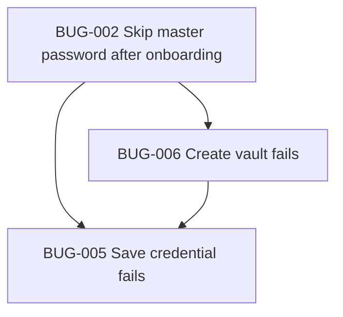

# SecureVault — Bug Tracker

Track known bugs and suspected issues. Update **Status** as items are fixed.
Pending feature/engineering work lives in [TASKS.md](./TASKS.md).

**Last updated:** 2026-06-14
**Open bugs:** 0 · **Done:** 15 · **Potential backlog:** 8

> All formally tracked bugs (BUG-002 → BUG-016) are resolved. The Potential Bug
> Backlog lists suspected issues that are watched, mitigated, or pending repro.

---

## Active Bug Index

_No open bugs._

## Completed Bug Index

| ID | Title | Priority | Status |
|----|-------|----------|--------|
| [BUG-016](#bug-016) | Biometric unlock switch not working (setup + settings) | P1 | done |
| [BUG-015](#bug-015) | Create Vault button does not work on setup screen | P0 | done |
| [BUG-012](#bug-012) | Biometric enable switch cannot be toggled | P1 | done |
| [BUG-007](#bug-007) | Home menu icon locks app with master password | P1 | done |
| [BUG-002](#bug-002) | No master password after onboarding | P0 | done |
| [BUG-003](#bug-003) | No close (X) on Add Credential | P1 | done |
| [BUG-004](#bug-004) | Website suggestion buttons don’t update URL | P2 | done |
| [BUG-005](#bug-005) | Save credential fails | P0 | done |
| [BUG-006](#bug-006) | Create vault fails | P0 | done |
| [BUG-008](#bug-008) | Vault header icon is on wrong side | P2 | done |
| [BUG-009](#bug-009) | Security alerts are not clickable | P2 | done |
| [BUG-010](#bug-010) | Multiple Edit Credential dialogs open | P1 | done |
| [BUG-011](#bug-011) | Health score does not update after add/delete | P1 | done |
| [BUG-013](#bug-013) | Onboarding back swipe exposes SecureVault before setup | P1 | done |
| [BUG-014](#bug-014) | White screen flash when switching tabs | P2 | done |

## Potential Bug Backlog

Track suspected issues before they are fully reproduced and converted into formal `BUG-xxx` items.

| ID | Potential bug | Risk | Trigger area | Status | Related item |
|----|---------------|------|--------------|--------|--------------|
| POT-001 | Auto-lock timer may race with active save and force unlock flow unexpectedly | High | App lifecycle / vault lock | potential_open | TASK-027 |
| POT-002 | CSV export may create duplicate entries when imported back without stronger identity checks | Medium | Vault import/export | mitigated | TASK-012 |
| POT-003 | Search + rapid tap on grouped credentials may open stale account after filter updates | High | Home/Vault grouped list | mitigated | BUG-010 |
| POT-004 | Password health counts may drift after bulk import and not refresh badges instantly | Medium | Health metrics | mitigated | BUG-011 |
| POT-005 | Theme override from settings may not apply consistently after cold app restart | Medium | App preferences/theme | potential_open | TASK-026 |
| POT-006 | Copy password action in nested dialogs may copy wrong account when dialog list rerenders | High | Credential picker dialog | potential_open | TASK-003 |
| POT-007 | Generated password passed to new entry may be lost if route params are trimmed by navigation replace | Medium | Generator to entry flow | potential_open | TASK-024 |
| POT-008 | Site logo cache fallback may show wrong brand icon for uncommon domains | Low | Site branding/cache | mitigated | TASK-006 |

---

<a id="bug-002"></a>

## BUG-002: No master password after onboarding

| Field | Value |
|-------|--------|
| **ID** | BUG-002 |
| **Type** | Bug |
| **Priority** | P0 — Critical |
| **Status** | done |
| **Area** | Auth / Vault setup |
| **Reported** | 2026-05-16 |
| **Blocks** | BUG-005, BUG-006 (downstream) |

### Description

After completing onboarding, the app **does not show** the **Create master password** screen. User lands in the main app without setting up or unlocking the vault.

### Steps to reproduce

1. Complete onboarding (3 steps → **Get started**).
2. Observe navigation goes straight to tabs/home.
3. Master password setup screen never appears.

### Expected

1. Onboarding complete → redirect to `/(auth)/setup-master-password` (or `index` routes there).
2. User creates master password, then enters the app.

### Actual

- Onboarding calls `router.replace('/(tabs)')` and skips vault setup.

### Likely cause

```31:31:app/(auth)/onboarding.tsx
    router.replace('/(tabs)');
```

Should use `router.replace('/')` so `app/index.tsx` can route to `setup-master-password` when `!isInitialized`, **or** navigate directly to `/(auth)/setup-master-password`.

`app/index.tsx` already has correct logic when hit:

```25:27:app/index.tsx
  if (!isInitialized) {
    return <Redirect href="/(auth)/setup-master-password" />;
  }
```

### Related files

- `app/(auth)/onboarding.tsx`
- `app/index.tsx`
- `app/(auth)/setup-master-password.tsx`

### Suggested fix

- Replace `router.replace('/(tabs)')` with `router.replace('/')` or `router.replace('/(auth)/setup-master-password')`.

---

<a id="bug-003"></a>

## BUG-003: No close button on Add Credential screen

| Field | Value |
|-------|--------|
| **ID** | BUG-003 |
| **Type** | Bug |
| **Priority** | P1 — High |
| **Status** | done |
| **Area** | Entry / UX |
| **Reported** | 2026-05-16 |

### Description

The **Add Credential** modal/screen has no **close (X)** or cancel control. User must use system back gesture only.

### Steps to reproduce

1. Unlock vault → Vault → **+** or **Add credential**.
2. Modal opens (`entry/new`).
3. Look for close/dismiss control in header.

### Expected

- Header with **X** (or “Cancel”) that calls `router.back()` without saving.

### Actual

- No header close button; only scroll content and **Save credential** at bottom.

### Likely cause

- `app/entry/[id].tsx` — modal presentation in `app/_layout.tsx` but no header UI component.

### Related files

- `app/entry/[id].tsx`
- `app/_layout.tsx` (`entry/[id]` modal options)

### Suggested fix

- Add top row: `X` button + title; optional `headerShown: true` with custom header on stack screen.

---

<a id="bug-004"></a>

## BUG-004: Website suggestion buttons don’t update URL

| Field | Value |
|-------|--------|
| **ID** | BUG-004 |
| **Type** | Bug |
| **Priority** | P2 — Medium |
| **Status** | done |
| **Area** | Add credential / UX |
| **Reported** | 2026-05-16 |

### Description

Tapping website suggestion buttons/chips (**Google**, **Instagram**, etc.) sets the **Website** name but often **does not update** the **Website URL** field after clicking, especially when URL already has text.

### Steps to reproduce

1. Open Add credential.
2. Enter any text in **Website URL** (or complete onboarding flow that pre-fills URL).
3. Tap **Google** (or another website suggestion button/chip).
4. **Website** updates; **Website URL** may stay unchanged.

### Expected

- Selecting a chip updates **both** website name and the correct URL (e.g. `https://google.com`).

### Actual

- URL only set when field is empty:

```131:135:app/entry/[id].tsx
  function applyQuickSite(site: string) {
    setWebsite(site);
    if (!url.trim()) {
      setUrl(`https://${site.toLowerCase().replace(/\s+/g, '')}.com`);
```

### Likely cause

- Conditional `if (!url.trim())` prevents overwriting existing URL.

### Related files

- `app/entry/[id].tsx`
- `services/site-branding.ts` (`KNOWN_DOMAINS` for accurate URLs)

### Suggested fix

- Always set URL from chip using `resolveSiteDomain` / known-domain map; or ask confirm before overwrite.

---

<a id="bug-005"></a>

## BUG-005: Save credential fails with error

| Field | Value |
|-------|--------|
| **ID** | BUG-005 |
| **Type** | Bug |
| **Priority** | P0 — Critical |
| **Status** | done |
| **Area** | Vault / CRUD |
| **Reported** | 2026-05-16 |
| **Related** | BUG-002, BUG-006 |

### Description

On **Add credential**, tapping **Save credential** shows alert: **“Could not save credential.”**

### Steps to reproduce

1. Open app (especially if onboarding skipped master password — see BUG-002).
2. Add credential → fill Website, Username, Password.
3. Tap **Save credential**.

### Expected

- Credential saved, modal closes, appears in Vault list.

### Actual

- `Alert.alert('Error', 'Could not save credential.')` from catch block in `handleSave`.

### Likely cause

- **Vault locked** — `addCredential` → `persist` throws `Vault is locked` if `encryptionKeyRef` is null (no successful setup/unlock).
- Chain from **BUG-002** / **BUG-006**: user never has unlocked vault.
- Other: validation, encrypt/persist failure (less common if vault unlocked).

### Related files

- `app/entry/[id].tsx` (`handleSave` catch)
- `contexts/vault-context.tsx` (`addCredential`, `persist`)
- `services/vault-storage.ts`

### Suggested fix

1. Fix **BUG-002** and **BUG-006** first.
2. Surface real error message in alert (e.g. `error.message`) for debugging.
3. Guard: disable Save or redirect to unlock if `!isUnlocked`.

---

<a id="bug-006"></a>

## BUG-006: Create vault / master password fails

| Field | Value |
|-------|--------|
| **ID** | BUG-006 |
| **Type** | Bug |
| **Priority** | P0 — Critical |
| **Status** | done |
| **Area** | Vault setup / Crypto |
| **Reported** | 2026-05-16 |
| **Related** | BUG-002, BUG-005 |

### Description

On **Create master password**, after entering password + confirm and tapping **Create vault**, setup **fails** (generic or secure-storage error). User cannot initialize vault.

### Steps to reproduce

1. Reach `/(auth)/setup-master-password` (may require manual navigation if BUG-002 unfixed).
2. Enter master password (≥ 8 chars) + confirm.
3. Tap **Create vault**.
4. Observe error message or no navigation to app.

### Expected

- Vault created, user navigated to main app, vault unlocked.

### Actual

- Error shown (e.g. “Could not create vault” / secure storage message) or hang then failure.

### Likely cause (investigate)

- `expo-secure-store` / native module mismatch (mitigated in recent fix — verify Expo Go after `npx expo install expo-secure-store`).
- PBKDF2 blocking UI / timeout on slow devices.
- Partial vault state from failed prior attempt.
- Device secure storage permissions.

### Related files

- `app/(auth)/setup-master-password.tsx`
- `services/vault-storage.ts`
- `services/crypto/vault-crypto.ts`
- `contexts/vault-context.tsx` (`setup`)

### Suggested fix

- Confirm SDK 54-compatible `expo-secure-store` installed; clear app data and retest.
- Log and display `error.message` from `setup()`.
- Add dev-only “Reset vault” if corrupted state.

---

<a id="bug-007"></a>

## BUG-007: Home menu icon locks app with master password

| Field | Value |
|-------|--------|
| **ID** | BUG-007 |
| **Type** | Bug |
| **Priority** | P1 — High |
| **Status** | done |
| **Area** | Home / Navigation / Auth |
| **Reported** | 2026-05-17 |

### Description

On the Home page, tapping the menu icon currently locks the app and sends the user back to master password unlock. The icon/action should be changed so users do not accidentally lock the app when trying to open the menu.

### Steps to reproduce

1. Unlock SecureVault.
2. Open the Home page.
3. Tap the menu icon.
4. App locks and requires the master password again.

### Expected

- The Home menu icon opens the intended menu/profile/actions UI, or uses a different icon if the action is lock.
- Locking the app should be explicit and clearly labeled.

### Actual

- Tapping the menu icon locks the app unexpectedly.

### Related files

- `app/(tabs)/index.tsx`
- `contexts/vault-context.tsx`
- `components/ui/button.tsx`

### Suggested fix

1. Replace the Home menu icon/action with the correct menu behavior.
2. If lock remains available, move it to an explicit **Lock vault** action with a matching icon.
3. Confirm the Home header icon matches the intended UI.

### Resolution

1. Dashboard menu icon and avatar now navigate to `/settings` instead of locking the vault (`src/components/screens/dashboard.tsx`).

---

<a id="bug-008"></a>

## BUG-008: Vault header icon is on wrong side

| Field | Value |
|-------|--------|
| **ID** | BUG-008 |
| **Type** | Bug |
| **Priority** | P2 — Medium |
| **Status** | done |
| **Area** | Vault / Header UI |
| **Reported** | 2026-05-17 |

### Description

On the My Vault page, the right-most Vault header icon should be moved to the left side and updated to match the intended UI.

### Steps to reproduce

1. Open SecureVault.
2. Go to the My Vault page.
3. Check the header icon placement.
4. Notice the Vault icon is on the right side instead of the left.

### Expected

- Vault header icon appears on the left side.
- Header spacing, icon style, and alignment match the reference UI.

### Actual

- The Vault header icon appears at the right-most side and does not match the desired UI.

### Related files

- `app/(tabs)/vault.tsx`
- `components/vault/credential-list-item.tsx`
- `constants/securevault-theme.ts`

### Suggested fix

1. Move the Vault header icon to the left side of the header.
2. Adjust spacing and typography to match the reference UI.
3. Verify the header still works in light and dark mode.

### Resolution

1. Rebuilt the Main Vault header so a shield icon tile + **Main Vault** title + password count sit on the **left** (`src/components/screens/main-vault.tsx`), matching the screenshot. The right side keeps the Sort-by control only.

---

<a id="bug-009"></a>

## BUG-009: Security alerts are not clickable

| Field | Value |
|-------|--------|
| **ID** | BUG-009 |
| **Type** | Bug |
| **Priority** | P2 — Medium |
| **Status** | done |
| **Area** | Home / Vault / Password Health |
| **Reported** | 2026-05-17 |

### Description

Security alerts are visible but not clickable. When a user taps an alert, the app should show the affected accounts and allow the user to open the relevant credential details.

### Steps to reproduce

1. Unlock SecureVault.
2. Open a page that shows security alerts.
3. Tap a weak/reused/compromised password alert.
4. Nothing useful happens, or the affected accounts are not shown.

### Expected

- Tapping a security alert opens a list/dialog/screen of affected accounts.
- Each affected account can be tapped to redirect to its credential detail page.
- Alert behavior is consistent between Home, Vault, and Health where applicable.

### Actual

- Security alerts are not clickable and do not guide the user to affected accounts.

### Related files

- `app/(tabs)/index.tsx`
- `app/(tabs)/vault.tsx`
- `app/(tabs)/health.tsx`
- `services/health-checks.ts`
- `components/vault/credential-list-item.tsx`

### Suggested fix

1. Wrap security alert rows/cards in pressable controls.
2. Pass affected credential IDs from health metrics to the alert UI.
3. Show affected accounts on tap.
4. Navigate selected account to `app/entry/[id].tsx`.
5. Add accessible labels for each alert action.

### Resolution

1. Dashboard "Security Health" banner is a single accessible `Pressable` → `/health` (`src/components/screens/dashboard.tsx`).
2. Main Vault "Security Pulse" alert card is now a `Pressable` → `/health` with an accessibility label (`src/components/screens/main-vault.tsx`); the Health screen lists the affected weak/reused/old accounts and links to each credential.

---

<a id="bug-010"></a>

## BUG-010: Multiple Edit Credential dialogs open

| Field | Value |
|-------|--------|
| **ID** | BUG-010 |
| **Type** | Bug |
| **Priority** | P1 — High |
| **Status** | done |
| **Area** | Entry / Edit credential / Navigation |
| **Reported** | 2026-05-17 |

### Description

Multiple Edit Credential dialogs/screens can open at the same time. This can confuse users and risks editing or saving the wrong credential state.

### Steps to reproduce

1. Unlock SecureVault.
2. Open a credential edit flow.
3. Tap edit/open actions repeatedly or from multiple credential rows.
4. Observe more than one Edit Credential dialog/screen opening.

### Expected

- Only one Edit Credential dialog/screen can be open at a time.
- Repeated taps are ignored while navigation/dialog opening is in progress.
- Opening a different credential closes or replaces the current edit dialog cleanly.

### Actual

- Multiple Edit Credential dialogs/screens can stack or appear together.

### Related files

- `app/entry/[id].tsx`
- `app/(tabs)/vault.tsx`
- `app/(tabs)/index.tsx`
- `components/vault/credential-list-item.tsx`

### Suggested fix

1. Debounce or disable edit/open actions while navigation is pending.
2. Keep a single active edit route/dialog state.
3. Ensure grouped account pickers close before navigating to edit.
4. Add guards against duplicate `router.push` / modal open calls.

### Resolution

1. Added `useNavigationLock()` (`src/hooks/use-navigation-lock.ts`) — blocks duplicate navigation for 800ms and resets on focus.
2. Both Dashboard and Main Vault rows open the editor through `runLocked(() => router.push({ pathname: '/edit-credential', params: { id } }))`, so rapid taps can no longer stack edit screens, and edit now targets the correct credential by `id`.

---

<a id="bug-011"></a>

## BUG-011: Health score does not update after add/delete

| Field | Value |
|-------|--------|
| **ID** | BUG-011 |
| **Type** | Bug |
| **Priority** | P1 — High |
| **Status** | done |
| **Area** | Password Health / Vault state |
| **Reported** | 2026-05-17 |
| **Related** | POT-004 |

### Description

The Health score is not working reliably and does not update instantly when an account is added or deleted. Password Health should react immediately to vault changes so the score, counts, alerts, and affected-account lists stay accurate.

### Steps to reproduce

1. Unlock SecureVault.
2. Check the current Health score.
3. Add a new account/credential, or delete an existing account.
4. Return to the Health page or dashboard health widgets.
5. Observe the score/counts do not update immediately.

### Expected

- Health score recalculates immediately after adding, editing, importing, or deleting credentials.
- Weak/reused/safe counts update instantly.
- Home, Vault, and Health screens all show the same fresh health state.
- No app restart or manual refresh is required.

### Actual

- Health score or related health counts can stay stale after account add/delete.

### Related files

- `contexts/vault-context.tsx`
- `services/health-checks.ts`
- `app/(tabs)/health.tsx`
- `app/(tabs)/index.tsx`
- `app/(tabs)/vault.tsx`

### Suggested fix

1. Ensure health metrics derive from the latest `credentials` state.
2. Recompute health synchronously whenever credentials change.
3. Verify add, edit, delete, import, and reset flows all trigger updated health state.
4. Avoid separate cached health state unless it is invalidated on every vault mutation.

---

<a id="bug-012"></a>

## BUG-012: Biometric enable switch cannot be toggled

| Field | Value |
|-------|--------|
| **ID** | BUG-012 |
| **Type** | Bug |
| **Priority** | P1 — High |
| **Status** | done |
| **Area** | Auth / Setup / Biometric UX |
| **Reported** | 2026-05-17 |
| **Related** | TASK-020 |

### Description

On Create master password, users reported the biometric enable switch was not clickable (or appeared permanently disabled), so they could not enable biometric unlock during setup.

### Steps to reproduce

1. Open `/(auth)/setup-master-password`.
2. Reach the biometric option row.
3. Try to toggle the switch.
4. Observe the control appears unresponsive on unsupported/misconfigured devices.

### Expected

- Biometric option is interactive and understandable.
- If unavailable, user receives a clear reason instead of a silent dead toggle.
- On supported devices, the toggle can be enabled and defaults to on.

### Actual

- Switch felt unclickable in some states due to strict disabled gating.

### Related files

- `app/(auth)/setup-master-password.tsx`
- `services/biometric-unlock.ts`
- `contexts/vault-context.tsx`

### Resolution (Run 3)

1. `setup-master-password.tsx` now calls `getBiometricAvailability()` (real `expo-local-authentication`) on mount and shows a context-aware subtitle (`Use Face ID` / `No biometrics enrolled` / `Not available on this device`).
2. The biometric card is fully pressable; tapping it when unsupported shows a clear explanation instead of a silent dead toggle.
3. The opt-in defaults **on** only when hardware exists **and** is enrolled (`canUseBiometrics`); otherwise it stays off and the track renders disabled.
4. Settings biometric toggle is also gated on availability with matching messaging.

---

<a id="bug-013"></a>

## BUG-013: Onboarding back swipe exposes SecureVault before setup

| Field | Value |
|-------|--------|
| **ID** | BUG-013 |
| **Type** | Bug |
| **Priority** | P1 — High |
| **Status** | done |
| **Area** | Onboarding / Auth gate / Vault setup |
| **Reported** | 2026-05-17 |
| **Related** | BUG-002, BUG-005 |

### Description

During onboarding, swiping back can reveal the SecureVault app page before onboarding and master-password setup are complete. If the app becomes inactive/deactivated and opens again before setup is complete, it should start from onboarding/auth setup, not from SecureVault.

No credentials should be addable until the master password has been created and the vault is initialized/unlocked.

### Steps to reproduce

1. Fresh install or reset local app data.
2. Start onboarding.
3. Swipe back during onboarding or background/deactivate the app and reopen it.
4. Observe SecureVault/main app content can appear before setup is finished.
5. Try to add a credential before creating the master password.

### Expected

- Onboarding cannot be bypassed with swipe-back/navigation history.
- If onboarding/setup is incomplete, reopening the app returns to onboarding or master-password setup.
- Tabs, Vault, Home, and Add Credential routes are blocked until master password setup is complete.
- No credential can be added until the master password exists and the vault is unlocked.

### Actual

- SecureVault/main app page can appear before onboarding/master-password setup is complete.
- Credential entry may be reachable before the vault is initialized.

### Related files

- `app/_layout.tsx`
- `app/index.tsx`
- `app/(auth)/onboarding.tsx`
- `app/(auth)/setup-master-password.tsx`
- `app/(tabs)/_layout.tsx`
- `app/entry/[id].tsx`
- `contexts/auth-context.tsx`
- `contexts/vault-context.tsx`

### Suggested fix

1. Make the root auth gate the single source of truth for onboarding, initialization, and unlock routing.
2. Replace onboarding navigation so completed/incomplete flows cannot leave stale main-app routes in history.
3. Guard tab and entry routes when `!isInitialized` or `!isUnlocked`.
4. Disable Add Credential actions until master-password setup is complete.
5. Test fresh launch, swipe-back, app inactive/active resume, and direct route access.

---

<a id="bug-014"></a>

## BUG-014: White screen flash when switching tabs

| Field | Value |
|-------|--------|
| **ID** | BUG-014 |
| **Type** | Bug |
| **Priority** | P2 — Medium |
| **Status** | done |
| **Area** | Navigation / Bottom nav / UX |
| **Reported** | 2026-06-13 |

### Description

Switching between the bottom-nav tabs (Dashboard / Vault / Health / Settings) shows a brief **white screen flash** during the transition, breaking the dark glassmorphic feel.

### Steps to reproduce

1. Unlock the vault.
2. Tap between the Dashboard, Vault, Health, and Settings tabs.
3. Observe a white flash as each screen transitions in.

### Expected

- Tab switches are instant with no white flash; the dark aubergine background is continuous.

### Actual

- A white frame appears mid-transition.

### Root cause

- `BottomNav` navigates with `router.replace()` while the root `Stack` applies `animation: 'slide_from_right'` to every route. The slide animation momentarily reveals the white native window root behind the incoming screen.
- The route guards (`app/dashboard.tsx`, `vault.tsx`, `health.tsx`, `settings.tsx`) render a bare `<View />` with no background while `isLoading`, which can also flash white.

### Related files

- `src/app/_layout.tsx`
- `src/components/vault/bottom-nav.tsx`
- `src/app/{dashboard,vault,health,settings}.tsx`

### Resolution

1. Declared explicit `Stack.Screen` entries for the four tab routes in `src/app/_layout.tsx` with `animation: 'none'`, so tab swaps are instant and never reveal the white window root.
2. Added a shared dark `RouteFallback` (background `#190e27`) replacing the bare `<View />` loading placeholders in all tab route guards.

---

<a id="bug-015"></a>

## BUG-015: Create Vault button does not work on setup screen

| Field | Value |
|-------|--------|
| **ID** | BUG-015 |
| **Type** | Bug (regression) |
| **Priority** | P0 — Critical |
| **Status** | done |
| **Area** | Vault setup / UX |
| **Reported** | 2026-06-14 |
| **Related** | BUG-006 |

### Description

On the **Initialize Your Vault** setup screen, tapping **CREATE VAULT** after entering matching passwords appears to do nothing. Users cannot complete vault initialization.

### Steps to reproduce

1. Complete onboarding → reach setup screen.
2. Enter master password (≥ 12 chars) and confirm.
3. Tap **CREATE VAULT** while the keyboard is still open (or immediately after typing).
4. Observe no action on first tap, or no feedback during the ~3s PBKDF2 derivation.

### Expected

- Button responds on first tap even with keyboard open.
- Loading feedback while vault is being created.
- Navigate to Dashboard on success; show alert on failure.

### Actual

- First tap often dismissed the keyboard instead of firing the button (`ScrollView` default `keyboardShouldPersistTaps`).
- Custom gradient `Pressable` could fail to receive touches on some Android builds.
- No loading state during async vault creation.

### Root cause

1. `ScrollView` missing `keyboardShouldPersistTaps` — classic RN tap-swallow bug.
2. Setup screen used a bespoke gradient button instead of the shared `PrimaryButton`.
3. `onCreate` was fire-and-forget with no `isCreating` guard.
4. **Regression (2026-06-14):** `setupMasterPassword` **awaited** `storeBiometricKey()` (expo-secure-store) after vault creation. On Android Expo Go this call can **hang indefinitely** when biometric unlock is enabled, leaving the screen stuck on "CREATING VAULT…" and never navigating away.

### Resolution

1. Added `keyboardShouldPersistTaps="always"` to setup `ScrollView`.
2. Replaced bespoke button with shared `PrimaryButton` (+ `pointerEvents="none"` on gradient child, `width: '100%'`).
3. Await async `onCreate`, show **CREATING VAULT…** label, disable button while creating.
4. **Do not await** `storeBiometricKey` during setup/unlock — run in background so SecureStore cannot block vault creation.
5. Navigate via `useEffect` after `isInitialized && isUnlocked` flush (avoids router race with React state).

### Related files

- `src/components/setup-master-password.tsx`
- `src/components/vault/primary-button.tsx`
- `src/app/setup.tsx`

---

<a id="bug-016"></a>

## BUG-016: Biometric unlock switch not working (setup + settings)

| Field | Value |
|-------|--------|
| **ID** | BUG-016 |
| **Type** | Bug (regression) |
| **Priority** | P1 — High |
| **Status** | done |
| **Area** | Auth / Setup / Settings / Biometric UX |
| **Reported** | 2026-06-14 |
| **Related** | BUG-012, TASK-020 |

### Description

The **Enable Biometric Unlock** switch on the setup screen and the **Biometric Unlock** toggle in Settings do not respond to taps.

### Steps to reproduce

1. Open setup screen → try toggling biometric switch.
2. Or unlock vault → Settings → Security → try toggling Biometric Unlock.
3. Observe switch does not change state.

### Expected

- Toggle responds immediately on supported devices.
- Clear alert when biometrics unavailable.
- Settings toggle persists via `updateSettings`.

### Actual

- Setup: whole-card `Pressable` with decorative toggle `View` — taps lost when keyboard open (same `ScrollView` issue as BUG-015).
- Settings: `SettingsRow` wrapped trailing `Toggle` in an outer `Pressable` even when `onPress` was undefined, blocking nested switch presses.

### Resolution

1. Setup: replaced card-level `Pressable` + fake toggle with shared `Toggle` component; added `keyboardShouldPersistTaps`.
2. Settings: `SettingsRow` renders a plain `View` when no `onPress` is provided so trailing toggles receive touches.
3. Added `disabled` prop to shared `Toggle` for unsupported devices.

### Related files

- `src/components/setup-master-password.tsx`
- `src/components/screens/settings.tsx`
- `src/components/vault/toggle.tsx`

---

## Dependency graph



---

## Resolution log

> **Archived (2026-06-13):** The entries below describe work done on the previous codebase, which
> was replaced by the current UI-only rebuild. They are retained for historical context only and do
> **not** reflect functionality currently present in `src/`. All items above are reset to **open**.

| Date | ID | Resolution | By |
|------|-----|------------|-----|
| 2026-06-14 | BUG-015 | Follow-up: stop awaiting SecureStore biometric key write (was hanging setup on Android); state-driven navigation after unlock. | Cursor |
| 2026-06-14 | BUG-016 | Biometric toggles: shared `Toggle` on setup, `SettingsRow` no longer wraps toggles in dead `Pressable`, `Toggle.disabled` prop. | Cursor |
| 2026-06-13 | BUG-012 | Setup biometric toggle wired to real `expo-local-authentication` availability with context-aware messaging; defaults on only when supported+enrolled. | Cursor |
| 2026-06-13 | POT-008 | Mitigated: per-domain logo status cache + icon fallback prevents wrong/again-fetched brand icons for uncommon domains. | Cursor |
| 2026-06-13 | POT-002 | Mitigated by `mergeCredentials` identity-key dedupe on import. | Cursor |
| 2026-06-13 | BUG-007 | Dashboard menu icon routes to `/settings` instead of locking the vault (`dashboard.tsx`). | Cursor |
| 2026-06-13 | BUG-008 | Rebuilt Main Vault header with a left-aligned shield icon + "Main Vault" title + password count (`main-vault.tsx`). | Cursor |
| 2026-06-13 | BUG-009 | Made the Main Vault "Security Pulse" alert card a pressable that opens `/health` (Dashboard banner already pressable). | Cursor |
| 2026-06-13 | BUG-010 | Main Vault rows now open edit via `useNavigationLock` + `{ params: { id } }`, preventing duplicate edit screens and fixing untargeted edits. | Cursor |
| 2026-06-13 | POT-003 | Mitigated by `useNavigationLock` + id-based edit routing on Home and Vault rows, preventing stale-account navigation on rapid taps. | Cursor |
| 2026-06-13 | BUG-002 | Root routing now sends new users through onboarding to master-password setup, and initialized users to unlock/dashboard based on vault state. | Cursor |
| 2026-06-13 | BUG-006 | Added AsyncStorage-backed vault setup with salted master-password hash, metadata, and unlocked session state after creation. | Cursor |
| 2026-06-13 | BUG-005 | Add Credential now validates and persists credentials through `VaultContext`, then shows saved entries in the Vault list. | Cursor |
| 2026-06-13 | BUG-003 | Confirmed Add Credential uses a back/close header control via `VaultHeader showBack`, preserving a cancel path before save. | Cursor |
| 2026-06-13 | BUG-004 | Quick-site chips now set both website name and canonical URL every time they are tapped. | Cursor |
| 2026-06-13 | BUG-011 | Health metrics now derive from live credentials in shared context and update on Dashboard, Vault, and Health after saves. | Cursor |
| 2026-06-13 | BUG-013 | Added protected route guards across setup, unlock, dashboard, vault, health, settings, my-vault, add, and edit routes. | Cursor |
| 2026-06-13 | POT-004 | Mitigated by deriving health counts from current `credentials` state instead of static mock values. | Cursor |
| 2026-05-17 | BUG-002 | Onboarding now returns to the root auth gate, which redirects uninitialized users to master password setup. | Cursor |
| 2026-05-17 | BUG-006 | Vault setup/unlock metadata now uses local AsyncStorage persistence instead of SecureStore for the current app build. | Cursor |
| 2026-05-17 | BUG-003 | Added an accessible close button to the credential editor header so users can dismiss add/edit credential without saving. | Cursor |
| 2026-05-17 | BUG-004 | Website suggestion chips now always set the matching canonical URL using the shared site-domain resolver. | Cursor |
| 2026-05-17 | BUG-005 | Save credential flow is resolved by the BUG-006 vault setup/storage fix, which allows the vault to initialize and unlock before persisting credentials. | Cursor |
| 2026-05-17 | BUG-007 | Home menu icon now opens a side navigation panel; locking the vault is an explicit labeled action inside the menu. | Cursor |
| 2026-05-17 | BUG-008 | Moved the vault icon/title to the left header and replaced the old right vault action with dedicated Import CSV and Export CSV controls. | Cursor |
| 2026-05-17 | BUG-010 | Added an edit-navigation lock in Home and Vault lists plus disabled row actions during route transition, preventing duplicate `entry/[id]` screens/dialogs from repeated taps. | Cursor |
| 2026-05-17 | BUG-011 | Made vault persistence optimistic (with rollback on failure) so credential mutations update in-memory state immediately, keeping Health/Home/Vault metrics in sync after add/edit/delete/import. | Cursor |
| 2026-05-17 | BUG-012 | Fixed biometric setup toggle UX by replacing silent disabled gating with explicit availability feedback, making the row pressable, and defaulting supported devices to biometric enabled. | Cursor |
| 2026-05-17 | BUG-009 | Security alert cards are now pressable and open an affected-accounts dialog (weak/reused/old) with direct account actions to open credential details. | Cursor |
| 2026-05-17 | BUG-013 | Added auth-route hard guards and disabled auth-stack back gestures so onboarding/setup cannot be bypassed via swipe-back, history, or direct access to tabs/settings/entry before unlock. | Cursor |
| 2026-05-17 | POT-001 | Mitigated auto-lock vs save race by tracking in-flight persists, deferring lock until save completion, and preventing stale rollback after a lock session change. | Cursor |
| 2026-05-17 | POT-002 | Verified CSV import dedupe already blocks re-import duplicates using normalized domain+username identity keys from existing and incoming credentials. | Cursor |
| 2026-05-17 | POT-003 | Switched grouped-account dialog selection to key-based live lookup in Home and Vault, preventing stale account routing after rapid search/filter updates. | Cursor |
| 2026-05-17 | POT-004 | Verified bulk CSV import writes through optimistic `persist`, and Home/Vault/Health badges recalculate from current `credentials` via shared health metrics without delayed refresh drift. | Cursor |

---

## Related docs

- [TASKS.md](./TASKS.md) — pending feature/engineering tasks
- [ROADMAP.md](./ROADMAP.md) — feature phases and overall progress
- [README.md](./README.md) — run instructions

---

*When closing a bug, update the counts above and add a row to the Resolution log.*
