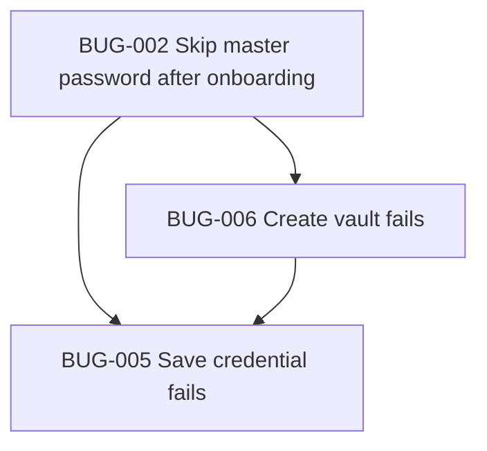

> _Continued from [BUGS.md](./BUGS.md) — Part 1._

## BUG-017: Tab switch feels frozen / janky before navigating

| Field | Value |
|-------|--------|
| **ID** | BUG-017 |
| **Type** | Bug |
| **Priority** | P1 — High |
| **Status** | done |
| **Area** | Navigation / Tabs / Performance |
| **Reported** | 2026-06-14 |
| **Related** | BUG-018, BUG-014 |

### Description

Tapping a tab in the bottom nav produces a poor transition — the app appears to **hang/freeze for a noticeable beat** before the next screen appears, instead of switching instantly or animating smoothly.

### Steps to reproduce

1. Unlock the vault and land on Dashboard.
2. Tap another tab (e.g. Vault, Health, Settings).
3. Observe a stutter/hang before the new screen renders.

### Expected

- Tab change is instant or smoothly animated, with no perceived freeze.

### Actual

- UI appears stuck for a moment, then jumps to the destination screen.

### Likely cause

- `(tabs)/_layout.tsx` uses a plain `Stack` with `animation: 'none'`, and the custom `BottomNav` switches via `router.replace(route)`. Each tab is a separate route that **fully mounts/unmounts** on every switch, so heavy screens (lists, blur, gradients, health computations) rebuild synchronously on the JS thread instead of being kept mounted.

```6:8:src/app/(tabs)/_layout.tsx
export default function TabsLayout() {
  return <Stack screenOptions={{ headerShown: false, animation: 'none' }} />;
}
```

```105:105:src/components/vault/bottom-nav.tsx
              onPress={() => router.replace(item.route)}
```

### Related files

- `src/app/(tabs)/_layout.tsx`
- `src/components/vault/bottom-nav.tsx`
- Tab screens under `src/app/(tabs)/`

### Suggested fix

- Use a real tab navigator that keeps screens mounted (or memoize/lazy-mount heavy screens) so switching does not re-run expensive renders.
- Defer non-critical work (blur, derived health metrics) with `InteractionManager`/memoization, and consider a lightweight transition instead of `animation: 'none'`.

### Resolution

- Replaced the plain tab-group `Stack` with hidden Expo Router `Tabs` so tab screens are managed as tabs instead of full stack route replacements.
- Changed the custom bottom nav to use `router.navigate` and ignore taps on the already-active tab.

---

<a id="bug-018"></a>


## BUG-018: White screen flash when pressing back

| Field | Value |
|-------|--------|
| **ID** | BUG-018 |
| **Type** | Bug |
| **Priority** | P2 — Medium |
| **Status** | done |
| **Area** | Navigation / Theming |
| **Reported** | 2026-06-14 |
| **Related** | BUG-014, BUG-017 |

### Description

Pressing back (hardware/gesture or in-app back) shows a **white screen flash for a second** during the transition before the previous screen paints. This is jarring on the dark theme.

### Steps to reproduce

1. Open a pushed screen (e.g. Add/Edit Credential, entry detail).
2. Press back.
3. Observe a brief white flash before the previous screen appears.

### Expected

- Transition stays on the themed (dark) background with no white frame.

### Actual

- A white/blank frame flashes during the back transition.

### Likely cause

- Navigator/scene container has no themed `contentStyle`/background, so the default white surface shows through while the destination screen mounts (mirrors the tab-switch flash fixed in BUG-014, but on the back path).

### Related files

- `src/app/_layout.tsx`
- `src/app/(tabs)/_layout.tsx`
- `src/app/(auth)/_layout.tsx`

### Suggested fix

- Set a themed background on the stack scene (e.g. `screenOptions.contentStyle.backgroundColor` and navigation theme background) so transitions never reveal the default white surface.

### Resolution

- Added themed backgrounds to nested auth and tab navigators so transitions do not expose the default white scene background.

---

<a id="bug-019"></a>


## BUG-019: Active tab indicator is clipped at the top

| Field | Value |
|-------|--------|
| **ID** | BUG-019 |
| **Type** | Bug |
| **Priority** | P3 — Low |
| **Status** | done |
| **Area** | UI / Bottom navigation |
| **Reported** | 2026-06-14 |
| **Related** | — |

### Description

The active tab's raised/floating indicator is **cut off slightly** at the top, so the highlighted icon does not look clean.

### Steps to reproduce

1. Look at the bottom nav on any tab screen.
2. Observe the active (lifted) icon is clipped where it rises above the bar.

### Expected

- The active indicator renders fully, lifted above the bar with its shadow intact.

### Likely cause

- The active icon is lifted with `transform: translateY: -18`, but the container `row` sets `overflow: 'hidden'` (needed for the rounded blur fill). The lifted portion that extends above the bar gets clipped by the parent's overflow.

```45:74:src/components/vault/bottom-nav.tsx
    row: {
      flexDirection: 'row',
      // ...
      borderRadius: t.radius.full,
      overflow: 'hidden',
      // ...
    },
    iconWrapActive: {
      // ...
      transform: [{ translateY: -18 }],
      // ...
    },
```

### Related files

- `src/components/vault/bottom-nav.tsx`

### Suggested fix

- Keep `overflow: 'hidden'` only on an inner blur/fill layer and let the active icon render in a non-clipping wrapper, or add top padding/extra height to the bar so the lifted icon (and shadow) is not cut off. Avoid clipping the elevated indicator.

### Resolution

- Split the bottom nav into a clipped visual surface and a non-clipping item layer, then added top breathing room so the active indicator and shadow render fully.

---

<a id="bug-020"></a>


## BUG-020: Password generator uses `Math.random()` instead of a CSPRNG

| Field | Value |
|-------|--------|
| **ID** | BUG-020 |
| **Type** | Bug / Security |
| **Priority** | P0 — Critical |
| **Status** | open |
| **Area** | Password generator |
| **Reported** | 2026-06-15 |

### Description

`generatePassword()` defaults to `Math.random()` for character selection. Every caller (Generator screen, Add Credential, Edit Credential) uses this default, so generated passwords are not cryptographically secure — a serious weakness for a password manager.

### Steps to reproduce

1. Open Generator (or tap generate on Add/Edit Credential).
2. Inspect `src/services/password-generator.ts` — `randomInt` defaults to `Math.floor(Math.random() * max)`.

### Expected

Password indices are derived from a cryptographically secure random source (e.g. `expo-crypto` `getRandomBytesAsync`).

### Actual

Passwords are generated using a predictable, non-cryptographic PRNG.

### Likely cause

```33:42:src/services/password-generator.ts
export function generatePassword(
  options: GeneratorOptions = DEFAULT_GENERATOR_OPTIONS,
  randomInt: (max: number) => number = (max) => Math.floor(Math.random() * max),
): string {
```

### Related files

- `src/services/password-generator.ts`
- `src/components/screens/generator.tsx`
- `src/components/screens/add-credential.tsx`
- `src/components/screens/edit-credential.tsx`

### Suggested fix

- Replace the default `randomInt` with a CSPRNG-backed implementation using `expo-crypto`.
- Add a unit test that verifies the generator uses secure randomness (mock `getRandomBytesAsync`).

---

<a id="bug-021"></a>


## BUG-021: Biometric vault key not bound to biometric auth in keystore

| Field | Value |
|-------|--------|
| **ID** | BUG-021 |
| **Type** | Bug / Security |
| **Priority** | P0 — Critical |
| **Status** | open |
| **Area** | Biometric unlock |
| **Reported** | 2026-06-15 |

### Description

The derived AES vault key is stored in SecureStore with only `WHEN_UNLOCKED_THIS_DEVICE_ONLY`. There is no `requireAuthentication` or access-control binding. The biometric prompt (`authenticateWithBiometrics`) is a separate UI gate — the key itself can be read by app code whenever the device is unlocked, without a fresh biometric scan.

### Steps to reproduce

1. Enable biometric unlock during setup or in Settings.
2. Inspect `storeBiometricKey` — no biometric access-control option is set.
3. Compare with `unlockWithBiometrics` flow: OS prompt runs, then `getBiometricKey()` reads the key without re-authenticating at the keystore level.

### Expected

The stored key requires a successful biometric authentication to read (platform access-control / Keychain `biometryCurrentSet` or equivalent).

### Actual

Key is stored with device-unlocked accessibility only; biometric gate is UI-only.

### Likely cause

```13:18:src/services/biometric-key.ts
    await SecureStore.setItemAsync(BIOMETRIC_KEY_STORAGE, keyHex, {
      keychainAccessible: SecureStore.WHEN_UNLOCKED_THIS_DEVICE_ONLY,
    });
```

Also: `authenticateWithBiometrics` uses `disableDeviceFallback: false`, allowing PIN fallback without updating the threat model.

### Related files

- `src/services/biometric-key.ts`
- `src/services/biometric.ts`
- `src/app/(auth)/unlock.tsx`
- `src/contexts/vault-context.tsx`

### Suggested fix

- Use SecureStore / platform APIs that require biometric authentication to read the key.
- Document and test behavior when biometrics are revoked or changed on the device.

---

<a id="bug-022"></a>


## BUG-022: Export backup is plaintext and uses the non-clearing clipboard

| Field | Value |
|-------|--------|
| **ID** | BUG-022 |
| **Type** | Bug / Security |
| **Priority** | P1 — High |
| **Status** | open |
| **Area** | Settings / Export |
| **Reported** | 2026-06-15 |

### Description

Export Vault copies all credentials (passwords in cleartext) via `copyToClipboard`, which does **not** auto-wipe the clipboard. Credential detail screens use `copySensitiveToClipboard` (30s clear). Exported backups linger on the clipboard indefinitely and are readable by other apps.

### Steps to reproduce

1. Unlock vault with at least one credential.
2. Settings → Export Vault → Copy Backup.
3. Observe `copyToClipboard(serializeVaultBackup(credentials))` — no auto-clear timer.

### Expected

- Sensitive export uses `copySensitiveToClipboard`, or
- Export is encrypted / written to a file share sheet, with explicit user warning.

### Actual

Plaintext JSON with all passwords copied to clipboard with no expiry.

### Likely cause

```152:170:src/components/screens/settings.tsx
  async function handleExport() {
    ...
            await copyToClipboard(serializeVaultBackup(credentials));
```

`serializeVaultBackup` stores credentials in plaintext (documented in `vault-backup.ts`).

### Related files

- `src/components/screens/settings.tsx`
- `src/services/vault-backup.ts`
- `src/services/feedback.ts`

### Suggested fix

- Use `copySensitiveToClipboard` for export, or implement encrypted backup format.
- Consider blocking export until encrypted backup is implemented (TASK-015).

---

<a id="bug-023"></a>


## BUG-023: Dark Mode toggle does nothing

| Field | Value |
|-------|--------|
| **ID** | BUG-023 |
| **Type** | Bug / Feature misbehavior |
| **Priority** | P1 — High |
| **Status** | open |
| **Area** | Settings / Theme |
| **Reported** | 2026-06-15 |
| **Related** | POT-005 |

### Description

Settings exposes a Dark Mode toggle that persists `themePreference` to vault settings, but nothing in the app reads `themePreference` to change the UI. The app is hardcoded dark (`DarkTheme`, `StatusBar style="light"`). Toggling shows "Light mode enabled" toast but the UI never changes.

### Steps to reproduce

1. Open Settings → Appearance → toggle Dark Mode off.
2. Observe toast "Light mode enabled".
3. UI remains dark; no light palette is applied.

### Expected

`themePreference` drives navigation theme, status bar, and component colors (light/dark/system).

### Actual

Setting is saved and toggle state updates; visual theme is unchanged.

### Likely cause

`themePreference` is only referenced in `settings.tsx` for the toggle value. `SecureVaultThemeProvider` / `ColorThemeProvider` do not consume it. Root layout always uses `DarkTheme`.

### Related files

- `src/components/screens/settings.tsx`
- `src/types/credential.ts` (`VaultSettings.themePreference`)
- `src/app/_layout.tsx`
- `src/contexts/securevault-theme-context.tsx`

### Suggested fix

- Wire `themePreference` into theme providers and `useTheme`, or remove/hide the toggle until light mode is implemented.

---

<a id="bug-024"></a>


## BUG-024: "Quick Fix All" button in Password Health is a no-op

| Field | Value |
|-------|--------|
| **ID** | BUG-024 |
| **Type** | Bug / Feature misbehavior |
| **Priority** | P1 — High |
| **Status** | open |
| **Area** | Password Health |
| **Reported** | 2026-06-15 |

### Description

The prominent gradient **Quick Fix All** button (and its `accessibilityLabel="Quick fix all password issues"`) only shows a toast — it does not fix, rotate, or navigate to fix any passwords.

### Steps to reproduce

1. Open Password Health with weak/reused credentials.
2. Tap **Quick Fix All**.
3. Toast appears: "Vault re-scanned — health X%". No credentials change.

### Expected

Button opens a fix flow, navigates to affected credentials, or runs an automated remediation (e.g. bulk generator / health actions).

### Actual

`rescan()` only calls `showToast` with the current score.

### Likely cause

```162:165:src/components/screens/password-health.tsx
  function rescan() {
    haptics.success();
    showToast(`Vault re-scanned — health ${metrics.score}%`, 'info');
  }
```

### Related files

- `src/components/screens/password-health.tsx`

### Suggested fix

- Implement a real quick-fix flow, or remove/relabel the button (e.g. "Refresh score") until implemented.

---

<a id="bug-025"></a>


## BUG-025: "My Vault" screen renders hardcoded mock data

| Field | Value |
|-------|--------|
| **ID** | BUG-025 |
| **Type** | Bug / Feature misbehavior |
| **Priority** | P1 — High |
| **Status** | open |
| **Area** | My Vault tab |
| **Reported** | 2026-06-15 |

### Description

The `/my-vault` tab screen shows fake accounts (Google Workspace, Gmail, GitHub, etc.), static "4 accounts have weak or reused passwords" alert, non-functional search, and filter chips that do not filter. Row taps navigate to `/vault` instead of credential detail. Known legacy screen; still routable as a tab.

### Steps to reproduce

1. Navigate to `/my-vault` (tab route exists in `(tabs)/_layout.tsx`).
2. Observe hardcoded `GROUPS` data — not from `useVault()`.
3. Change View/Category/Group chips — list unchanged.
4. Tap a credential row — goes to `/vault`, not `/entry/[id]`.

### Expected

Screen uses live vault credentials, working search/filters, and correct navigation — or route is removed from tabs.

### Actual

Full mock UI disconnected from vault context.

### Likely cause

```26:40:src/components/screens/my-vault.tsx
const GROUPS: { title: string; count: string; items: GroupItem[] }[] = [
  { title: 'Google', count: '3 accounts', ... },
  ...
];
```

Documented in `Mds/SESSION-HANDOFF.md` as legacy.

### Related files

- `src/components/screens/my-vault.tsx`
- `src/app/(tabs)/my-vault.tsx`
- `src/app/(tabs)/_layout.tsx`

### Suggested fix

- Wire to `useVault()` and reuse Main Vault patterns, or remove tab and delete mock screen.

---

<a id="bug-026"></a>


## BUG-026: Placeholder actions (Dashboard bell, Vault import/export icons)

| Field | Value |
|-------|--------|
| **ID** | BUG-026 |
| **Type** | Bug / Feature misbehavior |
| **Priority** | P2 — Medium |
| **Status** | open |
| **Area** | Dashboard / Main Vault |
| **Reported** | 2026-06-15 |

### Description

Several controls look actionable but are stubs:

- **Dashboard** bell icon → always `showToast('No new notifications', 'info')`.
- **Main Vault** Upload/Download header icons (labeled export/import) → `router.push('/settings')` only.

### Steps to reproduce

1. Dashboard → tap bell → toast only.
2. Main Vault → tap Upload or Download icon → lands on Settings, no export/import.

### Expected

Bell opens notifications or is hidden; export/import icons trigger the same flows as Settings export/import (or are removed).

### Actual

Misleading affordances with no real behavior.

### Related files

- `src/components/screens/dashboard.tsx`
- `src/components/screens/main-vault.tsx`

### Suggested fix

- Implement or remove/hide placeholders; align Vault header icons with Settings DATA section actions.

---

<a id="bug-027"></a>


## BUG-027: Generated passwords don't guarantee selected character types

| Field | Value |
|-------|--------|
| **ID** | BUG-027 |
| **Type** | Bug |
| **Priority** | P2 — Medium |
| **Status** | open |
| **Area** | Password generator |
| **Reported** | 2026-06-15 |

### Description

Password generation samples randomly from the combined character pool without ensuring at least one character from each enabled set (uppercase, lowercase, numbers, symbols). With symbols enabled, a password can still contain zero symbols (more likely at shorter lengths).

### Steps to reproduce

1. Generator → enable all character types, length 8–12.
2. Regenerate repeatedly — observe passwords missing symbols or other enabled classes.

### Expected

Each enabled character class appears at least once in the output (standard password generator behavior).

### Actual

Pure random sampling from pool only.

### Related files

- `src/services/password-generator.ts`

### Suggested fix

- After random fill, enforce one char per enabled set (shuffle positions), or reject/regenerate until constraints met.

---

<a id="bug-028"></a>


## BUG-028: Auto-lock "Immediately" fires during legit OS prompts

| Field | Value |
|-------|--------|
| **ID** | BUG-028 |
| **Type** | Bug |
| **Priority** | P2 — Medium |
| **Status** | open |
| **Area** | Vault lock / App lifecycle |
| **Reported** | 2026-06-15 |
| **Related** | POT-001 |

### Description

When `autoLockMinutes === 0` (Immediately), any `AppState` transition to `inactive`/`background` sets a timestamp; returning to `active` immediately calls `clearUnlockedSession()`. OS flows that briefly background the app — image picker (Edit logo), share sheets, biometric prompt — can lock the vault mid-edit and discard unsaved form state.

### Steps to reproduce

1. Settings → Auto-Lock → Immediately.
2. Edit credential → Change logo → pick from photo library.
3. Return to app — vault may be locked; unsaved edits lost.

### Expected

Immediate lock applies when user leaves the app intentionally, not during in-app system modals tied to current task.

### Actual

```142:145:src/contexts/vault-context.tsx
        if (minutes === 0) {
          clearUnlockedSession();
          return;
        }
```

### Related files

- `src/contexts/vault-context.tsx`
- `src/components/screens/edit-credential.tsx`

### Suggested fix

- Debounce or ignore `inactive` when a known modal (picker, biometric) is open; or treat "Immediately" as lock on true background only.

---

<a id="bug-029"></a>


## BUG-029: Credential writes use stale closures / no serialization

| Field | Value |
|-------|--------|
| **ID** | BUG-029 |
| **Type** | Bug |
| **Priority** | P2 — Medium |
| **Status** | open |
| **Area** | VaultContext |
| **Reported** | 2026-06-15 |

### Description

`commitCredentials` and mutators (`addCredential`, `toggleFavorite`, `updateCredential`, etc.) read `credentials` from the render closure and persist the full array. Rapid or concurrent actions (favorite toggle while save in flight, double taps) can overwrite each other — no functional updater or write queue.

### Steps to reproduce

1. Unlock vault with several credentials.
2. Rapidly toggle favorite on one row while editing another, or double-save quickly.
3. Observe possible lost updates or reverted favorite state.

### Expected

Serialized writes or functional `setCredentials(prev => ...)` so concurrent mutations merge correctly.

### Actual

Stale closure over `credentials` in async `commitCredentials`.

### Related files

- `src/contexts/vault-context.tsx`

### Suggested fix

- Use ref for latest credentials + queue, or functional state updates before persist; consider optimistic rollback on persist failure.

---

<a id="bug-030"></a>


## BUG-030: Generator password copy does not auto-clear the clipboard

| Field | Value |
|-------|--------|
| **ID** | BUG-030 |
| **Type** | Bug / Security |
| **Priority** | P2 — Medium |
| **Status** | open |
| **Area** | Generator |
| **Reported** | 2026-06-15 |

### Description

Generator **Copy password** uses `copyToClipboard` (no auto-wipe). Entry detail and vault row copy use `copySensitiveToClipboard` (30s clear). Freshly generated passwords linger on the clipboard.

### Steps to reproduce

1. Generator → generate → Copy password.
2. Wait 30+ seconds — clipboard still holds password (unlike entry detail copy).

### Expected

Consistent sensitive copy behavior across all password copy actions.

### Likely cause

```94:98:src/components/screens/generator.tsx
  async function handleCopy() {
    if (!password) return;
    await copyToClipboard(password);
```

### Related files

- `src/components/screens/generator.tsx`
- `src/services/feedback.ts`

### Suggested fix

- Use `copySensitiveToClipboard` and matching toast copy ("clears in 30s").

---

<a id="bug-031"></a>


## BUG-031: Backup import/export drops `customLogoUri`

| Field | Value |
|-------|--------|
| **ID** | BUG-031 |
| **Type** | Bug |
| **Priority** | P3 — Low |
| **Status** | open |
| **Area** | Vault backup |
| **Reported** | 2026-06-15 |

### Description

`normalizeCredential` in `vault-backup.ts` omits `customLogoUri` when parsing imports. Storage-layer `migrateCredential` preserves it. Round-tripping export → import loses custom logos.

### Related files

- `src/services/vault-backup.ts`
- `src/services/vault-storage.ts` (`migrateCredential`)

### Suggested fix

- Add `customLogoUri` to `normalizeCredential` and backup schema.

---

<a id="bug-032"></a>


## BUG-032: Breach result wording mixes accounts vs passwords

| Field | Value |
|-------|--------|
| **ID** | BUG-032 |
| **Type** | Bug |
| **Priority** | P3 — Low |
| **Status** | open |
| **Area** | Password Health |
| **Reported** | 2026-06-15 |

### Description

Breach UI shows "X of Y passwords found in breaches" using `breachedAccounts.length` (account count) vs `breach.checked` (distinct passwords). Three accounts sharing one breached password displays as "3 of N passwords".

### Related files

- `src/components/screens/password-health.tsx`
- `src/services/breach-check.ts`

### Suggested fix

- Clarify copy: "3 accounts (1 unique password)" or count unique breached passwords separately.

---

<a id="bug-033"></a>


## BUG-033: Health stat cards can sum to more than total

| Field | Value |
|-------|--------|
| **ID** | BUG-033 |
| **Type** | Bug |
| **Priority** | P3 — Low |
| **Status** | open |
| **Area** | Password Health |
| **Reported** | 2026-06-15 |

### Description

`weak` and `reused` counts overlap (same credential can be both). Stat grid shows Safe, Reused, Weak, Old separately — sum can exceed `total` credentials, confusing users.

### Related files

- `src/services/health-checks.ts`
- `src/components/screens/password-health.tsx`

### Suggested fix

- Use mutually exclusive buckets for display, or add footnote that categories overlap.

---

<a id="bug-034"></a>


## BUG-034: `autoLockLabel` has unreachable "Never" branch

| Field | Value |
|-------|--------|
| **ID** | BUG-034 |
| **Type** | Bug |
| **Priority** | P3 — Low |
| **Status** | open |
| **Area** | Settings |
| **Reported** | 2026-06-15 |

### Description

In `autoLockLabel`, `if (minutes <= 0) return 'Immediately'` runs before `if (minutes < 0) return 'Never'`, so the Never branch is dead code. Harmless today because `-1` is in `AUTO_LOCK_PRESETS` and matched by preset lookup first.

### Related files

- `src/components/screens/settings.tsx`

### Suggested fix

- Reorder: check `minutes < 0` before `minutes === 0`.

---

<a id="bug-035"></a>


## BUG-035: Onboarding completion not persisted on web

| Field | Value |
|-------|--------|
| **ID** | BUG-035 |
| **Type** | Bug |
| **Priority** | P3 — Low |
| **Status** | open |
| **Area** | Onboarding / Web |
| **Reported** | 2026-06-15 |

### Description

`getOnboardingComplete` / `setOnboardingComplete` are no-ops on web (`Platform.OS === 'web'`). Onboarding reappears on every web reload.

### Related files

- `src/services/onboarding.ts`
- `src/app/(auth)/index.tsx`

### Suggested fix

- Use `localStorage` or AsyncStorage fallback on web for onboarding flag.

---

<a id="bug-036"></a>


## BUG-036: `useNavigationLock` lacks try/finally around action

| Field | Value |
|-------|--------|
| **ID** | BUG-036 |
| **Type** | Bug |
| **Priority** | P3 — Low |
| **Status** | open |
| **Area** | Navigation |
| **Reported** | 2026-06-15 |

### Description

If `action()` passed to `runLocked` throws, `lockedRef` stays true until the timeout (800ms), briefly blocking further navigation.

### Related files

- `src/hooks/use-navigation-lock.ts`

### Suggested fix

- Wrap `action()` in try/finally and release lock on error, or clear lock immediately after synchronous dispatch.

---

<a id="bug-037"></a>


## BUG-037: Edit "back" skips the read-only credential detail view

| Field | Value |
|-------|--------|
| **ID** | BUG-037 |
| **Type** | Bug / UX |
| **Priority** | P3 — Low |
| **Status** | open |
| **Area** | Entry detail / Edit |
| **Reported** | 2026-06-15 |

### Description

On `/entry/[id]`, Edit mode is an in-place state switch (`mode === 'edit'` renders `EditCredentialScreen`). Header back and post-save `router.back()` return to the previous route (e.g. `/vault`), skipping the read-only detail view — not back to detail as users may expect.

### Steps to reproduce

1. Vault → open credential detail (read-only).
2. Edit Credential → tap back or save.
3. Lands on vault list, not read-only detail.

### Related files

- `src/app/entry/[id].tsx`
- `src/components/screens/edit-credential.tsx`

### Suggested fix

- Keep edit as nested state: back/save sets `mode` to `'view'` instead of `router.back()`, or use a stack screen for edit.

---


## Dependency graph



---


---

**Navigation:** [← Part 1](./BUGS.part-01.md) · **Part 2 of 3** · [Part 3 →](./BUGS.part-03.md)
