# SecureVault — Pending Tasks

Track pending feature/engineering work not yet done. Update **Status** and **Progress** as items are fixed.
Bugs and suspected issues are tracked separately in [BUGS.md](./BUGS.md).

**Last updated:** 2026-06-14 (TASK-062–TASK-079 added — Phase 7 Modern Animation & UX tasks)  
**Open:** 34 · **In progress:** 0 · **Done:** 45

> **Status (2026-06-14, Run 5):** No task items changed — the 4 open items remain backend-gated
> (out of scope for offline-first v1). This run verified the ROADMAP Phase 2 Dashboard and Vault
> UI tasks (10 of them) against the shipped, data-wired screens and checked them off in
> `ROADMAP.md` (Phase 2 → 61%, overall → 56%). See the ROADMAP Progress log for details.
>
> **Status (2026-06-13, Run 4):** Credentials are encrypted at rest with AES-256-GCM
> (PBKDF2-SHA256, 120k iterations via `@noble/ciphers` / `@noble/hashes`). Legacy plaintext
> vaults migrate on first unlock. The Generator tab is live. Categories are centralized in
> `constants/categories.ts`. Biometric unlock uses SecureStore for the derived key.

---

## Progress tracker

| Status | Count |
|--------|-------|
| Open | 34 |
| In progress | 0 |
| Blocked | 0 |
| Done | 45 |
| **Total** | **79** |

```
[███████████░░░░░░░░░] 57% resolved
```

| Priority | Open |
|----------|------|
| P0 — Critical | 0 |
| P1 — High | 11 |
| P2 — Medium | 19 |
| P3 — Low / Optional | 4 |

4 of the open items (TASK-017 backend/cloud sync, TASK-018 sharing, TASK-019 browser
extension, TASK-022 Google login) depend on a backend that is **out of scope** for the
offline-first v1 (Open decision D1 = *Offline only*). The remaining offline open item
is TASK-050 (EAS Build profiles), which is Phase 5 work that can ship offline.

**TASK-051–TASK-061 (P1)** are the **Phase 6 page migrations**: each remaining screen
must move off the legacy `useVaultColors` / `VaultType` / hardcoded-style system onto the
completed Phase 6 foundation (`useTheme`, `useThemePresets`, `theme.spacing/radius/typography`,
`theme.motion`, and `useHaptics`). Dashboard is already migrated (reference). Do these in
order, **onboarding first**.

**TASK-062–TASK-079 (P2)** are the **Phase 7 — Modern Animation & UX** track (ROADMAP 7.1–7.18):
advanced, gesture-driven, physics-based motion (swipe rows, drag-to-reorder, bottom sheets,
shared-element transitions, delight/celebration animations, ambient motion, reduced-motion +
60fps pass). This is a **second polish track and not a v1 blocker** — it builds on the Phase 6
tokens/UI kit. A deep code scan found it largely unimplemented; the few partials (Dashboard
entrances, `PressableScale`, `AnimatedBlobs`, motion tokens) are noted per task.

---

## Recommended Fix Order

✅ done: TASK-009 → … → TASK-036 → TASK-037 → TASK-038 → TASK-039 → TASK-040 → TASK-041 → TASK-042 → TASK-043 → TASK-044 → TASK-045 → TASK-046 → TASK-049 → TASK-048 → TASK-047
⏳ remaining (offline, do first): TASK-050 (EAS Build profiles)
⏳ Phase 6 page migrations (P1, do onboarding first): TASK-051 (Onboarding) → TASK-052 (Setup master password) → TASK-053 (Unlock) → TASK-054 (Main Vault) → TASK-055 (My Vault) → TASK-056 (Generator) → TASK-057 (Password Health) → TASK-058 (Settings) → TASK-059 (Add Credential) → TASK-060 (Entry detail/Edit) → TASK-061 (Change Password)
⏳ Phase 7 animation track (P2, after Phase 6 migrations; foundation first): TASK-074 (ambient backdrops) → TASK-076 (spring tab bar) → TASK-062 (swipe rows) → TASK-065 (bottom sheets) → TASK-063 (drag-to-reorder) → TASK-064 (pull-to-refresh) → TASK-066 (shared element) → TASK-067 (collapsing headers) → TASK-068 (Dashboard↔Health) → TASK-069 (success states) → TASK-070 (empty states) → TASK-071 (strength meter) → TASK-072 (health ring) → TASK-073 (milestone) → TASK-075 (skeleton morph) → TASK-077 (reduced-motion) → TASK-078 (60fps perf) → TASK-079 (motion audit)
⏳ remaining (backend-gated): TASK-017 → TASK-022 → TASK-018 → TASK-019

---

## How to use this file

1. Pick items **P0 first** (they block core flows).
2. Set status to `in_progress` when you start work.
3. When fixed, set status to `done` and add a row under **Resolution log**.
4. Link PRs or commits in the resolution notes.

**Status values:** `open` · `in_progress` · `blocked` · `done` · `wont_fix`

---

## Pending Tasks Index

| ID | Title | Priority | Status |
|----|-------|----------|--------|
| [TASK-051](#task-051) | Migrate Onboarding to Phase 6 tokens/hooks | P1 | open |
| [TASK-052](#task-052) | Migrate Setup Master Password to Phase 6 tokens/hooks | P1 | open |
| [TASK-053](#task-053) | Migrate Unlock Vault to Phase 6 tokens/hooks | P1 | open |
| [TASK-054](#task-054) | Migrate Main Vault to Phase 6 tokens/hooks | P1 | open |
| [TASK-055](#task-055) | Migrate My Vault to Phase 6 tokens/hooks | P1 | open |
| [TASK-056](#task-056) | Migrate Generator to Phase 6 tokens/hooks | P1 | open |
| [TASK-057](#task-057) | Migrate Password Health to Phase 6 tokens/hooks | P1 | open |
| [TASK-058](#task-058) | Migrate Settings to Phase 6 tokens/hooks | P1 | open |
| [TASK-059](#task-059) | Migrate Add Credential to Phase 6 tokens/hooks | P1 | open |
| [TASK-060](#task-060) | Migrate Entry detail / Edit Credential to Phase 6 tokens/hooks | P1 | open |
| [TASK-061](#task-061) | Migrate Change Password to Phase 6 tokens/hooks | P1 | open |
| [TASK-062](#task-062) | Swipe-to-action vault rows (copy/edit/delete) | P2 | open |
| [TASK-063](#task-063) | Long-press context menu + drag-to-reorder favorites | P2 | open |
| [TASK-064](#task-064) | Custom branded pull-to-refresh | P2 | open |
| [TASK-065](#task-065) | Velocity-aware bottom sheet gestures | P2 | open |
| [TASK-066](#task-066) | Shared-element transition: vault row → entry detail | P2 | open |
| [TASK-067](#task-067) | Scroll-driven collapsing headers + parallax hero | P2 | open |
| [TASK-068](#task-068) | Spatial continuity between Dashboard and Health | P2 | open |
| [TASK-069](#task-069) | Lottie / Reanimated success states | P2 | open |
| [TASK-070](#task-070) | Animated empty-state illustrations | P2 | open |
| [TASK-071](#task-071) | Generator strength meter spring fill + color interpolation | P2 | open |
| [TASK-072](#task-072) | Health score ring draw-on synced with count-up | P2 | open |
| [TASK-073](#task-073) | Celebratory moment on health-score milestone | P2 | open |
| [TASK-074](#task-074) | Perf-budgeted animated gradient/glow backdrops | P2 | open |
| [TASK-075](#task-075) | Shimmer skeleton → content morph | P2 | open |
| [TASK-076](#task-076) | Spring-animated tab bar | P2 | open |
| [TASK-077](#task-077) | Reduced-motion variants (`useReducedMotion`) | P2 | open |
| [TASK-078](#task-078) | 60fps worklet budget + perf profiling | P2 | open |
| [TASK-079](#task-079) | Motion consistency audit via `theme/animations.ts` | P2 | open |
| [TASK-050](#task-050) | EAS Build profiles (development, preview, production) | P2 | open |
| [TASK-017](#task-017) | Backend and cloud sync | P3 | open |
| [TASK-018](#task-018) | Credential sharing | P3 | open |
| [TASK-019](#task-019) | Browser extension | P3 | open |
| [TASK-022](#task-022) | Google login for account creation | P3 | open |

<details closed>
<summary>Completed Tasks</summary>

| ID | Title | Priority | Status |
|----|-------|----------|--------|
| [TASK-047](#task-047) | Read-only credential View mode (entry detail) | P2 | done |
| [TASK-048](#task-048) | Empty states, onboarding skip & logout/lock flows | P2 | done |
| [TASK-049](#task-049) | Security review checklist completed | P1 | done |
| [TASK-037](#task-037) | PBKDF2-SHA256 key derivation | P0 | done |
| [TASK-038](#task-038) | AES-GCM encrypt vault at rest | P0 | done |
| [TASK-039](#task-039) | Encrypted blob + salt storage | P0 | done |
| [TASK-040](#task-040) | In-memory decrypted cache while unlocked | P1 | done |
| [TASK-041](#task-041) | Categories enum/map | P2 | done |
| [TASK-042](#task-042) | Wire category chips to filter state | P2 | done |
| [TASK-043](#task-043) | Generator screen + bottom nav | P1 | done |
| [TASK-044](#task-044) | Wire password generator service to screen | P1 | done |
| [TASK-045](#task-045) | Save generated password to vault entry | P1 | done |
| [TASK-046](#task-046) | Vault error handling (wrong password, corrupt, storage full) | P1 | done |
| [TASK-001](#task-001) | Onboarding same image/content on all 3 steps | P1 | done |
| [TASK-002](#task-002) | Password inputs missing show/hide (eye) | P1 | done |
| [TASK-003](#task-003) | Support multiple credentials for the same account | P1 | done |
| [TASK-008](#task-008) | Vault metadata and last unlocked timestamp | P1 | done |
| [TASK-013](#task-013) | UX feedback polish | P1 | done |
| [TASK-021](#task-021) | Favorite and archive accounts on SecureVault page | P2 | done |
| [TASK-023](#task-023) | Modify edit credential page | P2 | done |
| [TASK-024](#task-024) | Copy passwords and show usernames on Home/Vault | P2 | done |
| [TASK-025](#task-025) | Delete all local data and master password from storage | P1 | done |
| [TASK-026](#task-026) | Settings page for vault and app controls | P1 | done |
| [TASK-027](#task-027) | App lock controls and configurable auto-lock | P1 | done |
| [TASK-029](#task-029) | Advanced vault search improvements | P1 | done |
| [TASK-030](#task-030) | Credential password history | P2 | done |
| [TASK-004](#task-004) | Reference UI for Password Health | P2 | done |
| [TASK-005](#task-005) | Foundation docs and project process | P2 | done |
| [TASK-009](#task-009) | Unit tests for generator and crypto | P1 | done |
| [TASK-010](#task-010) | Password age warnings and notifications | P2 | done |
| [TASK-012](#task-012) | Import/export and encrypted backups | P2 | done |
| [TASK-014](#task-014) | Accessibility and dynamic type pass | P1 | done |
| [TASK-015](#task-015) | Security hardening pass | P1 | done |
| [TASK-016](#task-016) | Release readiness and store assets | P1 | done |
| [TASK-028](#task-028) | AI-assisted vault folders and tags | P2 | done |
| [TASK-031](#task-031) | Stronger duplicate password warnings | P2 | done |
| [TASK-006](#task-006) | Cache site logos offline | P3 | done |
| [TASK-007](#task-007) | Custom logo upload per credential | P3 | done |
| [TASK-011](#task-011) | Breach monitoring via HIBP | P3 | done |
| [TASK-020](#task-020) | Optional fingerprint unlock for vault access | P1 | done |
| [TASK-032](#task-032) | Inline weak/reused/old badges on credential rows | P2 | done |
| [TASK-033](#task-033) | Auto-lock on background / inactivity | P1 | done |
| [TASK-034](#task-034) | Master password change flow | P1 | done |
| [TASK-035](#task-035) | Screenshot / screen-capture protection | P2 | done |
| [TASK-036](#task-036) | Loading and empty-state polish | P2 | done |

</details>

---

<a id="task-051"></a>

## TASK-051: Migrate Onboarding to Phase 6 tokens/hooks

| Field | Value |
|-------|--------|
| **ID** | TASK-051 |
| **Type** | Pending task |
| **Priority** | P1 — High |
| **Status** | open |
| **Area** | Phase 6 UI overhaul / Onboarding |
| **Reported** | 2026-06-14 |

### Description

Onboarding still uses the legacy `useVaultColors` + `VaultType` system with hardcoded spacing/radius/rgba. Migrate it onto the completed Phase 6 foundation so it matches the Dashboard reference. **Do this page first.**

### Scope

- Replace `useVaultColors()` with `useTheme()` (and `useThemePresets()` where it removes duplication).
- Replace `VaultType.*` text styles with `theme.typography.*`.
- Replace hardcoded spacing/radius/colors with `theme.spacing`, `theme.radius`, `theme.colors`.
- Drive slide transitions / entrances with `theme.motion` durations + easing (Reanimated); keep under 350ms.
- Add `useHaptics()` feedback on **Continue / Get started** instead of old helpers.

### Related files

- `src/components/screens/onboarding.tsx`
- `src/hooks/use-theme.ts`, `src/theme/presets.ts`, `src/hooks/use-haptics.ts`

### Acceptance criteria

- No `useVaultColors` / `VaultType` / hardcoded colors/spacing/radius/font sizes remain in the screen.
- Light + dark schemes resolve through `useTheme()`.
- Primary actions give haptic + motion feedback; animations < 350ms.
- Lint clean; no new `tsc` errors.

### Related

- ROADMAP Phase 6.20 (screen migration) + 6.4 / 6.13 / 6.15.

---

<a id="task-052"></a>

## TASK-052: Migrate Setup Master Password to Phase 6 tokens/hooks

| Field | Value |
|-------|--------|
| **ID** | TASK-052 |
| **Type** | Pending task |
| **Priority** | P1 — High |
| **Status** | open |
| **Area** | Phase 6 UI overhaul / Auth — Setup |
| **Reported** | 2026-06-14 |

### Description

Setup Master Password uses `useVaultColors`, `Fonts`, hardcoded rgba/spacing/radius/typography, and a `Modal animationType="fade"` rather than motion tokens. Migrate it onto the Phase 6 foundation.

### Scope

- Replace `useVaultColors()` / `Fonts` with `useTheme()` + `theme.typography.*`.
- Replace hardcoded spacing/radius/colors with `theme.spacing`, `theme.radius`, `theme.colors`.
- Replace the creating-vault modal’s `animationType="fade"` with a `theme.motion`-driven transition.
- Add `useHaptics()` feedback on create / success / validation error.

### Related files

- `src/components/setup-master-password.tsx`
- `src/hooks/use-theme.ts`, `src/theme/presets.ts`, `src/hooks/use-haptics.ts`

### Acceptance criteria

- No `useVaultColors` / `Fonts` / hardcoded styles remain; tokens resolve via `useTheme()`.
- Modal/transition uses motion tokens; animations < 350ms.
- Create + validation states give haptic feedback.
- Lint clean; no new `tsc` errors.

### Related

- ROADMAP Phase 6.20 + 6.4 / 6.13 / 6.15.

---

<a id="task-053"></a>

## TASK-053: Migrate Unlock Vault to Phase 6 tokens/hooks

| Field | Value |
|-------|--------|
| **ID** | TASK-053 |
| **Type** | Pending task |
| **Priority** | P1 — High |
| **Status** | open |
| **Area** | Phase 6 UI overhaul / Auth — Unlock |
| **Reported** | 2026-06-14 |

### Description

Unlock Vault uses `useVaultColors` / `VaultType` with hardcoded values and has no local haptic feedback on unlock / biometric press. Migrate it onto the Phase 6 foundation.

### Scope

- Replace `useVaultColors()` / `VaultType.*` with `useTheme()` + `theme.typography.*`.
- Replace hardcoded spacing/radius/colors with `theme.spacing`, `theme.radius`, `theme.colors`.
- Add `useHaptics()` feedback on unlock press, biometric press, success, and wrong-password error.
- Use `theme.motion` for any entrance / error-shake animation; keep under 350ms.

### Related files

- `src/components/screens/unlock-vault.tsx`
- `src/hooks/use-theme.ts`, `src/theme/presets.ts`, `src/hooks/use-haptics.ts`

### Acceptance criteria

- No `useVaultColors` / `VaultType` / hardcoded styles remain.
- Unlock, biometric, success, and error states give haptic feedback.
- Animations use motion tokens; < 350ms.
- Lint clean; no new `tsc` errors.

### Related

- ROADMAP Phase 6.20 + 6.4 / 6.13 / 6.15.

---

<a id="task-054"></a>

## TASK-054: Migrate Main Vault to Phase 6 tokens/hooks

| Field | Value |
|-------|--------|
| **ID** | TASK-054 |
| **Type** | Pending task |
| **Priority** | P1 — High |
| **Status** | open |
| **Area** | Phase 6 UI overhaul / Vault |
| **Reported** | 2026-06-14 |

### Description

Main Vault uses `useVaultColors`, `VaultType`, `vaultShadow`, `Fonts`, and many hardcoded spacing/radius/font values, with no Phase 6 motion. Migrate the screen — and the shared vault components it renders — onto the Phase 6 foundation.

### Scope

- Replace `useVaultColors()` / `VaultType.*` / `vaultShadow` with `useTheme()`, `theme.typography.*`, `theme.shadows.*`.
- Replace hardcoded spacing/radius/colors with `theme.spacing`, `theme.radius`, `theme.colors`.
- Migrate shared components used here (e.g. `credential-row`, `credential-avatar`, `category-card`, `vault-header`, `bottom-nav`) since they are shared app-wide.
- Add list stagger / row entrance via `theme.motion` and `PressableScale` + `useHaptics()` on row tap / copy.

### Related files

- `src/components/screens/main-vault.tsx`
- `src/components/vault/*` (shared components)
- `src/hooks/use-theme.ts`, `src/theme/presets.ts`, `src/hooks/use-haptics.ts`

### Acceptance criteria

- No `useVaultColors` / `VaultType` / `vaultShadow` / hardcoded styles remain in this screen.
- Shared vault components used here resolve through `useTheme()`.
- Row interactions give haptic + press feedback; list uses motion tokens; < 350ms.
- Lint clean; no new `tsc` errors.

### Related

- ROADMAP Phase 6.20 + 6.4 / 6.13 / 6.14 / 6.15.

---

<a id="task-055"></a>

## TASK-055: Migrate My Vault to Phase 6 tokens/hooks

| Field | Value |
|-------|--------|
| **ID** | TASK-055 |
| **Type** | Pending task |
| **Priority** | P1 — High |
| **Status** | open |
| **Area** | Phase 6 UI overhaul / Vault |
| **Reported** | 2026-06-14 |

### Description

My Vault uses `useVaultColors` / `VaultType`, mock accent hex values, hardcoded layout/type values, and no motion or haptics. Migrate it onto the Phase 6 foundation (reuse the shared components migrated in TASK-054).

### Scope

- Replace `useVaultColors()` / `VaultType.*` with `useTheme()` + `theme.typography.*`.
- Replace mock accent hexes + hardcoded spacing/radius with `theme.colors` / `theme.spacing` / `theme.radius`.
- Add list/section entrance via `theme.motion` and `useHaptics()` + `PressableScale` on interactive rows.

### Related files

- `src/components/screens/my-vault.tsx`
- `src/components/vault/*` (shared components)
- `src/hooks/use-theme.ts`, `src/theme/presets.ts`, `src/hooks/use-haptics.ts`

### Acceptance criteria

- No `useVaultColors` / `VaultType` / mock hex / hardcoded styles remain.
- Interactions give haptic + press feedback; motion via tokens; < 350ms.
- Lint clean; no new `tsc` errors.

### Related

- ROADMAP Phase 6.20 + 6.4 / 6.13 / 6.14 / 6.15.

---

<a id="task-056"></a>

## TASK-056: Migrate Generator to Phase 6 tokens/hooks

| Field | Value |
|-------|--------|
| **ID** | TASK-056 |
| **Type** | Pending task |
| **Priority** | P1 — High |
| **Status** | open |
| **Area** | Phase 6 UI overhaul / Generator |
| **Reported** | 2026-06-14 |

### Description

Generator uses `useVaultColors` / `VaultType` with many hardcoded style numbers and old `hapticSuccess` / `hapticWarning` helpers. Migrate it onto the Phase 6 foundation and `useHaptics()`.

### Scope

- Replace `useVaultColors()` / `VaultType.*` with `useTheme()` + `theme.typography.*`.
- Replace hardcoded spacing/radius/colors with `theme.spacing`, `theme.radius`, `theme.colors`.
- Replace `hapticSuccess` / `hapticWarning` with `useHaptics()` (copy → selection/success, error → error).
- Animate password regeneration / copy confirmation with `theme.motion`; < 350ms.

### Related files

- `src/components/screens/generator.tsx`
- `src/hooks/use-haptics.ts`, `src/hooks/use-theme.ts`, `src/theme/presets.ts`

### Acceptance criteria

- No `useVaultColors` / `VaultType` / hardcoded styles or direct `hapticSuccess`/`hapticWarning` calls remain.
- Copy / generate / error states use `useHaptics()`; motion via tokens; < 350ms.
- Lint clean; no new `tsc` errors.

### Related

- ROADMAP Phase 6.20 + 6.4 / 6.13 / 6.15.

---

<a id="task-057"></a>

## TASK-057: Migrate Password Health to Phase 6 tokens/hooks

| Field | Value |
|-------|--------|
| **ID** | TASK-057 |
| **Type** | Pending task |
| **Priority** | P1 — High |
| **Status** | open |
| **Area** | Phase 6 UI overhaul / Password Health |
| **Reported** | 2026-06-14 |

### Description

Password Health uses `useVaultColors`, `VaultType`, `SerifFont`, and hardcoded typography/spacing/radius, with no haptics for scan/actions. Migrate it onto the Phase 6 foundation.

### Scope

- Replace `useVaultColors()` / `VaultType.*` / `SerifFont` with `useTheme()` + `theme.typography.*`.
- Replace hardcoded spacing/radius/colors with `theme.spacing`, `theme.radius`, `theme.colors`.
- Animate the score ring / count-up and list entrances with `theme.motion` (reuse `AnimatedNumber` pattern once 6.9 lands); < 350ms.
- Add `useHaptics()` feedback on scan / fix actions.

### Related files

- `src/components/screens/password-health.tsx`
- `src/components/vault/score-ring.tsx`
- `src/hooks/use-theme.ts`, `src/theme/presets.ts`, `src/hooks/use-haptics.ts`

### Acceptance criteria

- No `useVaultColors` / `VaultType` / `SerifFont` / hardcoded styles remain.
- Score + lists animate via motion tokens; actions give haptic feedback; < 350ms.
- Lint clean; no new `tsc` errors.

### Related

- ROADMAP Phase 6.20 + 6.4 / 6.9 / 6.13 / 6.15.

---

<a id="task-058"></a>

## TASK-058: Migrate Settings to Phase 6 tokens/hooks

| Field | Value |
|-------|--------|
| **ID** | TASK-058 |
| **Type** | Pending task |
| **Priority** | P1 — High |
| **Status** | open |
| **Area** | Phase 6 UI overhaul / Settings |
| **Reported** | 2026-06-14 |

### Description

Settings uses `useVaultColors` / `VaultType`, hardcoded style values and rgba colors, and old `hapticSuccess` / `hapticWarning` helpers. Migrate it onto the Phase 6 foundation and `useHaptics()`.

### Scope

- Replace `useVaultColors()` / `VaultType.*` with `useTheme()` + `theme.typography.*`.
- Replace hardcoded spacing/radius/rgba with `theme.spacing`, `theme.radius`, `theme.colors`.
- Replace `hapticSuccess` / `hapticWarning` with `useHaptics()` on toggles / destructive actions (toggle → selection, success → success, warning → warning/error).
- Keep the existing color-theme picker working through the new token resolution.

### Related files

- `src/components/screens/settings.tsx`
- `src/hooks/use-haptics.ts`, `src/hooks/use-theme.ts`, `src/theme/presets.ts`

### Acceptance criteria

- No `useVaultColors` / `VaultType` / hardcoded styles or direct `hapticSuccess`/`hapticWarning` calls remain.
- Toggles / destructive actions use `useHaptics()`; < 350ms motion.
- Color-theme picker still applies correctly.
- Lint clean; no new `tsc` errors.

### Related

- ROADMAP Phase 6.20 + 6.4 / 6.13 / 6.15.

---

<a id="task-059"></a>

## TASK-059: Migrate Add Credential to Phase 6 tokens/hooks

| Field | Value |
|-------|--------|
| **ID** | TASK-059 |
| **Type** | Pending task |
| **Priority** | P1 — High |
| **Status** | open |
| **Area** | Phase 6 UI overhaul / Add Credential |
| **Reported** | 2026-06-14 |

### Description

Add Credential uses `useVaultColors` / `VaultType` with hardcoded style values and old `hapticSuccess` / `hapticWarning` helpers. Migrate it onto the Phase 6 foundation and `useHaptics()`.

### Scope

- Replace `useVaultColors()` / `VaultType.*` with `useTheme()` + `theme.typography.*`.
- Replace hardcoded spacing/radius/colors with `theme.spacing`, `theme.radius`, `theme.colors`.
- Migrate the shared `input-field` component used here to tokens (focus/error states).
- Replace `hapticSuccess` / `hapticWarning` with `useHaptics()` on save / validation error.

### Related files

- `src/components/screens/add-credential.tsx`
- `src/components/vault/input-field.tsx`
- `src/hooks/use-haptics.ts`, `src/hooks/use-theme.ts`, `src/theme/presets.ts`

### Acceptance criteria

- No `useVaultColors` / `VaultType` / hardcoded styles or direct haptic-helper calls remain.
- Inputs use tokenized focus/error states; save/validation give `useHaptics()` feedback; < 350ms.
- Lint clean; no new `tsc` errors.

### Related

- ROADMAP Phase 6.20 + 6.4 / 6.7 / 6.13 / 6.15.

---

<a id="task-060"></a>

## TASK-060: Migrate Entry detail / Edit Credential to Phase 6 tokens/hooks

| Field | Value |
|-------|--------|
| **ID** | TASK-060 |
| **Type** | Pending task |
| **Priority** | P1 — High |
| **Status** | open |
| **Area** | Phase 6 UI overhaul / Entry detail |
| **Reported** | 2026-06-14 |

### Description

Entry detail / Edit Credential uses `useVaultColors` / `VaultType` with hardcoded style values and old haptic + clipboard helpers. Migrate it onto the Phase 6 foundation and `useHaptics()` (keep `copySensitiveToClipboard` behavior, route its haptic through the hook).

### Scope

- Replace `useVaultColors()` / `VaultType.*` with `useTheme()` + `theme.typography.*`.
- Replace hardcoded spacing/radius/colors with `theme.spacing`, `theme.radius`, `theme.colors`.
- Replace `hapticSuccess` / `hapticWarning` with `useHaptics()` on save / copy / delete-confirm / validation error.
- Animate card expand / save confirmation with `theme.motion`; < 350ms.

### Related files

- `src/components/screens/edit-credential.tsx`
- `src/hooks/use-haptics.ts`, `src/services/feedback.ts` (clipboard), `src/hooks/use-theme.ts`, `src/theme/presets.ts`

### Acceptance criteria

- No `useVaultColors` / `VaultType` / hardcoded styles or direct `hapticSuccess`/`hapticWarning` calls remain.
- Copy stays masked/secure; save / copy / delete give `useHaptics()` feedback; motion via tokens; < 350ms.
- Lint clean; no new `tsc` errors.

### Related

- ROADMAP Phase 6.20 + 6.4 / 6.13 / 6.15.

---

<a id="task-061"></a>

## TASK-061: Migrate Change Password to Phase 6 tokens/hooks

| Field | Value |
|-------|--------|
| **ID** | TASK-061 |
| **Type** | Pending task |
| **Priority** | P1 — High |
| **Status** | open |
| **Area** | Phase 6 UI overhaul / Auth — Change Password |
| **Reported** | 2026-06-14 |

### Description

Change Password uses `useVaultColors` / `VaultType` with hardcoded style values and old `hapticSuccess` / `hapticWarning` helpers. Migrate it onto the Phase 6 foundation and `useHaptics()`.

### Scope

- Replace `useVaultColors()` / `VaultType.*` with `useTheme()` + `theme.typography.*`.
- Replace hardcoded spacing/radius/colors with `theme.spacing`, `theme.radius`, `theme.colors`.
- Replace `hapticSuccess` / `hapticWarning` with `useHaptics()` on the validation branches and success.
- Use `theme.motion` for any error / success transition; < 350ms.

### Related files

- `src/components/screens/change-password.tsx`
- `src/hooks/use-haptics.ts`, `src/hooks/use-theme.ts`, `src/theme/presets.ts`

### Acceptance criteria

- No `useVaultColors` / `VaultType` / hardcoded styles or direct haptic-helper calls remain.
- Validation + success use `useHaptics()`; motion via tokens; < 350ms.
- Lint clean; no new `tsc` errors.

### Related

- ROADMAP Phase 6.20 + 6.4 / 6.13 / 6.15.

---

<a id="task-062"></a>

## TASK-062: Swipe-to-action vault rows (copy/edit/delete)

| Field | Value |
|-------|--------|
| **ID** | TASK-062 |
| **Type** | Pending task |
| **Priority** | P2 — Medium |
| **Status** | open |
| **Area** | Phase 7 Animation / Vault list |
| **Reported** | 2026-06-14 |

### Description

Vault rows are plain `Pressable` — no swipe actions. Add gesture-driven swipe-to-action (reveal copy / edit / delete) with spring snap, haptic detents, and a full-swipe shortcut. (ROADMAP 7.1)

### Scope

- Use `react-native-gesture-handler` + Reanimated for an interruptible, reversible swipe.
- Reveal copy / edit / delete actions; spring snap to open/closed; haptic detent at threshold.
- Full-swipe triggers the primary action; source spring/timing from `theme/animations.ts`.

### Related files

- `src/components/vault/credential-row.tsx`
- `src/theme/animations.ts`, `src/hooks/use-haptics.ts`

### Acceptance criteria

- Rows swipe with spring physics, are interruptible/reversible, and fire haptic detents.
- Full-swipe shortcut works; reduced-motion variant respected (see TASK-077).
- Runs on the UI thread at 60fps; lint clean; no new `tsc` errors.

### Related

- ROADMAP Phase 7.1. Deep scan: **not implemented**.

---

<a id="task-063"></a>

## TASK-063: Long-press context menu + drag-to-reorder favorites

| Field | Value |
|-------|--------|
| **ID** | TASK-063 |
| **Type** | Pending task |
| **Priority** | P2 — Medium |
| **Status** | open |
| **Area** | Phase 7 Animation / Vault list |
| **Reported** | 2026-06-14 |

### Description

Add long-press → context menu and drag-to-reorder for favorites. Requires a favorite-order field in the data model (currently only an `isFavorite` boolean). (ROADMAP 7.2)

### Scope

- Long-press opens a context menu (`react-native-gesture-handler`); drag-to-reorder via Reanimated layout animations.
- Add an explicit favorite order to `Credential` + persist via vault context.
- Haptic on long-press activation and drop.

### Related files

- `src/components/vault/credential-row.tsx`, `src/components/screens/my-vault.tsx`
- `src/types/credential.ts`, `src/contexts/vault-context.tsx`
- `src/hooks/use-haptics.ts`, `src/theme/animations.ts`

### Acceptance criteria

- Long-press menu works; favorites reorder by drag and persist across restarts.
- Reorder uses layout animations at 60fps; reduced-motion variant respected.
- Lint clean; no new `tsc` errors.

### Related

- ROADMAP Phase 7.2. Deep scan: **not implemented** (no favorite-order field).

---

<a id="task-064"></a>

## TASK-064: Custom branded pull-to-refresh

| Field | Value |
|-------|--------|
| **ID** | TASK-064 |
| **Type** | Pending task |
| **Priority** | P2 — Medium |
| **Status** | open |
| **Area** | Phase 7 Animation / Vault & Dashboard |
| **Reported** | 2026-06-14 |

### Description

No pull-to-refresh exists. Add a custom branded animated indicator (shield/progress) instead of the default spinner. (ROADMAP 7.3)

### Scope

- Gesture-driven pull with an animated shield/progress drawn via Reanimated/SVG.
- Soft haptic at the refresh threshold (map already has `pullToRefresh`).
- Apply on the scrollable list screens (Vault, Dashboard).

### Related files

- `src/components/screens/main-vault.tsx`, `src/components/screens/dashboard.tsx`
- `src/hooks/use-haptics.ts`, `src/theme/animations.ts`

### Acceptance criteria

- Custom indicator animates with the pull; soft haptic at threshold.
- No default spinner; reduced-motion variant respected; 60fps.
- Lint clean; no new `tsc` errors.

### Related

- ROADMAP Phase 7.3. Deep scan: **not implemented**.

---

<a id="task-065"></a>

## TASK-065: Velocity-aware bottom sheet gestures

| Field | Value |
|-------|--------|
| **ID** | TASK-065 |
| **Type** | Pending task |
| **Priority** | P2 — Medium |
| **Status** | open |
| **Area** | Phase 7 Animation / Sheets |
| **Reported** | 2026-06-14 |

### Description

No bottom sheet exists. Add velocity-aware sheets with snap points, fling-to-dismiss, and a backdrop that fades with drag. (ROADMAP 7.4)

### Scope

- Add `@gorhom/bottom-sheet` (or equivalent Reanimated sheet); configure snap points.
- Fling-to-dismiss honoring gesture velocity; backdrop opacity interpolates with drag.
- Use for contextual actions (e.g. row actions, filters).

### Related files

- New `src/components/ui/bottom-sheet.tsx` (UI kit)
- `package.json` (add `@gorhom/bottom-sheet`)
- `src/theme/animations.ts`

### Acceptance criteria

- Sheet snaps to points, flings to dismiss by velocity, backdrop fades with drag.
- Gestures interruptible/reversible at 60fps; reduced-motion variant respected.
- Lint clean; no new `tsc` errors.

### Related

- ROADMAP Phase 7.4. Deep scan: **not implemented** (no sheet dependency).

---

<a id="task-066"></a>

## TASK-066: Shared-element transition — vault row → entry detail

| Field | Value |
|-------|--------|
| **ID** | TASK-066 |
| **Type** | Pending task |
| **Priority** | P2 — Medium |
| **Status** | open |
| **Area** | Phase 7 Animation / Navigation |
| **Reported** | 2026-06-14 |

### Description

Tapping a row routes to `/entry/[id]` with no shared element. Add a shared-element transition so the logo + title morph in place into the detail screen. (ROADMAP 7.5)

### Scope

- Use Reanimated shared element transitions / `expo-router` transitions.
- Morph credential logo + title from the row into the detail header.
- Reverse cleanly on back navigation.

### Related files

- `src/components/vault/credential-row.tsx`, `src/app/entry/[id].tsx`, `src/components/screens/edit-credential.tsx`
- `src/app/(tabs)/_layout.tsx` (transition config)

### Acceptance criteria

- Logo/title morph in/out on push/pop with spatial continuity at 60fps.
- Reduced-motion variant falls back to a crossfade.
- Lint clean; no new `tsc` errors.

### Related

- ROADMAP Phase 7.5. Deep scan: **not implemented**.

---

<a id="task-067"></a>

## TASK-067: Scroll-driven collapsing headers + parallax hero

| Field | Value |
|-------|--------|
| **ID** | TASK-067 |
| **Type** | Pending task |
| **Priority** | P2 — Medium |
| **Status** | open |
| **Area** | Phase 7 Animation / Headers |
| **Reported** | 2026-06-14 |

### Description

Screens use normal `ScrollView` with no scroll-driven motion. Add collapsing headers with a parallax hero (header shrinks/blurs as content scrolls). (ROADMAP 7.6)

### Scope

- Drive header height/opacity/blur from `useAnimatedScrollHandler` + `interpolate`.
- Parallax hero on Dashboard / Health; keep work on the UI thread.

### Related files

- `src/components/screens/dashboard.tsx`, `src/components/screens/password-health.tsx`, `src/components/screens/main-vault.tsx`
- `src/theme/animations.ts`

### Acceptance criteria

- Header collapses/blurs smoothly with scroll; hero parallaxes at 60fps.
- Reduced-motion variant respected; lint clean; no new `tsc` errors.

### Related

- ROADMAP Phase 7.6. Deep scan: **not implemented**.

---

<a id="task-068"></a>

## TASK-068: Spatial continuity between Dashboard and Health

| Field | Value |
|-------|--------|
| **ID** | TASK-068 |
| **Type** | Pending task |
| **Priority** | P2 — Medium |
| **Status** | open |
| **Area** | Phase 7 Animation / Navigation |
| **Reported** | 2026-06-14 |

### Description

Dashboard has an animated health card but navigates to `/health` via `router.push` with no shared/spatial transition (tab transitions are disabled). Make the score/number morph across screens for spatial continuity. (ROADMAP 7.7)

### Scope

- Morph the health score/number from the Dashboard card into the Health screen ring.
- Coordinate with TASK-066 transition approach and TASK-072 ring animation.

### Related files

- `src/components/screens/dashboard.tsx`, `src/components/screens/password-health.tsx`
- `src/app/(tabs)/_layout.tsx`, `src/theme/animations.ts`

### Acceptance criteria

- Score/number visually carries between Dashboard and Health at 60fps.
- Reduced-motion variant respected; lint clean; no new `tsc` errors.

### Related

- ROADMAP Phase 7.7. Deep scan: **partial** (animated card exists; no shared/spatial transition).

---

<a id="task-069"></a>

## TASK-069: Lottie / Reanimated success states

| Field | Value |
|-------|--------|
| **ID** | TASK-069 |
| **Type** | Pending task |
| **Priority** | P2 — Medium |
| **Status** | open |
| **Area** | Phase 7 Animation / Feedback |
| **Reported** | 2026-06-14 |

### Description

Success feedback is mostly toast + haptics. Add animated success states (animated checkmark on save, copy-confirm pulse) via Lottie or Reanimated. (ROADMAP 7.8)

### Scope

- Animated checkmark on save; copy-confirm pulse on copy actions.
- Either add `lottie-react-native` or build with Reanimated/SVG.
- Reuse across add/edit credential, generator, settings.

### Related files

- New `src/components/ui/success-check.tsx`
- `src/components/screens/add-credential.tsx`, `src/components/screens/edit-credential.tsx`, `src/components/screens/generator.tsx`
- `package.json` (optional `lottie-react-native`)

### Acceptance criteria

- Save shows an animated success; copy shows a confirm pulse; < 350ms / tasteful.
- Reduced-motion variant falls back to static; lint clean; no new `tsc` errors.

### Related

- ROADMAP Phase 7.8. Deep scan: **partial** (toast/haptics only; no dedicated animation).

---

<a id="task-070"></a>

## TASK-070: Animated empty-state illustrations

| Field | Value |
|-------|--------|
| **ID** | TASK-070 |
| **Type** | Pending task |
| **Priority** | P2 — Medium |
| **Status** | open |
| **Area** | Phase 7 Animation / Empty states |
| **Reported** | 2026-06-14 |

### Description

`empty-state.tsx` is static icon + text. Add subtle looping motion to empty-state illustrations (reduce-motion safe). (ROADMAP 7.9)

### Scope

- Add a subtle, low-cost looping animation to the empty-state illustration.
- Pause when offscreen; provide a static reduced-motion variant.

### Related files

- `src/components/vault/empty-state.tsx`
- `src/theme/animations.ts`, `src/hooks` (reduced-motion)

### Acceptance criteria

- Empty states animate subtly and loop without jank; pause offscreen.
- Reduced-motion variant is static; lint clean; no new `tsc` errors.

### Related

- ROADMAP Phase 7.9. Deep scan: **not implemented**.

---

<a id="task-071"></a>

## TASK-071: Generator strength meter spring fill + color interpolation

| Field | Value |
|-------|--------|
| **ID** | TASK-071 |
| **Type** | Pending task |
| **Priority** | P2 — Medium |
| **Status** | open |
| **Area** | Phase 7 Animation / Generator |
| **Reported** | 2026-06-14 |

### Description

The generator strength meter changes width/color instantly via styles. Animate the fill with `withSpring` and interpolate color as strength changes. (ROADMAP 7.10)

### Scope

- Spring-animate the meter fill width; `interpolateColor` between weak→strong colors.
- Drive from the strength score; source spring config from `theme/animations.ts`.

### Related files

- `src/components/screens/generator.tsx`
- `src/theme/animations.ts`

### Acceptance criteria

- Meter fill springs and color interpolates smoothly with strength; 60fps.
- Reduced-motion variant snaps instantly; lint clean; no new `tsc` errors.

### Related

- ROADMAP Phase 7.10. Deep scan: **not implemented**.

---

<a id="task-072"></a>

## TASK-072: Health score ring draw-on synced with count-up

| Field | Value |
|-------|--------|
| **ID** | TASK-072 |
| **Type** | Pending task |
| **Priority** | P2 — Medium |
| **Status** | open |
| **Area** | Phase 7 Animation / Health |
| **Reported** | 2026-06-14 |

### Description

`ScoreRing` renders the SVG dash offset statically; the Health screen ring does not draw on or sync with a count-up. Animate the ring draw-on synced with the number count-up. (ROADMAP 7.11)

### Scope

- Animate SVG `strokeDashoffset` draw-on with Reanimated; sync to the count-up number.
- Reuse the `AnimatedNumber` pattern (Phase 6 7.9) for the count-up.

### Related files

- `src/components/vault/score-ring.tsx`, `src/components/screens/password-health.tsx`
- `src/theme/animations.ts`

### Acceptance criteria

- Ring draws on in sync with the count-up number at 60fps.
- Reduced-motion variant renders final state instantly; lint clean; no new `tsc` errors.

### Related

- ROADMAP Phase 7.11. Deep scan: **partial** (static ring; Dashboard has a JS count-up only).

---

<a id="task-073"></a>

## TASK-073: Celebratory moment on health-score milestone

| Field | Value |
|-------|--------|
| **ID** | TASK-073 |
| **Type** | Pending task |
| **Priority** | P2 — Medium |
| **Status** | open |
| **Area** | Phase 7 Animation / Health |
| **Reported** | 2026-06-14 |

### Description

No milestone celebration exists. Add a subtle, tasteful, dismissible celebratory moment (light confetti / glow) when the health score crosses a milestone. (ROADMAP 7.12)

### Scope

- Trigger on crossing a milestone threshold (e.g. reaching a target score).
- Light confetti / glow; dismissible; success haptic; not repeated annoyingly.

### Related files

- `src/components/screens/password-health.tsx`
- `src/hooks/use-haptics.ts`, `src/theme/animations.ts`

### Acceptance criteria

- Celebration fires once per milestone crossing; tasteful and dismissible.
- Reduced-motion variant degrades gracefully; lint clean; no new `tsc` errors.

### Related

- ROADMAP Phase 7.12. Deep scan: **not implemented**.

---

<a id="task-074"></a>

## TASK-074: Perf-budgeted animated gradient/glow backdrops

| Field | Value |
|-------|--------|
| **ID** | TASK-074 |
| **Type** | Pending task |
| **Priority** | P2 — Medium |
| **Status** | open |
| **Area** | Phase 7 Animation / Ambient |
| **Reported** | 2026-06-14 |

### Description

`AnimatedBlobs` loops ambient blobs but never pauses offscreen or caps resource use. Make animated gradient/glow backdrops perf-budgeted (slow drift, paused when offscreen). (ROADMAP 7.13)

### Scope

- Pause/cancel the loop when the screen is unfocused / blobs are offscreen (`useIsFocused`).
- Slow drift only; cap GPU/CPU cost; resume on focus.

### Related files

- `src/components/ui/animated-blobs.tsx`, `src/components/vault/screen-background.tsx`
- `src/theme/animations.ts`

### Acceptance criteria

- Backdrops pause when offscreen/unfocused and resume on focus; no wasted frames.
- Reduced-motion variant is static; lint clean; no new `tsc` errors.

### Related

- ROADMAP Phase 7.13. Deep scan: **partial** (loops, but no offscreen pause).

---

<a id="task-075"></a>

## TASK-075: Shimmer skeleton → content morph

| Field | Value |
|-------|--------|
| **ID** | TASK-075 |
| **Type** | Pending task |
| **Priority** | P2 — Medium |
| **Status** | open |
| **Area** | Phase 7 Animation / Loading |
| **Reported** | 2026-06-14 |

### Description

No skeleton/shimmer exists; loading uses `RouteFallback`. Add shimmer skeletons that morph into content via Reanimated layout animations (no hard pop-in). (ROADMAP 7.14)

### Scope

- Build a `SkeletonLoader` (Phase 6 7.12) shimmer; morph skeleton → content with layout animations.
- Apply to list/detail loading states; never blank-screen or pop-in.

### Related files

- New `src/components/ui/skeleton-loader.tsx`
- `src/components/vault/route-fallback.tsx`, list/detail screens
- `src/theme/animations.ts`

### Acceptance criteria

- Loading shows shimmer that fades/morphs into content (~200ms); no pop-in.
- Reduced-motion variant crossfades; lint clean; no new `tsc` errors.

### Related

- ROADMAP Phase 7.14 (depends on Phase 6 7.12). Deep scan: **not implemented**.

---

<a id="task-076"></a>

## TASK-076: Spring-animated tab bar

| Field | Value |
|-------|--------|
| **ID** | TASK-076 |
| **Type** | Pending task |
| **Priority** | P2 — Medium |
| **Status** | open |
| **Area** | Phase 7 Animation / Navigation |
| **Reported** | 2026-06-14 |

### Description

`bottom-nav.tsx` uses static active styling. Add a spring-animated active pill that slides between tabs, with icon morph/scale on selection. (ROADMAP 7.15)

### Scope

- Reanimated spring for the active pill slide; icon scale/morph on selection.
- Selection haptic; source spring config from `theme/animations.ts`.

### Related files

- `src/components/vault/bottom-nav.tsx`
- `src/hooks/use-haptics.ts`, `src/theme/animations.ts`

### Acceptance criteria

- Active pill slides with spring; selected icon scales/morphs; selection haptic fires.
- Reduced-motion variant snaps; 60fps; lint clean; no new `tsc` errors.

### Related

- ROADMAP Phase 7.15. Deep scan: **partial** (static active styling only).

---

<a id="task-077"></a>

## TASK-077: Reduced-motion variants (`useReducedMotion`)

| Field | Value |
|-------|--------|
| **ID** | TASK-077 |
| **Type** | Pending task |
| **Priority** | P2 — Medium |
| **Status** | open |
| **Area** | Phase 7 Animation / Accessibility |
| **Reported** | 2026-06-14 |

### Description

No reduced-motion handling exists. Respect `useReducedMotion()` and provide crossfade/instant variants for every Phase 7 animation; nothing should convey meaning by motion alone. (ROADMAP 7.16)

### Scope

- Add a reduced-motion hook/wrapper; branch each animation (TASK-062–076) to a crossfade/instant variant.
- Verify no information is conveyed by motion alone.

### Related files

- New `src/hooks/use-reduced-motion.ts`
- All Phase 7 animated components/screens

### Acceptance criteria

- With Reduce Motion enabled, every animation has a verified static/crossfade variant.
- No meaning lost; lint clean; no new `tsc` errors.

### Related

- ROADMAP Phase 7.16 (cross-cutting). Deep scan: **not implemented**.

---

<a id="task-078"></a>

## TASK-078: 60fps worklet budget + perf profiling

| Field | Value |
|-------|--------|
| **ID** | TASK-078 |
| **Type** | Pending task |
| **Priority** | P2 — Medium |
| **Status** | open |
| **Area** | Phase 7 Animation / Performance |
| **Reported** | 2026-06-14 |

### Description

No perf profiling / FPS instrumentation exists. Ensure all animation runs on the UI thread (Reanimated worklets), avoid JS layout thrash, and profile on a mid-range device. (ROADMAP 7.17)

### Scope

- Audit Phase 7 animations for UI-thread execution; remove JS-driven/layout-thrash paths.
- Profile with the perf monitor on a mid-range device; record results.

### Related files

- All Phase 7 animated components/screens
- `src/theme/animations.ts`

### Acceptance criteria

- All animations hold 60fps on a mid-range device; no JS-thread bottlenecks.
- Profiling results recorded; lint clean; no new `tsc` errors.

### Related

- ROADMAP Phase 7.17. Deep scan: **partial** (worklet-capable libs present; no profiling).

---

<a id="task-079"></a>

## TASK-079: Motion consistency audit via `theme/animations.ts`

| Field | Value |
|-------|--------|
| **ID** | TASK-079 |
| **Type** | Pending task |
| **Priority** | P2 — Medium |
| **Status** | open |
| **Area** | Phase 7 Animation / QA |
| **Reported** | 2026-06-14 |

### Description

Final audit: all springs/durations must source from `theme/animations.ts`; fine-tune timing + easing and run design QA. (ROADMAP 7.18)

### Scope

- Sweep all animated code for hardcoded durations/springs; route them through `theme/animations.ts`.
- Final timing/easing fine-tune; design QA (visual, motion, code, UX) per migrated screen.

### Related files

- All Phase 7 animated components/screens
- `src/theme/animations.ts`

### Acceptance criteria

- No hardcoded motion values remain; all sourced from `theme/animations.ts`.
- Design QA checklist passes; lint clean; no new `tsc` errors.

### Related

- ROADMAP Phase 7.18 (final, after TASK-062–078). Deep scan: **partial** (tokens exist; not enforced).

---

<a id="task-001"></a>

## TASK-001: Onboarding same content on all 3 steps

| Field | Value |
|-------|--------|
| **ID** | TASK-001 |
| **Type** | Pending task |
| **Priority** | P1 — High |
| **Status** | done |
| **Area** | Onboarding / UX |
| **Reported** | 2026-05-16 |

### Description

The starting (onboarding) flow shows the **same hero image and copy** on every step. Only the step dots and button label change (`Continue` → `Get started`). Users expect **different display info** per step (e.g. security, vault, sync).

### Steps to reproduce

1. Fresh install or reset onboarding.
2. Open app → onboarding.
3. Tap **Continue** twice.
4. Observe: same Unsplash image, title *“Enhance safety with Total security”*, and subtitle each time.

### Expected

- Step 1–3 each show **unique** illustration and/or title + body text aligned with the feature being introduced.

### Actual

- One image (`ONBOARDING_IMAGE`) and one text block for all steps; `step` state only updates dot indicators.

### Likely cause

- `app/(auth)/onboarding.tsx` — no per-step content map; single `Image` + static strings.

### Related files

- `app/(auth)/onboarding.tsx`

### Suggested fix

- Add `ONBOARDING_STEPS: { title, subtitle, image? }[]` and render by `step` index.

### Resolution

1. `OnboardingScreen` uses a `SLIDES` array with three distinct icons, badges, titles, and descriptions (`src/components/screens/onboarding.tsx`).

---

<a id="task-002"></a>

## TASK-002: Password inputs missing show/hide toggle

| Field | Value |
|-------|--------|
| **ID** | TASK-002 |
| **Type** | Pending task / UI improvement |
| **Priority** | P1 — High |
| **Status** | done |
| **Area** | UI components / Forms |
| **Reported** | 2026-05-16 |

### Description

Password fields across the app use plain `Input` with `secureTextEntry` only. There is **no consistent “show password” (eye) control** to reveal or hide text. Users expect a **see password** button on every password input (master password, unlock, confirm password, credential password, etc.).

### Steps to reproduce

1. Open **Create master password** — Master password and Confirm fields: masked only, no eye icon.
2. Open **Unlock SecureVault** — Master password field: masked only, no eye icon.
3. Open **Add credential** — Password field has eye toggle (partial); other screens do not.
4. Compare: only `app/entry/[id].tsx` implements manual `Eye` / `EyeOff` via `rightIcon`; setup/unlock do not.

### Expected

- All password inputs use the **same UI pattern**: text field + **eye button** to toggle visibility.
- Accessible label (e.g. “Show password” / “Hide password”).
- Works in light and dark theme.

### Actual

- Most password boxes are always hidden with no toggle.
- `components/ui/input.tsx` supports `rightIcon` but has no built-in password mode.
- Inconsistent UX: Add credential has custom toggle; auth screens do not.

### Affected screens

| Screen | File | Has eye toggle? |
|--------|------|-----------------|
| Create master password | `app/(auth)/setup-master-password.tsx` | No |
| Confirm master password | `app/(auth)/setup-master-password.tsx` | No |
| Unlock vault | `app/(auth)/unlock.tsx` | No |
| Add / edit credential password | `app/entry/[id].tsx` | Yes (custom `rightIcon`) |
| Generator (display) | `app/(tabs)/generator.tsx` | N/A (plain `Text`, always visible) |

### Likely cause

- No shared `PasswordInput` component; each screen wires `secureTextEntry` ad hoc.
- Base `Input` does not expose `isPassword` / `showToggle` prop.

### Related files

- `components/ui/input.tsx`
- `app/(auth)/setup-master-password.tsx`
- `app/(auth)/unlock.tsx`
- `app/entry/[id].tsx` (refactor to use shared component)

### Suggested fix

1. Add `components/ui/password-input.tsx` (or extend `Input` with `variant="password"`):
   - Internal `showPassword` state
   - `secureTextEntry={!showPassword}`
   - `Pressable` with `Eye` / `EyeOff` from `lucide-react-native`
2. Replace all master/password fields with `PasswordInput`.
3. Remove duplicated toggle logic from `entry/[id].tsx`.

---

<a id="task-003"></a>

## TASK-003: Support multiple credentials for the same account

| Field | Value |
|-------|--------|
| **ID** | TASK-003 |
| **Type** | Pending task / Feature |
| **Priority** | P1 — High |
| **Status** | done |
| **Area** | Vault / Data model / UX |
| **Reported** | 2026-05-17 |

### Description

Users should be able to save **multiple credentials for the same account or website**. For example, Instagram can have two saved passwords/logins, such as personal and business accounts, without overwriting or hiding either entry.

### Expected

- Vault supports more than one credential with the same `website` / domain.
- Entries are distinguishable by username, label, notes, or account name.
- Search, category filters, Dashboard, and Health treat each saved credential as a separate vault item.

### Current risk

- Current UI may make duplicate website entries look identical if they share the same logo/title.
- Any future duplicate detection should not block legitimate multi-account saves.

### Related files

- `types/credential.ts`
- `contexts/vault-context.tsx`
- `app/entry/[id].tsx`
- `app/(tabs)/vault.tsx`
- `components/vault/credential-list-item.tsx`

### Suggested fix

1. Add an optional display label or account label to credentials.
2. Ensure add/update logic uses unique credential IDs, not website/domain uniqueness.
3. Update list rows and search to show enough context for duplicate websites.
4. Add tests or manual QA for two Instagram entries with different usernames/passwords.

---

<a id="task-004"></a>

## TASK-004: Reference UI for Password Health

| Field | Value |
|-------|--------|
| **ID** | TASK-004 |
| **Type** | Pending task / UI improvement |
| **Priority** | P2 — Medium |
| **Status** | done |
| **Area** | Password Health / Dashboard / UI |
| **Reported** | 2026-05-17 |

### Description

Update the **Password Health** experience to better match the provided reference UI: bold card-based layout, strong visual hierarchy, rounded panels, category chips, password strength/health summary, and a polished mobile-first dashboard feel.

### Reference

- User-provided reference image in chat (2026-05-17): three mobile screens showing dashboard, password generator, and password detail styling.

### Expected

- Password Health screen has a richer visual layout inspired by the reference design.
- Health summary cards clearly show total passwords, safe/reused/weak/compromised counts, or equivalent app-supported metrics.
- Styling remains consistent with SecureVault theme colors, dark/light mode, typography, and safe-area behavior.
- UI is responsive on common mobile screen sizes.

### Current risk

- Existing health screen may feel visually inconsistent with the desired app direction.
- Metrics should not imply security checks that are not implemented yet; any unavailable checks should be labeled clearly or omitted.

### Related files

- `app/(tabs)/health.tsx`
- `components/ui/card.tsx`
- `components/ui/badge.tsx`
- `constants/securevault-theme.ts`
- `services/health-checks.ts`
- `types/credential.ts`

### Suggested fix

1. Audit the current Password Health screen and available health metrics.
2. Create a reference-inspired layout using existing theme tokens and reusable UI components.
3. Add summary cards/chips for supported metrics only.
4. Verify light/dark mode and small-screen behavior.

---

<a id="task-005"></a>

## TASK-005: Foundation docs and project process

| Field | Value |
|-------|--------|
| **ID** | TASK-005 |
| **Type** | Pending task / Project setup |
| **Priority** | P2 — Medium |
| **Status** | done |
| **Area** | Foundation / Docs / Process |
| **Reported** | 2026-05-17 |
| **Roadmap** | 0.4, 0.5, 0.6 |

### Description

Finish the remaining Phase 0 foundation work from `ROADMAP.md`: extract the design reference safely, document v1 scope, and define a lightweight branch / issue-label strategy if GitHub is used.

### Expected

- `securevault.zip` is extracted locally as a read-only reference without committing generated or dependency files.
- V1 must-have vs nice-to-have scope is documented in project docs.
- Branch naming and issue labels are documented for future work.

### Related files

- `ROADMAP.md`
- `README.md`
- `securevault.zip`

### Suggested fix

1. Extract only useful reference assets/screens and ignore dependency/build artifacts.
2. Add a concise v1 scope section to docs.
3. Document branch names and label conventions in `README.md` or a contributor note.

---

<a id="task-006"></a>

## TASK-006: Cache site logos offline

| Field | Value |
|-------|--------|
| **ID** | TASK-006 |
| **Type** | Pending task / Enhancement |
| **Priority** | P3 — Low / Optional |
| **Status** | done |
| **Area** | Website branding / Performance |
| **Reported** | 2026-05-17 |
| **Roadmap** | W.7 |

### Description

Cache fetched website logos/favicons so credential lists load faster and remain useful offline.

### Expected

- Site logo lookups avoid unnecessary repeated network requests.
- Cached logos survive app restarts where practical.
- Failure to fetch a logo falls back gracefully to initials or category styling.

### Related files

- `services/site-branding.ts`
- `components/vault/credential-avatar.tsx`
- `components/vault/credential-list-item.tsx`

### Suggested fix

1. Choose a cache mechanism compatible with Expo.
2. Cache logos by resolved domain.
3. Keep fallback rendering for cache misses and offline mode.

### Resolution (Run 3)

1. New `services/site-branding.ts` resolves a credential's website/URL to a domain (with a `KNOWN_DOMAINS` brand map) and a Google favicon URL.
2. New `components/vault/credential-avatar.tsx` renders favicons via `expo-image` with `cachePolicy="disk"` (offline-friendly, survives restarts) and falls back to the category icon on error.
3. A persisted per-domain status map (`getLogoStatus` / `setLogoStatus` in AsyncStorage) means known-bad domains skip the network and render the icon immediately with no flicker.

---

<a id="task-007"></a>

## TASK-007: Custom logo upload per credential

| Field | Value |
|-------|--------|
| **ID** | TASK-007 |
| **Type** | Pending task / Enhancement |
| **Priority** | P3 — Low / Optional |
| **Status** | done |
| **Area** | Credential branding / Entry form |
| **Reported** | 2026-05-17 |
| **Roadmap** | W.8 |

### Description

Allow users to attach a custom logo/image to a credential when the automatic favicon is missing or inaccurate.

### Expected

- Credential model can reference an optional custom logo asset.
- Entry form lets the user pick, replace, or remove the logo.
- Vault rows prefer custom logo over fetched favicon.

### Related files

- `types/credential.ts`
- `app/entry/[id].tsx`
- `components/vault/credential-avatar.tsx`
- `services/vault-storage.ts`

### Suggested fix

1. Add optional logo metadata to credentials.
2. Use Expo image picker / file APIs if this moves into active scope.
3. Store local asset references safely and handle missing files.

### Resolution (Run 3)

1. Added optional `customLogoUri` to the `Credential` type (migration-safe default in `vault-storage.ts`) and a `setCredentialLogo(id, uri?)` action in `vault-context`.
2. Edit Credential shows a pressable avatar with an edit badge; tapping opens a Choose Photo / Remove Logo sheet via `expo-image-picker` (`launchImageLibraryAsync`, square crop) with permission handling.
3. `CredentialAvatar` prefers `customLogoUri` over the fetched favicon across Dashboard, Vault, and Edit rows.

---

<a id="task-008"></a>

## TASK-008: Vault metadata and last unlocked timestamp

| Field | Value |
|-------|--------|
| **ID** | TASK-008 |
| **Type** | Pending task / Data model |
| **Priority** | P1 — High |
| **Status** | done |
| **Area** | Vault / Storage / Security |
| **Reported** | 2026-05-17 |
| **Roadmap** | 3.3 |

### Description

Add explicit vault metadata, including encrypted blob versioning and `lastUnlockedAt`, so future migrations and security UI have stable data to read.

### Expected

- Vault blob includes a schema/version field.
- Unlock flow records `lastUnlockedAt`.
- Existing vault data migrates safely.

### Related files

- `types/credential.ts`
- `contexts/vault-context.tsx`
- `services/vault-storage.ts`
- `services/crypto/vault-crypto.ts`

### Suggested fix

1. Define a versioned vault payload interface.
2. Add migration logic for existing unversioned payloads.
3. Update setup/unlock paths to persist `lastUnlockedAt`.

### Resolution

1. `VaultMetadata` includes `version`, `createdAt`, `updatedAt`, and `lastUnlockedAt`; setup/unlock persist `lastUnlockedAt` via `vault-storage.ts` (v2 blob with migration).

---

<a id="task-009"></a>

## TASK-009: Unit tests for generator and crypto

| Field | Value |
|-------|--------|
| **ID** | TASK-009 |
| **Type** | Pending task / Testing |
| **Priority** | P1 — High |
| **Status** | done |
| **Area** | Quality / Crypto / Generator |
| **Reported** | 2026-05-17 |
| **Roadmap** | 3.17 |

### Description

Add focused unit tests for password generation and crypto helpers to reduce risk around security-critical behavior.

### Expected

- Generator tests cover length, character options, and edge cases.
- Crypto tests cover key derivation, encrypt/decrypt roundtrip, wrong password behavior, and malformed payload handling.
- Test command is documented and runnable locally.

### Related files

- `services/password-generator.ts`
- `services/crypto/vault-crypto.ts`
- `package.json`

### Suggested fix

1. Confirm the project test runner setup or add Jest for Expo.
2. Mock Expo randomness where deterministic tests need it.
3. Keep tests small and deterministic.

---

<a id="task-010"></a>

## TASK-010: Password age warnings and notifications

| Field | Value |
|-------|--------|
| **ID** | TASK-010 |
| **Type** | Pending task / Health enhancement |
| **Priority** | P2 — Medium |
| **Status** | done |
| **Area** | Password Health |
| **Reported** | 2026-05-17 |
| **Roadmap** | 4.4 |

### Description

Add an “old password” heuristic so Password Health can warn when a credential has not been updated recently, including optional user notifications/reminders.

### Expected

- Health metrics can identify old credentials using `updatedAt`.
- Threshold is documented and easy to tune.
- UI labels avoid overstating risk; age should be a recommendation, not a breach signal.
- Health page shows old-password warnings clearly.
- Optional notification/reminder behavior is configurable and not spammy.

### Related files

- `services/health-checks.ts`
- `app/(tabs)/health.tsx`
- `types/credential.ts`

### Suggested fix

1. Add an age threshold constant.
2. Extend health metrics with old-password counts/items.
3. Surface the recommendation in Health and affected credential rows if appropriate.
4. Add optional reminder/notification behavior for old credentials.

---

<a id="task-011"></a>

## TASK-011: Breach monitoring via HIBP

| Field | Value |
|-------|--------|
| **ID** | TASK-011 |
| **Type** | Pending task / Optional security feature |
| **Priority** | P3 — Low / Optional |
| **Status** | done |
| **Area** | Password Health / Privacy |
| **Reported** | 2026-05-17 |
| **Roadmap** | Phase 0 nice-to-have, Phase 4+ future |

### Description

Investigate and optionally implement breach checking using the Have I Been Pwned k-anonymity API.

### Expected

- Privacy review documents exactly what leaves the device.
- Checks use k-anonymity, never raw passwords.
- UI clearly distinguishes breach findings from local weak/reused password checks.

### Related files

- `services/health-checks.ts`
- `app/(tabs)/health.tsx`
- `ROADMAP.md`

### Suggested fix

1. Resolve the roadmap decision for breach API in v1.
2. Add a small service for k-anonymity hash-prefix lookup if approved.
3. Add clear loading/error/offline states.

### Resolution (Run 3)

1. New `services/breach-check.ts` implements the HIBP "Pwned Passwords" range API using k-anonymity — only the first 5 chars of the SHA-1 hash (via `expo-crypto`) leave the device; the raw password never does. `Add-Padding` header is sent to mask response size.
2. `scanCredentialsForBreaches` de-duplicates by password so a reused password is queried once.
3. Password Health gained a **Breach Monitor** card with idle / scanning (spinner) / error / done states; breached accounts are listed and tap through to Edit Credential. Privacy note documented inline and resolves Open decision D6 (k-anonymity only).

---

<a id="task-012"></a>

## TASK-012: Import/export and encrypted backups

| Field | Value |
|-------|--------|
| **ID** | TASK-012 |
| **Type** | Pending task / Data portability |
| **Priority** | P2 — Medium |
| **Status** | done |
| **Area** | Import / Export / Backups |
| **Reported** | 2026-05-17 |
| **Roadmap** | Phase 0 nice-to-have, 5.10, 5.11 |

### Description

Add import/export support for encrypted backups, with CSV import considered separately if it remains in scope.

### Expected

- Users can export an encrypted backup file.
- Users can import a compatible encrypted backup.
- CSV import, if added, validates fields and warns about plaintext handling.

### Related files

- `services/vault-storage.ts`
- `contexts/vault-context.tsx`
- `types/credential.ts`
- `app/(tabs)/vault.tsx`

### Suggested fix

1. Define a backup file format and version.
2. Reuse existing encryption primitives.
3. Add restore validation and conflict/overwrite UX.

---

<a id="task-013"></a>

## TASK-013: UX feedback polish

| Field | Value |
|-------|--------|
| **ID** | TASK-013 |
| **Type** | Pending task / Polish |
| **Priority** | P1 — High |
| **Status** | done |
| **Area** | UX / Feedback |
| **Reported** | 2026-05-17 |
| **Roadmap** | 5.2, 5.3, 5.4, 5.6 |

### Description

Improve production polish with haptics, loading/skeleton states, toast/snackbar feedback, and complete empty / skip / logout flows.

### Expected

- Copy, save, delete, and key success/error actions provide consistent feedback.
- Long-running screens show loading or skeleton states.
- Empty states are useful across Dashboard, Vault, Health, and Search.
- Onboarding skip/logout flows behave intentionally.

### Related files

- `app/(tabs)/index.tsx`
- `app/(tabs)/vault.tsx`
- `app/(tabs)/health.tsx`
- `app/entry/[id].tsx`
- `contexts/auth-context.tsx`

### Suggested fix

1. Add a shared feedback pattern before duplicating alerts.
2. Use `expo-haptics` where available and safe.
3. Audit empty/loading/error states screen by screen.

### Resolution

1. Added `ToastProvider` + `useToast()`, `feedback.ts` (clipboard + haptics), and wired copy/save/delete feedback across Dashboard, Main Vault, Edit Credential, and Add Credential screens.

---

<a id="task-014"></a>

## TASK-014: Accessibility and dynamic type pass

| Field | Value |
|-------|--------|
| **ID** | TASK-014 |
| **Type** | Pending task / Accessibility |
| **Priority** | P1 — High |
| **Status** | done |
| **Area** | Accessibility / UI |
| **Reported** | 2026-05-17 |
| **Roadmap** | 5.5 |

### Description

Run an accessibility pass for labels, contrast, touch targets, screen-reader behavior, and dynamic type support where possible.

### Expected

- Interactive controls have useful accessibility labels and roles.
- Touch targets meet mobile accessibility expectations.
- Text remains readable with larger system font settings.
- Light/dark mode contrast is checked.

### Related files

- `components/ui/*`
- `components/navigation/pill-tab-bar.tsx`
- `app/(tabs)/*`
- `app/(auth)/*`
- `app/entry/[id].tsx`

### Suggested fix

1. Start with shared UI primitives.
2. Audit every main screen with screen-reader semantics in mind.
3. Fix contrast and text scaling issues using existing theme tokens.

---

<a id="task-015"></a>

## TASK-015: Security hardening pass

| Field | Value |
|-------|--------|
| **ID** | TASK-015 |
| **Type** | Pending task / Security |
| **Priority** | P1 — High |
| **Status** | done |
| **Area** | Security / Privacy |
| **Reported** | 2026-05-17 |
| **Roadmap** | 5.7, 5.8, 5.9 |

### Description

Complete a security hardening pass before beta, including screenshot policy, clipboard auto-clear, and a documented review checklist.

### Expected

- Copied passwords are cleared after a short timeout where platform APIs allow it.
- Screenshot / screen-capture policy is decided and implemented if in scope.
- Security review checklist covers crypto, storage, logging, clipboard, and network behavior.

### Related files

- `app/entry/[id].tsx`
- `app/(tabs)/generator.tsx`
- `services/crypto/vault-crypto.ts`
- `services/vault-storage.ts`
- `README.md`

### Suggested fix

1. Implement clipboard auto-clear first because passwords are copied today.
2. Decide whether to add `expo-screen-capture`.
3. Document the security checklist and mark known tradeoffs.

---

<a id="task-016"></a>

## TASK-016: Release readiness and store assets

| Field | Value |
|-------|--------|
| **ID** | TASK-016 |
| **Type** | Pending task / Release |
| **Priority** | P1 — High |
| **Status** | done |
| **Area** | Release / Store prep |
| **Reported** | 2026-05-17 |
| **Roadmap** | 5.12, 5.13, 5.14, 5.15, 5.16 |

### Description

Prepare the app for internal/beta distribution with assets, legal docs, EAS profiles, testing tracks, and store listing copy.

### Expected

- App icon, splash screen, and store screenshots are ready.
- Privacy policy and terms exist.
- EAS build profiles support development, preview, and production.
- TestFlight / internal testing track setup is documented.
- Store listing copy is drafted.

### Related files

- `app.json`
- `README.md`
- `assets/*`
- `package.json`

### Suggested fix

1. Update Expo config for final assets.
2. Add EAS configuration if missing.
3. Document release commands and beta checklist.

---

<a id="task-017"></a>

## TASK-017: Backend and cloud sync (optional)

| Field | Value |
|-------|--------|
| **ID** | TASK-017 |
| **Type** | Pending task / Optional backend |
| **Priority** | P3 — Low / Optional |
| **Status** | open |
| **Area** | Backend / Sync |
| **Reported** | 2026-05-17 |
| **Roadmap** | 6.1–6.8 |

### Description

Plan and implement optional multi-device cloud sync only if the product moves beyond offline-first v1.

### Expected

- API structure follows project backend rules.
- Auth model is documented.
- Server stores encrypted vault blobs, preferably zero-knowledge.
- Conflict strategy is documented.
- Mobile app uses a clear sync status and offline queue.

### Related files

- `.cursor/rules/backend-mongodb.mdc`
- `contexts/vault-context.tsx`
- `services/vault-storage.ts`
- `ROADMAP.md`

### Suggested fix

1. Resolve whether cloud sync is in scope.
2. Document auth/session and conflict strategy before coding.
3. Keep local encrypted vault behavior working offline.

---

<a id="task-018"></a>

## TASK-018: Credential sharing (optional)

| Field | Value |
|-------|--------|
| **ID** | TASK-018 |
| **Type** | Pending task / Optional feature |
| **Priority** | P3 — Low / Optional |
| **Status** | open |
| **Area** | Sharing / Security |
| **Reported** | 2026-05-17 |
| **Roadmap** | Phase 0 nice-to-have |

### Description

Explore secure credential sharing for a future release.

### Expected

- Sharing model is designed before implementation.
- Permissions, expiration, revocation, and audit behavior are documented.
- No plaintext credential sharing is introduced.

### Related files

- `ROADMAP.md`
- `types/credential.ts`
- `services/crypto/vault-crypto.ts`

### Suggested fix

1. Defer until cloud/account model is decided.
2. Write a threat model before adding UI.
3. Prototype only after encryption and revocation approach is clear.

---

<a id="task-019"></a>

## TASK-019: Browser extension (optional)

| Field | Value |
|-------|--------|
| **ID** | TASK-019 |
| **Type** | Pending task / Optional platform |
| **Priority** | P3 — Low / Optional |
| **Status** | open |
| **Area** | Browser extension / Autofill |
| **Reported** | 2026-05-17 |
| **Roadmap** | Phase 0 nice-to-have |

### Description

Track a future browser extension for autofill and desktop workflows.

### Expected

- Extension is scoped separately from the mobile v1 app.
- Security model covers vault unlock, local storage, and page injection risks.
- Sync dependency is understood before implementation.

### Related files

- `ROADMAP.md`

### Suggested fix

1. Keep deferred until backend/sync direction is clear.
2. Define supported browsers and autofill UX.
3. Build a separate implementation plan before coding.

---

<a id="task-020"></a>

## TASK-020: Optional fingerprint unlock for vault access

| Field | Value |
|-------|--------|
| **ID** | TASK-020 |
| **Type** | Pending task / Security feature |
| **Priority** | P1 — High |
| **Status** | done |
| **Area** | Auth / Vault unlock / Biometrics |
| **Reported** | 2026-05-17 |
| **Roadmap** | Phase 5 security hardening |

### Description

Add a fingerprint/biometric unlock option so users do not need to enter the master password every time they open the app. This should only be available when the user explicitly enables fingerprint unlock while creating the master password.

### Expected

- Master password setup includes an optional **Enable fingerprint unlock** choice.
- If enabled, the unlock screen lets the user open the vault with fingerprint/biometric authentication.
- If not enabled, the app continues to require the master password.
- Biometric unlock never bypasses initial master password creation.
- Users can disable fingerprint unlock later from settings/security.

### Current risk

- Adding biometrics without an explicit opt-in could weaken user trust.
- The app must still handle devices without biometric hardware, disabled biometrics, or changed biometric enrollment.
- The encrypted vault key handling needs a security review before implementation.

### Current state (diagnosed 2026-06-13)

Fingerprint/Face ID unlock **does not work because it was never implemented** — it is only a UI placeholder:

- The fingerprint button on `src/components/screens/unlock-vault.tsx` (lines ~50–56) only fires `Alert.alert('Biometrics unavailable', 'Use your master password for now.')`. It never calls any biometric API.
- `expo-local-authentication` is **not installed** (absent from `package.json`), so there is no native biometric capability wired up at all.
- The Settings "biometric" toggle and `setupMasterPassword(password, biometricEnabled)` only persist a `biometricEnabled` flag via `updateSettings`/storage. Nothing ever reads that flag to trigger a scan.

### Related files

- `src/components/screens/unlock-vault.tsx` (button is a stub)
- `src/components/setup-master-password.tsx`
- `src/components/screens/settings.tsx` (toggle stores flag only)
- `src/contexts/vault-context.tsx`
- `src/services/vault-storage.ts`
- `package.json` (missing `expo-local-authentication`)

### Suggested fix

1. Install `expo-local-authentication` and add a persisted opt-in flag during master password setup (the flag already exists; wire it to real behavior).
2. On the unlock screen, check `hasHardwareAsync()` + `isEnrolledAsync()`; when `settings.biometricEnabled` is on, call `authenticateAsync()` to unlock the vault (auto-prompt on mount and on button tap).
3. Store any biometric unlock metadata securely and never store the raw master password.
4. Show/enable the fingerprint button only when the user opted in and the device supports it; hide/disable it otherwise, and gate the Settings toggle on hardware availability.
5. Add fallback to master password when biometric auth fails or is unavailable.

### Resolution (Run 3)

1. Installed `expo-local-authentication`; new `services/biometric.ts` wraps `hasHardwareAsync` / `isEnrolledAsync` / `supportedAuthenticationTypesAsync` / `authenticateAsync` with safe web + error fallbacks and a friendly method label.
2. Setup screen opt-in (BUG-012) persists `settings.biometricEnabled`. The unlock screen now auto-prompts the scanner on mount when enabled+available, and the fingerprint button calls `authenticateWithBiometrics` → `unlockWithBiometrics()`.
3. `unlockWithBiometrics` uses `touchVaultUnlock()` (records `lastUnlockedAt` without re-entering the password); raw master password is never stored.
4. The fingerprint button is shown only when the user opted in and the device supports it; master-password entry always remains as fallback.

---

<a id="task-021"></a>

## TASK-021: Favorite and archive accounts on SecureVault page

| Field | Value |
|-------|--------|
| **ID** | TASK-021 |
| **Type** | Pending task / Feature |
| **Priority** | P2 — Medium |
| **Status** | done |
| **Area** | Vault / Account organization / UX |
| **Reported** | 2026-05-17 |

### Description

Add favorite and archive actions for saved accounts on the SecureVault/Vault page so users can keep important credentials easy to find and hide old or inactive accounts without deleting them.

### Expected

- Users can mark/unmark a credential as **favorite** from the Vault account row or detail screen.
- Users can **archive** a credential without deleting it.
- Archived credentials are hidden from the default Vault list but remain recoverable from an archive filter/view.
- Favorite credentials are visually marked and can be filtered or sorted near the top.
- Dashboard and Health behavior for archived credentials is defined before implementation.

### Current risk

- Archiving should not be confused with deleting; the UI needs clear labels and confirmation where appropriate.
- Health metrics may become confusing if archived credentials still count as weak/reused.
- Data model changes should remain backward-compatible with existing vault entries.

### Related files

- `types/credential.ts`
- `contexts/vault-context.tsx`
- `app/(tabs)/vault.tsx`
- `app/entry/[id].tsx`
- `components/vault/credential-list-item.tsx`

### Suggested fix

1. Add `isFavorite` and `isArchived` fields to credentials with safe defaults.
2. Add favorite/archive actions to Vault rows and/or credential detail.
3. Add Vault filters for **Favorites** and **Archived**.
4. Decide whether archived credentials count in Dashboard and Health metrics.
5. Add manual QA for favorite, archive, unarchive, search, and category filtering.

### Resolution

1. `isFavorite`/`isArchived` fields + `toggleFavorite`/`toggleArchive` already exist in `vault-context`; Edit Credential exposes both toggles.
2. Main Vault now has primary **Active / Favorites / Archived** view pills plus the existing category chips (`src/components/screens/main-vault.tsx`). Active hides archived, Favorites shows starred non-archived, Archived recovers hidden items.
3. Each row shows a star toggle (`onToggleFavorite`) with toast feedback; favorites are visually marked via the filled star in `CredentialRow`.
4. Archived credentials are excluded from Dashboard counts/recents and the security-pulse alert is hidden in the Archived view.

---

<a id="task-022"></a>

## TASK-022: Google login for account creation

| Field | Value |
|-------|--------|
| **ID** | TASK-022 |
| **Type** | Pending task / Auth feature |
| **Priority** | P3 — Low / Optional |
| **Status** | open |
| **Area** | Auth / Account creation / Backend |
| **Reported** | 2026-05-17 |
| **Roadmap** | Phase 9 backend & sync |

### Description

Add **Continue with Google** support so users can create a SecureVault account using their Google account instead of entering email/password manually.

### Expected

- Account creation screen includes a **Continue with Google** option.
- Google login creates or links a SecureVault user account.
- Existing local vault security still requires the master password / vault unlock flow.
- Auth state is persisted safely and supports logout.
- Google auth setup works for Android, iOS, and Expo development builds.

### Current risk

- Google login requires backend account/session handling and OAuth configuration.
- Account login must not weaken vault encryption or replace the master password by default.
- Cloud account identity and encrypted vault sync need clear separation.

### Related files

- `app/(auth)/onboarding.tsx`
- `app/(auth)/setup-master-password.tsx`
- `contexts/auth-context.tsx`
- `contexts/vault-context.tsx`
- `ROADMAP.md`

### Suggested fix

1. Choose the auth provider flow for Expo Google sign-in.
2. Add backend account creation/linking before enabling Google login in production.
3. Add a Google sign-in button to the auth/account creation flow.
4. Keep master password setup required for vault encryption after account creation.
5. Add logout and account unlinking behavior.

---

<a id="task-023"></a>

## TASK-023: Modify edit credential page

| Field | Value |
|-------|--------|
| **ID** | TASK-023 |
| **Type** | Pending task / UX improvement |
| **Priority** | P2 — Medium |
| **Status** | done |
| **Area** | Entry / Edit credential / UX |
| **Reported** | 2026-05-17 |

### Description

Improve the edit credential page so updating saved accounts feels clearer, safer, and easier to use.

### Expected

- Edit mode has a clear page title, close/cancel action, and save action.
- Existing credential details are easy to review and modify.
- Important actions like copy password, show/hide password, favorite/archive, and delete are placed consistently.
- Validation errors are visible near the relevant fields.
- Unsaved changes are handled safely before closing.

### Current risk

- The add/edit flow can become crowded as more account actions are added.
- Users may accidentally lose changes if navigation or close behavior is unclear.
- Favorite/archive work should fit this page without duplicating Vault row actions.

### Related files

- `app/entry/[id].tsx`
- `components/ui/input.tsx`
- `components/ui/password-input.tsx`
- `contexts/vault-context.tsx`
- `types/credential.ts`

### Suggested fix

1. Review current add/edit layout and separate create vs edit-specific actions where needed.
2. Improve header, save/cancel placement, and destructive action grouping.
3. Add unsaved-change handling before dismissing edited credentials.
4. Ensure the page supports upcoming favorite/archive fields cleanly.
5. Test editing website, URL, username, password, category, and notes.

### Resolution

1. Full rewrite of `edit-credential.tsx`: loads credential by `id`, sectioned form, favorite/archive toggles, password history (reveal/copy/restore), save/delete with toast + haptic feedback.

---

<a id="task-024"></a>

## TASK-024: Copy passwords and show usernames on Home/Vault

| Field | Value |
|-------|--------|
| **ID** | TASK-024 |
| **Type** | Pending task / UX improvement |
| **Priority** | P2 — Medium |
| **Status** | done |
| **Area** | Home / Vault / Credential actions |
| **Reported** | 2026-05-17 |

### Description

Add a clear way to copy saved passwords, and remove the blur from usernames on the Home and Vault pages so users can identify accounts without opening each credential.

### Expected

- Users can copy a credential password from the relevant row/detail action.
- Copy action gives visible feedback, such as toast/snackbar or button state.
- Usernames are readable on Home and Vault pages.
- Passwords remain masked/blurred by default unless explicitly revealed or copied.
- Copy behavior works for grouped multiple-account entries.

### Current risk

- Copy actions can expose sensitive data through the clipboard if not paired with clear feedback and future clipboard auto-clear.
- Removing username blur should not accidentally reveal passwords.
- Grouped duplicate-site rows need a clear account selection before copying.

### Related files

- `app/(tabs)/index.tsx`
- `app/(tabs)/vault.tsx`
- `app/entry/[id].tsx`
- `components/vault/credential-list-item.tsx`
- `contexts/vault-context.tsx`

### Suggested fix

1. Add password copy affordance to credential rows or detail actions.
2. Use platform clipboard APIs with success feedback.
3. Remove username blur styling on Home and Vault list rows.
4. Keep password masking intact by default.
5. Verify behavior for single credentials and grouped same-site credentials.

### Resolution

1. `CredentialRow` shows a copy button (`onCopy`) wired on both Dashboard and Main Vault to `copyToClipboard` (`expo-clipboard`) + haptic + a toast ("&lt;site&gt; password copied").
2. Usernames render in clear text (`detail={credential.username || 'No username'}`); passwords are never shown in rows, only copied to clipboard.

---

<a id="task-025"></a>

## TASK-025: Delete all local data and master password from storage

| Field | Value |
|-------|--------|
| **ID** | TASK-025 |
| **Type** | Pending task / Security feature |
| **Priority** | P1 — High |
| **Status** | done |
| **Area** | Settings / Vault storage / Auth reset |
| **Reported** | 2026-05-17 |

### Description

Add a destructive reset option that deletes all local vault data, local app data, stored vault metadata, and any master-password-related storage so the app returns to a fresh setup state.

### Expected

- User can choose a **Delete all local data** / **Reset SecureVault** action.
- Action clears encrypted vault data, local credential cache, onboarding/auth state if needed, vault metadata, biometric opt-in, and master-password-derived storage.
- App locks/logs out immediately and returns to onboarding or master password setup.
- User must confirm the destructive action before deletion.
- The reset action is clearly labeled as irreversible for local data.

### Current risk

- Partial deletion could leave the app in a broken initialized-but-unusable state.
- Accidentally exposing this action without confirmation could cause data loss.
- Secure storage and AsyncStorage keys must be cleared together.

### Related files

- `contexts/auth-context.tsx`
- `contexts/vault-context.tsx`
- `services/vault-storage.ts`
- `services/crypto/vault-crypto.ts`
- `app/(auth)/setup-master-password.tsx`
- `app/(auth)/unlock.tsx`

### Suggested fix

1. Add a single reset helper that clears all vault/auth storage keys.
2. Wire a guarded UI action behind confirmation.
3. Clear in-memory vault state after storage deletion.
4. Redirect user to the fresh app setup flow.
5. Manually test reset after setup, unlock, imported data, and failed setup states.

### Resolution

1. Settings **Delete Everything** button calls `resetVault()` behind a destructive `Alert`, clears AsyncStorage, and routes to `/` with toast feedback (`src/components/screens/settings.tsx`).

---

<a id="task-026"></a>

## TASK-026: Settings page for vault and app controls

| Field | Value |
|-------|--------|
| **ID** | TASK-026 |
| **Type** | Pending task / Feature |
| **Priority** | P1 — High |
| **Status** | done |
| **Area** | Settings / Security / Preferences |
| **Reported** | 2026-05-17 |
| **Roadmap** | Phase 5 polish & release prep |

### Description

Add a Settings page that centralizes important vault and app controls, including changing the master password, disabling biometrics, resetting local data, selecting app theme, and configuring auto-lock timeout.

### Expected

- Settings page is reachable from the app shell or Home menu.
- User can change master password after confirming the current password.
- User can disable biometric unlock if it is enabled.
- User can reset local data from a clearly destructive action.
- User can choose app theme preference if app-level theme override is supported.
- User can configure auto-lock timeout.

### Current risk

- Settings will gather security-sensitive actions and needs careful confirmation UX.
- Master password change must re-encrypt the vault without data loss.
- Theme and lock settings need safe defaults and persistence.

### Related files

- `app/(tabs)/index.tsx`
- `app/(auth)/unlock.tsx`
- `contexts/auth-context.tsx`
- `contexts/vault-context.tsx`
- `contexts/securevault-theme-context.tsx`
- `services/vault-storage.ts`

### Suggested fix

1. Add a Settings route/screen.
2. Group actions into Security, Appearance, and Data sections.
3. Reuse existing biometric disable and reset-local-data helpers.
4. Add master-password-change flow with vault re-encryption.
5. Persist theme and auto-lock preferences.

### Resolution

1. Settings screen wired to `useVault()` settings: biometric toggle, dark mode, password history recording, export/import stubs, and destructive reset — all persisted via `updateSettings()`.

---

<a id="task-027"></a>

## TASK-027: App lock controls and configurable auto-lock

| Field | Value |
|-------|--------|
| **ID** | TASK-027 |
| **Type** | Pending task / Security feature |
| **Priority** | P1 — High |
| **Status** | done |
| **Area** | App lock / Security / Settings |
| **Reported** | 2026-05-17 |
| **Roadmap** | Phase 5 security hardening |

### Description

Add explicit app lock controls, including a manual lock button and configurable auto-lock timeout, so users can decide when SecureVault requires re-authentication.

### Expected

- User can manually lock the vault from a clear **Lock vault** action.
- Auto-lock timeout can be configured from Settings.
- Timeout options use safe presets, such as immediately, 1 minute, 5 minutes, 15 minutes, and never only if allowed.
- App consistently locks after background/inactivity according to the selected timeout.

### Current risk

- Lock controls can conflict with the current Home menu icon behavior.
- Too-long timeout options may weaken security.
- Configurable lock state must work with biometric unlock fallback.

### Related files

- `contexts/vault-context.tsx`
- `app/(tabs)/index.tsx`
- `app/(auth)/unlock.tsx`
- `services/vault-storage.ts`

### Suggested fix

1. Replace ambiguous lock/menu actions with an explicit lock control.
2. Move auto-lock duration to persisted settings.
3. Use configured timeout in app-state lock logic.
4. Validate manual lock behavior with master password and biometric unlock.

### Resolution

1. Added **Lock Vault Now** action (calls `lockVault()` → `/unlock`) and expandable auto-lock preset chips using `AUTO_LOCK_PRESETS`, persisted via `updateSettings()`.

---

<a id="task-028"></a>

## TASK-028: AI-assisted vault folders and tags

| Field | Value |
|-------|--------|
| **ID** | TASK-028 |
| **Type** | Pending task / Organization feature |
| **Priority** | P2 — Medium |
| **Status** | done |
| **Area** | Vault organization / AI / Tags |
| **Reported** | 2026-05-17 |
| **Roadmap** | Phase 3 local vault & security |

### Description

Add folders/tags beyond fixed categories, with optional AI-assisted suggestions to help organize credentials automatically.

### Expected

- Credentials can have user-managed folders and tags.
- Vault can filter/search by folder and tag.
- AI suggestions can propose tags/folders from website/domain/account label.
- User approves suggested organization before it is applied.
- Local/offline behavior remains usable even if AI is unavailable.

### Current risk

- AI features may require network access and privacy review.
- Tags/folders must not leak sensitive vault data.
- Data model changes need migrations for existing credentials.

### Related files

- `types/credential.ts`
- `contexts/vault-context.tsx`
- `app/(tabs)/vault.tsx`
- `app/entry/[id].tsx`

### Suggested fix

1. Add folder/tag fields to credential model.
2. Build manual folder/tag management first.
3. Add AI suggestions as an optional layer with explicit user confirmation.
4. Document what data, if any, leaves the device.

---

<a id="task-029"></a>

## TASK-029: Advanced vault search improvements

| Field | Value |
|-------|--------|
| **ID** | TASK-029 |
| **Type** | Pending task / UX improvement |
| **Priority** | P1 — High |
| **Status** | done |
| **Area** | Vault / Search / Filtering |
| **Reported** | 2026-05-17 |
| **Roadmap** | Phase 3 local vault & security |

### Description

Improve search so users can find credentials by website, username, notes, category, and account label.

### Expected

- Search checks website, URL/domain, username, notes, category, and account label.
- Search results remain fast for local vault data.
- Matching duplicate-site accounts remain distinguishable.
- Search works consistently on Vault, Home/recent lists, and any account picker.

### Current risk

- Notes search may expose more sensitive context in results.
- Search logic can become duplicated across screens.
- Account labels and grouped credentials need consistent matching.

### Related files

- `app/(tabs)/vault.tsx`
- `app/(tabs)/index.tsx`
- `components/vault/credential-list-item.tsx`
- `contexts/vault-context.tsx`
- `types/credential.ts`

### Suggested fix

1. Create a shared credential search helper.
2. Include all supported fields in normalized search text.
3. Reuse the helper across Vault, Home, and grouped account picker.
4. Add manual QA for each searchable field.

### Resolution

1. Shared `src/services/credential-search.ts` (`buildCredentialSearchText`, `matchesCredentialQuery`, `filterCredentials`) normalizes website, url, username, category, accountLabel, notes, folder, and tags into a token-AND search.
2. Both Dashboard and Main Vault now use `filterCredentials` instead of bespoke inline filters, so search matches identical fields everywhere.

---

<a id="task-030"></a>

## TASK-030: Credential password history

| Field | Value |
|-------|--------|
| **ID** | TASK-030 |
| **Type** | Pending task / Security feature |
| **Priority** | P2 — Medium |
| **Status** | done |
| **Area** | Vault / Credential history / Security |
| **Reported** | 2026-05-17 |
| **Roadmap** | Phase 3 local vault & security |

### Description

Track previous passwords for a credential so users can review password changes and avoid accidentally reusing old passwords for the same account.

### Expected

- When a credential password changes, the previous password is stored in encrypted vault data.
- History is visible from the credential detail/edit page.
- Password history remains masked by default.
- User can clear history for a credential if desired.
- Health checks can optionally warn when a password was reused from history.

### Current risk

- Storing old passwords increases sensitive data retained in the vault.
- UI must explain why history exists and how to clear it.
- Import/migration logic must initialize history safely.

### Related files

- `types/credential.ts`
- `contexts/vault-context.tsx`
- `app/entry/[id].tsx`
- `services/health-checks.ts`

### Suggested fix

1. Add an encrypted password history field to credentials.
2. Append previous password only when password changes.
3. Add masked history UI in credential detail.
4. Add clear-history action with confirmation.

### Resolution

1. `updateCredential` appends prior password to `passwordHistory` (capped at 10) when password changes; Edit Credential shows masked history with reveal/copy/restore actions.

---

<a id="task-031"></a>

## TASK-031: Stronger duplicate password warnings

| Field | Value |
|-------|--------|
| **ID** | TASK-031 |
| **Type** | Pending task / Health enhancement |
| **Priority** | P2 — Medium |
| **Status** | done |
| **Area** | Password Health / Reuse warnings |
| **Reported** | 2026-05-17 |
| **Roadmap** | Phase 4 password health |

### Description

Improve reused-password detection UX so duplicate password warnings are clearer, more actionable, and easier to resolve.

### Expected

- Health page groups accounts that share the same password.
- Vault rows show stronger reused-password indicators.
- User can tap a duplicate warning to see all affected accounts.
- Duplicate warnings explain why reuse is risky without exposing passwords.
- Resolution flow points users toward editing or generating a new password.

### Current risk

- Current reused-password checks may be technically correct but not actionable enough.
- Grouping duplicate passwords must not reveal the password value.
- Warnings should avoid noisy false urgency for intentionally duplicated test/demo entries.

### Related files

- `services/health-checks.ts`
- `app/(tabs)/health.tsx`
- `app/(tabs)/vault.tsx`
- `components/vault/credential-list-item.tsx`

### Suggested fix

1. Group reused-password findings by password hash/comparison key in memory.
2. Add a clear affected-accounts view.
3. Improve copy and severity labels for duplicate-password warnings.
4. Link each affected row to edit/generate a new password.

---

<a id="task-032"></a>

## TASK-032: Inline weak/reused/old badges on credential rows

| Field | Value |
|-------|--------|
| **ID** | TASK-032 |
| **Type** | Pending task / Health enhancement |
| **Priority** | P2 — Medium |
| **Status** | done |
| **Area** | Vault / Dashboard / Password Health |
| **Reported** | 2026-06-13 |
| **Roadmap** | 4.8 |

### Description

Surface password risk inline on credential rows (Dashboard + Vault) so users can spot weak, reused, or old passwords without opening Password Health.

### Resolution (Run 3)

1. `CredentialRow` accepts an optional `badges` prop (`weak` / `reused` / `old` / `breached`) and renders the single highest-severity pill next to the name with matching theme color + an accessibility hint.
2. Dashboard and Main Vault build `weakIds` / `reusedIds` / `oldIds` sets from `computeHealthMetrics` and pass per-row membership.

---

<a id="task-033"></a>

## TASK-033: Auto-lock on background / inactivity

| Field | Value |
|-------|--------|
| **ID** | TASK-033 |
| **Type** | Pending task / Security feature |
| **Priority** | P1 — High |
| **Status** | done |
| **Area** | App lifecycle / Vault lock |
| **Reported** | 2026-06-13 |
| **Roadmap** | 3.9 |
| **Related** | POT-001, TASK-027 |

### Description

Enforce the configured auto-lock timeout when the app is backgrounded so the vault re-locks after inactivity (the Settings preset previously persisted but was never enforced on app-state changes).

### Resolution (Run 3)

1. `VaultProvider` subscribes to `AppState`; it records a background timestamp and, on returning to `active`, locks the vault per `settings.autoLockMinutes` (`-1` never, `0` immediately, otherwise N minutes).
2. Latest values are read through refs so the listener subscribes once and never goes stale.

---

<a id="task-034"></a>

## TASK-034: Master password change flow

| Field | Value |
|-------|--------|
| **ID** | TASK-034 |
| **Type** | Pending task / Security feature |
| **Priority** | P1 — High |
| **Status** | done |
| **Area** | Settings / Auth |
| **Reported** | 2026-06-13 |
| **Related** | TASK-026 |

### Description

Replace the Settings "Change master password — coming soon" alert with a real change flow (the `changeMasterPassword` context/storage helper already existed but had no UI).

### Resolution (Run 3)

1. New `change-password.tsx` screen + route (guarded by initialized + unlocked) with current / new / confirm fields, 12-char minimum, mismatch and same-as-current validation, and toast + haptic feedback.
2. Settings "Change Master Password" now routes to it; storage re-salts and re-hashes via `changeStoredMasterPassword` without touching stored credentials.

---

<a id="task-035"></a>

## TASK-035: Screenshot / screen-capture protection

| Field | Value |
|-------|--------|
| **ID** | TASK-035 |
| **Type** | Pending task / Security hardening |
| **Priority** | P2 — Medium |
| **Status** | done |
| **Area** | Security / Privacy |
| **Reported** | 2026-06-13 |
| **Roadmap** | 5.7 |

### Description

Decide and implement a screenshot / screen-recording policy for sensitive vault content.

### Resolution (Run 3)

1. Installed `expo-screen-capture`. `VaultProvider` calls `preventScreenCaptureAsync` while the vault is unlocked and `allowScreenCaptureAsync` when locked, tagged so the policy is scoped to the unlocked session.
2. Wrapped in web + try/catch guards so unsupported devices/emulators never crash.

---

<a id="task-036"></a>

## TASK-036: Loading and empty-state polish

| Field | Value |
|-------|--------|
| **ID** | TASK-036 |
| **Type** | Pending task / Polish |
| **Priority** | P2 — Medium |
| **Status** | done |
| **Area** | UX / Loading & empty states |
| **Reported** | 2026-06-13 |
| **Roadmap** | 5.3, 5.6 |

### Description

Replace bare loading frames and plain-text empty states with polished, branded UI.

### Resolution (Run 3)

1. `RouteFallback` now shows a branded shield badge + `ActivityIndicator` on the dark canvas (used by all route guards while the vault hydrates).
2. New reusable `EmptyState` component (icon + title + description) replaces the plain-text empty messages on Dashboard (empty vault / no search matches) and Main Vault (per-view/category/search messaging).

---

<a id="task-037"></a>

## TASK-037: PBKDF2-SHA256 key derivation

| Field | Value |
|-------|--------|
| **ID** | TASK-037 |
| **Priority** | P0 — Critical |
| **Status** | done |
| **Roadmap** | 3.5 |

### Resolution (Run 4)

1. New `services/crypto/vault-crypto.ts` derives a 256-bit AES key via PBKDF2-SHA256 (`@noble/hashes`), 120k iterations, random 16-byte salt.

---

<a id="task-038"></a>

## TASK-038: AES-GCM encrypt vault at rest

| Field | Value |
|-------|--------|
| **ID** | TASK-038 |
| **Priority** | P0 — Critical |
| **Status** | done |
| **Roadmap** | 3.6 |

### Resolution (Run 4)

1. Credential payloads encrypt with AES-256-GCM (`@noble/ciphers/aes.js`); wrong password fails GCM authentication without a separate password hash.

---

<a id="task-039"></a>

## TASK-039: Encrypted blob + salt storage

| Field | Value |
|-------|--------|
| **ID** | TASK-039 |
| **Priority** | P0 — Critical |
| **Status** | done |
| **Roadmap** | 3.7 |

### Resolution (Run 4)

1. `vault-storage.ts` v3 format stores salt + encrypted blob in AsyncStorage; biometric derived key in `expo-secure-store` via `services/biometric-key.ts`. Legacy v2 plaintext vaults migrate on first unlock.

---

<a id="task-040"></a>

## TASK-040: In-memory decrypted cache while unlocked

| Field | Value |
|-------|--------|
| **ID** | TASK-040 |
| **Priority** | P1 — High |
| **Status** | done |
| **Roadmap** | 3.8 |

### Resolution (Run 4)

1. `VaultProvider` holds `encryptionKeyRef` only while unlocked; `clearUnlockedSession()` wipes key + credentials on lock and auto-lock.

---

<a id="task-041"></a>

## TASK-041: Categories enum/map

| Field | Value |
|-------|--------|
| **ID** | TASK-041 |
| **Priority** | P2 — Medium |
| **Status** | done |
| **Roadmap** | 3.2 |

### Resolution (Run 4)

1. New `constants/categories.ts` with `CREDENTIAL_CATEGORIES`, `CATEGORY_FILTERS`, icons — reused by Dashboard, Vault, Add/Edit forms.

---

<a id="task-042"></a>

## TASK-042: Wire category chips to filter state

| Field | Value |
|-------|--------|
| **ID** | TASK-042 |
| **Priority** | P2 — Medium |
| **Status** | done |
| **Roadmap** | 3.13 |

### Resolution (Run 4)

1. Dashboard category cards navigate to `/vault?category=<id>`; Main Vault reads the param and applies the shared filter chips.

---

<a id="task-043"></a>

## TASK-043: Generator screen + bottom nav

| Field | Value |
|-------|--------|
| **ID** | TASK-043 |
| **Priority** | P1 — High |
| **Status** | done |
| **Roadmap** | 2.4 |

### Resolution (Run 4)

1. New `components/screens/generator.tsx` + `app/generator.tsx` route; `BottomNav` gained a Generator tab (Wand2 icon).

---

<a id="task-044"></a>

## TASK-044: Wire password generator service to screen

| Field | Value |
|-------|--------|
| **ID** | TASK-044 |
| **Priority** | P1 — High |
| **Status** | done |
| **Roadmap** | 3.14 |

### Resolution (Run 4)

1. Generator uses `services/password-generator.ts` with length stepper/presets, charset toggles, strength meter, copy, and regenerate.

---

<a id="task-045"></a>

## TASK-045: Save generated password to vault entry

| Field | Value |
|-------|--------|
| **ID** | TASK-045 |
| **Priority** | P1 — High |
| **Status** | done |
| **Roadmap** | 3.15 |

### Resolution (Run 4)

1. "Save secure password" navigates to `/add-credential?password=…`; Add Credential prefills the password field from route params.

---

<a id="task-046"></a>

## TASK-046: Vault error handling (wrong password, corrupt, storage full)

| Field | Value |
|-------|--------|
| **ID** | TASK-046 |
| **Priority** | P1 — High |
| **Status** | done |
| **Roadmap** | 3.18 |

### Resolution (Run 4)

1. GCM decrypt failure → "Master password is incorrect"; corrupt JSON → `CorruptVaultError` with reset offer on unlock screen; AsyncStorage write failure → storage-full message.

---

<a id="task-047"></a>

## TASK-047: Read-only credential View mode (entry detail)

| Field | Value |
|-------|--------|
| **ID** | TASK-047 |
| **Type** | Pending task / UI |
| **Priority** | P2 — Medium |
| **Status** | done |
| **Area** | Entry detail / Vault |
| **Reported** | 2026-06-14 |
| **Roadmap** | 2.6 (Entry detail — View mode) |

### Description

Opening a credential from the Dashboard, Vault, or Health lists routes to `entry/[id]`, which currently mounts the always-editable `EditCredentialScreen`. There is no dedicated read-only "view" of a credential — every field is an editable input the moment the screen opens. Phase 2.6 expects a read-only detail view first, with an explicit switch into edit mode.

### Expected

- A read-only detail view that displays website/URL, username, masked password, notes, and category with **no editable inputs**.
- Masked password by default with a show/hide toggle and copy actions (reuse the existing `copySensitiveToClipboard` 30s auto-clear behavior).
- An explicit **Edit** affordance that switches into the existing edit flow (`EditCredentialScreen`).
- Delete remains behind a confirmation dialog (already implemented in edit mode).
- View mode is the default landing state when opening an entry; edit is opt-in.

### Related files

- `src/app/entry/[id].tsx` (currently renders `EditCredentialScreen` directly)
- `src/components/screens/edit-credential.tsx` (existing edit flow + masked password / copy / delete)
- `src/components/screens/dashboard.tsx`, `src/components/screens/main-vault.tsx`, `src/components/screens/password-health.tsx` (entry points that `router.push('/entry/[id]')`)

### Suggested fix

1. Add a read-only view component (or a `mode` state in the entry screen) that renders fields as static rows instead of `TextInput`s.
2. Default `entry/[id]` to view mode; add an "Edit" button that flips to the editable form.
3. Keep show/hide + copy in view mode; route Delete through the existing confirmation `Alert`.
4. Mark ROADMAP 2.6 "View mode" complete once shipped.

### Resolution (2026-06-14)

1. Reworked `src/app/entry/[id].tsx` so credential routes default to a read-only detail view with static website, URL, username, masked password, category, and notes.
2. Added password reveal/hide plus username/password/URL copy actions, with password copies using the existing 30s sensitive clipboard auto-clear path.
3. Added an explicit `EDIT CREDENTIAL` action that switches into the existing `EditCredentialScreen`; delete remains behind that existing edit-mode confirmation flow.
4. Verified the entry route with focused ESLint.

---

<a id="task-048"></a>

## TASK-048: Empty states, onboarding skip & logout/lock flows

| Field | Value |
|-------|--------|
| **ID** | TASK-048 |
| **Type** | Pending task / UX |
| **Priority** | P2 — Medium |
| **Status** | done |
| **Area** | Onboarding / Dashboard / Vault / Health / Auth |
| **Reported** | 2026-06-14 |
| **Roadmap** | 5.6 (Empty states and onboarding skip / logout flows) |

### Description

Three related UX gaps grouped under one task. The app already has an `EmptyState`
component (`src/components/vault/empty-state.tsx`) used by the Vault, plus a manual
lock (`lockVault`) and full reset (`resetVault`) in `VaultContext`. This task is about
making empty states **consistent across every screen**, adding a way to **skip
onboarding**, and surfacing a **discoverable, polished lock/logout flow** that wipes
the in-memory decrypted session.

### Scope — Empty states

- Audit every list/section for a "nothing here yet" state with an **icon, short
  explanation, and a clear call-to-action**:
  - Dashboard with zero credentials (e.g. "No passwords yet — Add your first one").
  - Health screen with nothing to analyze (no weak/reused/old/breached items).
  - Search with no matching results (distinct from "vault is empty").
  - Favorites and Archived views when those filters are empty.
  - Recently Used section when there is no recent activity.
- Reuse the shared `EmptyState` so copy, spacing, and iconography stay consistent.

### Scope — Onboarding skip

- Add a **Skip** affordance to the multi-step onboarding carousel that jumps straight
  to master-password setup.
- Skipping must still persist the "onboarding complete" flag
  (`setOnboardingComplete()` / `src/services/onboarding.ts`) so the carousel does not
  reappear on next launch.
- Route to `(auth)/setup` after skipping.

### Scope — Logout / lock flow

- Provide a clear, discoverable **Lock / Log out** action (e.g. on Dashboard header
  and/or Settings) that calls `lockVault()` and routes back to `(auth)/unlock`.
- Show a brief confirmation before locking so it is not triggered accidentally.
- On lock, ensure the decrypted AES key and any cached plaintext are cleared from
  memory (`clearUnlockedSession()` already does this — verify nothing else retains
  secrets).
- Distinguish **Lock** (re-unlock with master password/biometrics, data kept) from
  **Reset/Delete data** (`resetVault()`, destructive) so users do not confuse them.

### Expected

- Every primary screen renders a sensible, on-brand empty state.
- Onboarding can be skipped and never re-shows after completion.
- A clean lock/logout path exists that wipes decrypted data and returns to unlock.

### Related files

- `src/components/vault/empty-state.tsx` (shared empty-state component)
- `src/components/screens/dashboard.tsx`, `src/components/screens/password-health.tsx`,
  `src/components/screens/main-vault.tsx` (screens needing empty-state coverage)
- `src/components/screens/onboarding.tsx` (add Skip), `src/services/onboarding.ts`
  (persist completion flag)
- `src/contexts/vault-context.tsx` (`lockVault`, `clearUnlockedSession`, `resetVault`)
- `src/app/(auth)/unlock.tsx`, `src/app/(auth)/setup.tsx` (routing targets)
- `src/components/screens/settings.tsx` (logout/lock entry point)

### Suggested fix

1. Extend `EmptyState` usage to Dashboard, Health, search, Favorites, and Archived
   views with view-aware copy + CTA.
2. Add a Skip button to the onboarding carousel that persists the completion flag and
   routes to setup.
3. Add a confirmed Lock/Log out control that calls `lockVault()` and navigates to
   `(auth)/unlock`; keep it visually separate from destructive reset.
4. Mark ROADMAP 5.6 complete once all three are shipped.

### Resolution (2026-06-14)

1. Extended the shared `EmptyState` with optional CTA actions and wired them on Dashboard search/empty-vault, Main Vault empty/filter states, and Password Health zero-credential state.
2. Verified the existing onboarding Skip path persists `setOnboardingComplete()` through `src/app/(auth)/index.tsx`; added clearer accessibility labels to Skip and sign-in affordances.
3. Replaced the unconfirmed Vault lock FAB behavior with a confirmed lock action that clears the unlocked session, shows feedback, and routes to `/unlock`.
4. Verified touched UI files with focused ESLint.

---

<a id="task-049"></a>

## TASK-049: Security review checklist completed

| Field | Value |
|-------|--------|
| **ID** | TASK-049 |
| **Type** | Pending task / Security |
| **Priority** | P1 — High |
| **Status** | done |
| **Area** | Security / Release readiness |
| **Reported** | 2026-06-14 |
| **Roadmap** | 5.9 (Security review checklist completed) |

### Description

A formal, **documented self-audit** of the app's security posture before release.
For a password manager this is a release blocker. The deliverable is a written
checklist (a new doc under `Mds/`, e.g. `Mds/SECURITY-REVIEW.md`) where every item is
verified against the real code, and any findings are fixed or logged as follow-up
tasks/bugs.

### Checklist — must verify each item

**Cryptography**
- AES-256-GCM used correctly for the vault blob (auth tag verified on decrypt).
- PBKDF2-SHA256 with a sufficient iteration count (currently 120k) — confirm and
  document the value.
- Unique random salt per vault and unique IV/nonce per encryption; **no IV reuse**.
- No key reuse across vaults/sessions.

**Key & session handling**
- Master/derived key lives **only in memory** while unlocked and is cleared on lock
  and on background (`clearUnlockedSession`, auto-lock TASK-033).
- Biometric-derived key stored **only** in `SecureStore`, never in `AsyncStorage`.
- No secrets retained after `lockVault()` / `resetVault()`.

**Storage**
- No plaintext credentials in `AsyncStorage`, logs, console output, or crash reports.
- Encrypted blob + salt at rest only; legacy plaintext migration path is safe.

**Clipboard & screen**
- Clipboard auto-clear works for copied passwords (TASK-035/5.8, 30s).
- Screenshot/screen-capture protection **re-enabled for production** —
  `SCREEN_CAPTURE_PROTECTION_ENABLED = true` (see 5.7 production reminder).

**Transport / network**
- HIBP breach checks use **k-anonymity** (only the SHA-1 prefix is sent, never the
  full hash or password).
- All network calls over HTTPS; no secrets in query strings or analytics.

**App hardening**
- Auto-lock on background/inactivity is enforced and configurable.
- No secrets leak via deep links or navigation params (entry routing passes IDs, not
  passwords).
- Input validation on credential and master-password forms.

### Expected

- `Mds/SECURITY-REVIEW.md` exists with every checklist item marked verified or with a
  linked follow-up.
- All P0/P1 findings fixed before release; lower-severity findings logged as tasks.

### Related files

- `src/services/crypto/vault-crypto.ts` (AES-GCM, PBKDF2, salt/IV)
- `src/contexts/vault-context.tsx` (session handling, auto-lock, screen-capture flag)
- `src/services/storage` / vault storage helpers (`resetStoredVault`,
  `unlockStoredVault`, blob + salt persistence)
- HIBP breach-check service (k-anonymity request)
- `Mds/SECURITY-REVIEW.md` (to be created)

### Suggested fix

1. Create `Mds/SECURITY-REVIEW.md` from the checklist above.
2. Walk each item against the code; mark pass/fail with evidence (file + line).
3. Fix failures or open follow-up TASK/BUG entries; re-flip the screen-capture flag for
   production builds.
4. Mark ROADMAP 5.9 complete once the checklist is fully verified.

### Resolution (2026-06-14)

1. Added `Mds/SECURITY-REVIEW.md` with verified evidence for cryptography, key/session handling, storage, clipboard/screen protection, HIBP network privacy, auto-lock, navigation params, and input validation.
2. Re-enabled unlocked-session screen-capture protection by setting `SCREEN_CAPTURE_PROTECTION_ENABLED = true` in `src/contexts/vault-context.tsx`.
3. Verified the edited TypeScript file with `npx eslint "src/contexts/vault-context.tsx"`.

---

<a id="task-050"></a>

## TASK-050: EAS Build profiles (development, preview, production)

| Field | Value |
|-------|--------|
| **ID** | TASK-050 |
| **Type** | Pending task / Build & release tooling |
| **Priority** | P2 — Medium |
| **Status** | open |
| **Area** | Build / CI / Release readiness |
| **Reported** | 2026-06-14 |
| **Roadmap** | 5.14 (EAS Build profiles) |

### Description

EAS (Expo Application Services) is how the project compiles real native binaries
instead of running only in Expo Go. There is currently **no `eas.json`** at the repo
root. This task creates it and defines three build profiles so the app can be tested
on devices, shared with testers, and submitted to the stores.

### Scope — build profiles

- **development** — dev client build (`developmentClient: true`, `distribution:
  internal`) with debugging tools, for installing on physical devices during
  development.
- **preview** — internal release-like build for testers without going through the
  stores (Android **APK**, iOS **ad-hoc/internal IPA**, `distribution: internal`).
- **production** — optimized, signed store build (Android **AAB**, iOS **store IPA**)
  for actual release.

Each profile should define, as needed: build type / `distribution`, the Android
`buildType` (apk vs app-bundle), environment variables (`env`), `channel` for EAS
Update, and signing credentials handling.

### Prerequisites / related setup

- Install/login: `eas-cli`, `eas login`, then `eas build:configure`.
- Ensure `app.json` has a valid `ios.bundleIdentifier`, `android.package`, `version`,
  and EAS `projectId` (`extra.eas.projectId`).
- Decide signing approach (EAS-managed credentials vs manual) and document it.
- (Optional) add a `production` submit profile later for `eas submit` (feeds 5.15/5.16).

### Expected

- A root `eas.json` exists with `development`, `preview`, and `production` profiles.
- `eas build -p android --profile <profile>` and `-p ios` succeed for each profile and
  produce installable artifacts (APK/AAB, dev client, IPA).

### Related files

- `eas.json` (to be created at repo root)
- `app.json` (bundle identifier, package, version, `extra.eas.projectId`)
- `package.json` (add EAS-related scripts if desired)

### Suggested fix

1. Run `eas build:configure` to scaffold `eas.json` and the EAS `projectId`.
2. Fill in the three profiles (development / preview / production) with the build
   type, distribution, env vars, and channel per the scope above.
3. Verify each profile builds an installable artifact on EAS.
4. Mark ROADMAP 5.14 complete once all three profiles build successfully.

### Notes

- Depends on a valid Expo/EAS account and project; the build itself runs on EAS
  servers (or local with `--local`).
- Feeds directly into TASK for 5.15 (TestFlight / internal testing) and 5.16 (store
  listings) — those consume the artifacts produced here.

---

## Dependency graph

```mermaid
flowchart TD
  TASK001[TASK-001 Onboarding content]
  TASK002[TASK-002 Password show/hide UI]
  TASK003[TASK-003 Multiple credentials per account]
  TASK004[TASK-004 Password Health reference UI]
  TASK005[TASK-005 Foundation docs/process]
  TASK006[TASK-006 Offline logo cache]
  TASK007[TASK-007 Custom credential logos]
  TASK008[TASK-008 Vault metadata]
  TASK009[TASK-009 Generator/crypto tests]
  TASK010[TASK-010 Password age heuristic]
  TASK011[TASK-011 HIBP breach monitoring]
  TASK012[TASK-012 Import/export backups]
  TASK013[TASK-013 UX feedback polish]
  TASK014[TASK-014 Accessibility pass]
  TASK015[TASK-015 Security hardening]
  TASK016[TASK-016 Release readiness]
  TASK017[TASK-017 Backend/cloud sync]
  TASK018[TASK-018 Credential sharing]
  TASK019[TASK-019 Browser extension]
  TASK020[TASK-020 Fingerprint unlock]
  TASK021[TASK-021 Favorite/archive accounts]
  TASK022[TASK-022 Google login]
  TASK023[TASK-023 Edit credential page]
  TASK024[TASK-024 Copy passwords/show usernames]
  TASK025[TASK-025 Reset local storage]
  TASK026[TASK-026 Settings page]
  TASK027[TASK-027 App lock controls]
  TASK028[TASK-028 AI folders/tags]
  TASK029[TASK-029 Advanced search]
  TASK030[TASK-030 Password history]
  TASK031[TASK-031 Duplicate password warnings]

  TASK008 --> TASK025
  TASK008 --> TASK015
  TASK008 --> TASK026
  TASK026 --> TASK027
  TASK009 --> TASK015
  TASK015 --> TASK020
  TASK011 --> TASK004
  TASK010 --> TASK031
  TASK021 --> TASK023
  TASK023 --> TASK024
  TASK028 --> TASK029
  TASK030 --> TASK031
  TASK017 --> TASK022
  TASK017 --> TASK018
  TASK017 --> TASK019
```



**Recommended fix order:** TASK-009 → TASK-015 → TASK-016 → TASK-006 → TASK-007 → TASK-011 → TASK-017 → TASK-022 → TASK-018 → TASK-019

---

## Resolution log

> **Archived (2026-06-13):** The entries below describe work done on the previous codebase, which
> was replaced by the current UI-only rebuild. They are retained for historical context only and do
> **not** reflect functionality currently present in `src/`. All items above are reset to **open**.

| Date | ID | Resolution | By |
|------|-----|------------|-----|
| 2026-06-14 | TASK-047 | Added default read-only `/entry/[id]` detail mode with masked password reveal/copy and explicit Edit handoff to the existing editable flow. | Cursor |
| 2026-06-14 | TASK-048 | Added CTA-capable shared empty states across Dashboard/Vault/Health, confirmed onboarding Skip persistence, and changed the Vault lock FAB into a confirmed lock/logout flow that routes to unlock. | Cursor |
| 2026-06-14 | TASK-049 | Added `Mds/SECURITY-REVIEW.md`, verified the release security checklist against crypto/storage/session/clipboard/HIBP code, and re-enabled screen-capture protection while unlocked. | Cursor |
| 2026-06-14 | ROADMAP 2.2/2.3 | Verified 10 Phase 2 UI tasks against shipped code (`dashboard.tsx`, `main-vault.tsx`, `bottom-nav.tsx`): Dashboard greeting header, 6-category stat cards, Manage/Recently-Used, pill tab bar; Vault shield header, search, category chips, credential rows, security-alert card, empty states. Checked in ROADMAP; no BUG/TASK counts changed. | Cursor |
| 2026-06-13 | TASK-037 | PBKDF2-SHA256 key derivation (120k iter) in `services/crypto/vault-crypto.ts`. | Cursor |
| 2026-06-13 | TASK-038 | AES-256-GCM encrypt/decrypt for credential blob at rest via `@noble/ciphers`. | Cursor |
| 2026-06-13 | TASK-039 | Encrypted vault v3 in AsyncStorage + biometric key in SecureStore; legacy plaintext migration on unlock. | Cursor |
| 2026-06-13 | TASK-040 | In-memory `encryptionKeyRef` cleared on lock/auto-lock; credentials empty while locked. | Cursor |
| 2026-06-13 | TASK-041 | Shared `constants/categories.ts` map used across Dashboard/Vault/Add/Edit. | Cursor |
| 2026-06-13 | TASK-042 | Dashboard category cards deep-link to Vault with `?category=` filter param. | Cursor |
| 2026-06-13 | TASK-043 | Generator screen + `/generator` route + bottom-nav tab. | Cursor |
| 2026-06-13 | TASK-044 | Generator wired to password-generator service (length, charset, strength, copy). | Cursor |
| 2026-06-13 | TASK-045 | Save secure password → Add Credential with prefilled password param. | Cursor |
| 2026-06-13 | TASK-046 | Wrong-password/corrupt-vault/storage-full error handling on unlock + storage layer. | Cursor |
| 2026-06-13 | TASK-020 | Real biometric unlock: `services/biometric.ts`, auto-prompt + fingerprint button on unlock screen, `unlockWithBiometrics` via `touchVaultUnlock`, master-password fallback. | Cursor |
| 2026-06-13 | TASK-011 | HIBP k-anonymity breach monitor (`services/breach-check.ts`) + Password Health Breach Monitor card with loading/error/result states. | Cursor |
| 2026-06-13 | TASK-006 | Brand logos via `services/site-branding.ts` + `CredentialAvatar` using expo-image disk cache and a persisted per-domain status map. | Cursor |
| 2026-06-13 | TASK-007 | Custom per-credential logo upload via `expo-image-picker` + `customLogoUri` field + `setCredentialLogo`; avatar prefers custom logo. | Cursor |
| 2026-06-13 | TASK-032 | Inline weak/reused/old badge pill on `CredentialRow`, fed by health-metric id sets on Dashboard and Vault. | Cursor |
| 2026-06-13 | TASK-033 | Auto-lock enforced on AppState background→active per `autoLockMinutes` preset (never/immediately/N min). | Cursor |
| 2026-06-13 | TASK-034 | Real master-password change screen/route wired to `changeMasterPassword` (re-salt + re-hash, credentials intact). | Cursor |
| 2026-06-13 | TASK-035 | `expo-screen-capture` prevents screenshots/recording while the vault is unlocked (allow on lock). | Cursor |
| 2026-06-13 | TASK-036 | Branded `RouteFallback` spinner + reusable `EmptyState` on Dashboard/Vault. | Cursor |
| 2026-06-13 | TASK-009 | Added jest-expo + 19 unit tests for password-generator and health-checks; `npm test` script documented in README. | Cursor |
| 2026-06-13 | TASK-015 | Implemented `copySensitiveToClipboard` with 30s auto-clear on Dashboard, Vault, and Edit Credential password copies. | Cursor |
| 2026-06-13 | TASK-010 | Health screen surfaces Old stat card + old-password advisory banner using `isOldCredential` (180-day threshold). | Cursor |
| 2026-06-13 | TASK-031 | Rebuilt Health with Needs Attention list + Reused Groups drilldown linking each affected account to edit. | Cursor |
| 2026-06-13 | TASK-004 | Password Health UI rebuilt: score ring, Safe/Reused/Weak/Old stats, Needs Attention, Reused Groups, Secure Tips. | Cursor |
| 2026-06-13 | TASK-028 | Main Vault shows dynamic folder/tag filter chips derived from credential metadata (manual org; AI deferred). | Cursor |
| 2026-06-13 | TASK-014 | Accessibility pass: labels on search, quick-site chips, category chips, health rows, vault filters. | Cursor |
| 2026-06-13 | TASK-012 | JSON vault backup export/import via clipboard with website+username dedupe (`vault-backup.ts` + Settings). | Cursor |
| 2026-06-13 | TASK-005 | README documents v1 scope, decisions, branch naming, and issue labels. | Cursor |
| 2026-06-13 | TASK-016 | Updated app.json metadata (SecureVault name, description, aubergine splash) + README release checklist. | Cursor |
| 2026-06-13 | TASK-001 | Onboarding uses three distinct slides with unique icons, badges, titles, and descriptions. | Cursor |
| 2026-06-13 | TASK-008 | Vault metadata v2 includes `lastUnlockedAt`; setup/unlock persist timestamp in `vault-storage.ts`. | Cursor |
| 2026-06-13 | TASK-013 | Toast + haptic feedback wired on Add Credential save/validation; infra used across Dashboard/Vault/Edit. | Cursor |
| 2026-06-13 | TASK-023 | Edit Credential fully wired: load by id, sectioned form, history, favorite/archive, save/delete. | Cursor |
| 2026-06-13 | TASK-025 | Settings Delete Everything calls `resetVault()` with confirm dialog, toast, and route to `/`. | Cursor |
| 2026-06-13 | TASK-026 | Settings wired to vault context: biometric, theme, password history toggle, lock, auto-lock presets. | Cursor |
| 2026-06-13 | TASK-027 | Manual **Lock Vault Now** + configurable auto-lock presets persisted in Settings. | Cursor |
| 2026-06-13 | TASK-030 | Password history captured on credential update; Edit Credential shows reveal/copy/restore UI. | Cursor |
| 2026-06-13 | TASK-021 | Added Active/Favorites/Archived view pills + per-row favorite star toggle on Main Vault; archived excluded from default list and Dashboard. | Cursor |
| 2026-06-13 | TASK-024 | Main Vault rows now copy passwords to clipboard with toast/haptic feedback and show readable usernames (passwords stay masked). | Cursor |
| 2026-06-13 | TASK-029 | Main Vault now reuses the shared `filterCredentials` helper so search matches the same fields as Dashboard. | Cursor |
| 2026-06-13 | TASK-002 | Password fields on setup, unlock, and add credential now provide accessible show/hide controls. | Cursor |
| 2026-06-13 | TASK-003 | Credentials are stored with unique IDs, allow duplicate websites, and show usernames in Vault/Home rows so same-site accounts remain distinguishable. | Cursor |
| 2026-05-17 | TASK-002 | Added a shared password input with an accessible eye toggle and applied it to setup, unlock, and credential password fields. | Cursor |
| 2026-05-17 | TASK-003 | Added support for multiple credentials per site with account labels, grouped duplicate-site rows, avatar count badges, and a blurred account-picker dialog on Vault and Home. | Cursor |
| 2026-05-17 | TASK-012 | Added Google Password Manager CSV import with storage file picker, filename-only selection UI, duplicate detection, and vault persistence. | Cursor |
| 2026-05-17 | TASK-020 | Added explicit setup-time biometric opt-in, SecureStore-protected vault-key unlock, unlock-screen biometric fallback, and a menu action to disable biometric unlock. | Cursor |
| 2026-05-17 | TASK-025 | Added a destructive local data reset that clears SecureVault AsyncStorage keys, biometric SecureStore data, in-memory vault state, and returns the app to onboarding. | Cursor |
| 2026-05-17 | TASK-005 | Completed Phase 0 foundation docs/process by extracting `securevault.zip` to a local ignored reference folder and documenting V1 scope plus branch/label conventions in project docs. | Cursor |
| 2026-05-17 | TASK-008 | Added `metadata` and versioned vault payload migration, and now setup/unlock/biometric unlock persist `lastUnlockedAt` updates in the encrypted vault blob. | Cursor |
| 2026-05-17 | TASK-026 | Added a dedicated Settings screen from the Home menu with sections for master-password change (safe re-encryption), biometric disable, local-data reset, theme preference override, and persisted auto-lock timeout options. | Cursor |
| 2026-05-17 | TASK-027 | Added explicit manual lock controls and finalized configurable auto-lock timeout behavior via persisted safe presets in Settings and app-state lock handling. | Cursor |
| 2026-05-17 | TASK-029 | Added a shared credential search helper and reused it across Home and Vault so search consistently matches website, URL/domain, username, notes, category, and account label (including grouped account pickers). | Cursor |
| 2026-05-17 | TASK-028 | Added folder/tag fields with migration-safe normalization, Vault folder/tag filtering, and optional OpenAI-assisted organization suggestions on Entry with explicit apply confirmation and offline fallback. | Cursor |
| 2026-05-17 | TASK-030 | Added password history entries with vault migration to v4, tracked previous passwords on change with capped retention, and exposed secure history reveal/copy/restore UI in credential detail with optional recording toggle in Settings. | Cursor |
| 2026-05-17 | TASK-021 | Added favorite/archive fields with migration-safe defaults, Vault and Entry actions, filtered archive/favorites views, and a new My Space tab; archived credentials are excluded from Home and Health summaries by design. | Cursor |
| 2026-05-17 | TASK-024 | Finalized clear copy-password flows with visible feedback and readable usernames in Home/Vault lists, and refreshed the Edit Credential UI using the provided sectioned reference layout. | Cursor |
| 2026-05-17 | TASK-023 | Refined the edit credential experience with sectioned layout, clearer field grouping, consistent action placement, and cleaner button styling for safer/faster updates. | Cursor |
| 2026-05-17 | TASK-010 | Added old-password health heuristics with a tunable threshold, surfaced old-password risk in Health and Vault alerts, and introduced optional non-spammy reminder controls in Settings. | Cursor |
| 2026-05-17 | TASK-031 | Added grouped reused-password findings with an affected-accounts drilldown modal, stronger reused indicators in Vault rows, and direct edit flow guidance to rotate duplicates. | Cursor |
| 2026-05-17 | TASK-004 | Completed Password Health reference-UI alignment with updated theme colors, improved score-state styling, consistent section spacing, and right-side visual accent polish. | Cursor |
| 2026-05-17 | TASK-014 | Completed an accessibility and dynamic-type pass across shared UI and primary app flows with clearer labels/hints, better tab and section semantics, and larger touch targets for icon-heavy actions. | Cursor |
| 2026-05-17 | TASK-001 | Added a per-step onboarding content map so each of the three steps now shows distinct title, subtitle, and hero image while preserving existing skip/login/navigation behavior. | Cursor |

---

## Related docs

- [BUGS.md](./BUGS.md) — bug tracker and potential-bug backlog
- [ROADMAP.md](./ROADMAP.md) — feature phases and overall progress
- [README.md](./README.md) — run instructions

---

*When closing an item, update the [Progress tracker](#progress-tracker) counts and resolution log.*
