> _Continued from [TASKS.md](./TASKS.md) — Part 3._

## TASK-033: Auto-lock on background / inactivity

| Field | Value |
|-------|--------|
| **ID** | TASK-033 |
| **Type** | Pending task / Security feature |
| **Priority** | P1 — High |
| **Status** | done |
| **Area** | App lifecycle / Vault lock |
| **Reported** | 2026-06-13 |
| **Roadmap** | 3.9 |
| **Related** | POT-001, TASK-027 |

### Description

Enforce the configured auto-lock timeout when the app is backgrounded so the vault re-locks after inactivity (the Settings preset previously persisted but was never enforced on app-state changes).

### Resolution (Run 3)

1. `VaultProvider` subscribes to `AppState`; it records a background timestamp and, on returning to `active`, locks the vault per `settings.autoLockMinutes` (`-1` never, `0` immediately, otherwise N minutes).
2. Latest values are read through refs so the listener subscribes once and never goes stale.

---

## TASK-034: Master password change flow

| Field | Value |
|-------|--------|
| **ID** | TASK-034 |
| **Type** | Pending task / Security feature |
| **Priority** | P1 — High |
| **Status** | done |
| **Area** | Settings / Auth |
| **Reported** | 2026-06-13 |
| **Related** | TASK-026 |

### Description

Replace the Settings "Change master password — coming soon" alert with a real change flow (the `changeMasterPassword` context/storage helper already existed but had no UI).

### Resolution (Run 3)

1. New `change-password.tsx` screen + route (guarded by initialized + unlocked) with current / new / confirm fields, 12-char minimum, mismatch and same-as-current validation, and toast + haptic feedback.
2. Settings "Change Master Password" now routes to it; storage re-salts and re-hashes via `changeStoredMasterPassword` without touching stored credentials.

---

## TASK-035: Screenshot / screen-capture protection

| Field | Value |
|-------|--------|
| **ID** | TASK-035 |
| **Type** | Pending task / Security hardening |
| **Priority** | P2 — Medium |
| **Status** | done |
| **Area** | Security / Privacy |
| **Reported** | 2026-06-13 |
| **Roadmap** | 5.7 |

### Description

Decide and implement a screenshot / screen-recording policy for sensitive vault content.

### Resolution (Run 3)

1. Installed `expo-screen-capture`. `VaultProvider` calls `preventScreenCaptureAsync` while the vault is unlocked and `allowScreenCaptureAsync` when locked, tagged so the policy is scoped to the unlocked session.
2. Wrapped in web + try/catch guards so unsupported devices/emulators never crash.

---

## TASK-036: Loading and empty-state polish

| Field | Value |
|-------|--------|
| **ID** | TASK-036 |
| **Type** | Pending task / Polish |
| **Priority** | P2 — Medium |
| **Status** | done |
| **Area** | UX / Loading & empty states |
| **Reported** | 2026-06-13 |
| **Roadmap** | 5.3, 5.6 |

### Description

Replace bare loading frames and plain-text empty states with polished, branded UI.

### Resolution (Run 3)

1. `RouteFallback` now shows a branded shield badge + `ActivityIndicator` on the dark canvas (used by all route guards while the vault hydrates).
2. New reusable `EmptyState` component (icon + title + description) replaces the plain-text empty messages on Dashboard (empty vault / no search matches) and Main Vault (per-view/category/search messaging).

---

## TASK-037: PBKDF2-SHA256 key derivation

| Field | Value |
|-------|--------|
| **ID** | TASK-037 |
| **Priority** | P0 — Critical |
| **Status** | done |
| **Roadmap** | 3.5 |

### Resolution (Run 4)

1. New `services/crypto/vault-crypto.ts` derives a 256-bit AES key via PBKDF2-SHA256 (`@noble/hashes`), 120k iterations, random 16-byte salt.

---

## TASK-038: AES-GCM encrypt vault at rest

| Field | Value |
|-------|--------|
| **ID** | TASK-038 |
| **Priority** | P0 — Critical |
| **Status** | done |
| **Roadmap** | 3.6 |

### Resolution (Run 4)

1. Credential payloads encrypt with AES-256-GCM (`@noble/ciphers/aes.js`); wrong password fails GCM authentication without a separate password hash.

---

## TASK-039: Encrypted blob + salt storage

| Field | Value |
|-------|--------|
| **ID** | TASK-039 |
| **Priority** | P0 — Critical |
| **Status** | done |
| **Roadmap** | 3.7 |

### Resolution (Run 4)

1. `vault-storage.ts` v3 format stores salt + encrypted blob in AsyncStorage; biometric derived key in `expo-secure-store` via `services/biometric-key.ts`. Legacy v2 plaintext vaults migrate on first unlock.

---

## TASK-040: In-memory decrypted cache while unlocked

| Field | Value |
|-------|--------|
| **ID** | TASK-040 |
| **Priority** | P1 — High |
| **Status** | done |
| **Roadmap** | 3.8 |

### Resolution (Run 4)

1. `VaultProvider` holds `encryptionKeyRef` only while unlocked; `clearUnlockedSession()` wipes key + credentials on lock and auto-lock.

---

## TASK-041: Categories enum/map

| Field | Value |
|-------|--------|
| **ID** | TASK-041 |
| **Priority** | P2 — Medium |
| **Status** | done |
| **Roadmap** | 3.2 |

### Resolution (Run 4)

1. New `constants/categories.ts` with `CREDENTIAL_CATEGORIES`, `CATEGORY_FILTERS`, icons — reused by Dashboard, Vault, Add/Edit forms.

---

## TASK-042: Wire category chips to filter state

| Field | Value |
|-------|--------|
| **ID** | TASK-042 |
| **Priority** | P2 — Medium |
| **Status** | done |
| **Roadmap** | 3.13 |

### Resolution (Run 4)

1. Dashboard category cards navigate to `/vault?category=<id>`; Main Vault reads the param and applies the shared filter chips.

---

## TASK-043: Generator screen + bottom nav

| Field | Value |
|-------|--------|
| **ID** | TASK-043 |
| **Priority** | P1 — High |
| **Status** | done |
| **Roadmap** | 2.4 |

### Resolution (Run 4)

1. New `components/screens/generator.tsx` + `app/generator.tsx` route; `BottomNav` gained a Generator tab (Wand2 icon).

---

## TASK-044: Wire password generator service to screen

| Field | Value |
|-------|--------|
| **ID** | TASK-044 |
| **Priority** | P1 — High |
| **Status** | done |
| **Roadmap** | 3.14 |

### Resolution (Run 4)

1. Generator uses `services/password-generator.ts` with length stepper/presets, charset toggles, strength meter, copy, and regenerate.

---

## TASK-045: Save generated password to vault entry

| Field | Value |
|-------|--------|
| **ID** | TASK-045 |
| **Priority** | P1 — High |
| **Status** | done |
| **Roadmap** | 3.15 |

### Resolution (Run 4)

1. "Save secure password" navigates to `/add-credential?password=…`; Add Credential prefills the password field from route params.

---

## TASK-046: Vault error handling (wrong password, corrupt, storage full)

| Field | Value |
|-------|--------|
| **ID** | TASK-046 |
| **Priority** | P1 — High |
| **Status** | done |
| **Roadmap** | 3.18 |

### Resolution (Run 4)

1. GCM decrypt failure → "Master password is incorrect"; corrupt JSON → `CorruptVaultError` with reset offer on unlock screen; AsyncStorage write failure → storage-full message.

---

## TASK-047: Read-only credential View mode (entry detail)

| Field | Value |
|-------|--------|
| **ID** | TASK-047 |
| **Type** | Pending task / UI |
| **Priority** | P2 — Medium |
| **Status** | done |
| **Area** | Entry detail / Vault |
| **Reported** | 2026-06-14 |
| **Roadmap** | 2.6 (Entry detail — View mode) |

### Description

Opening a credential from the Dashboard, Vault, or Health lists routes to `entry/[id]`, which currently mounts the always-editable `EditCredentialScreen`. There is no dedicated read-only "view" of a credential — every field is an editable input the moment the screen opens. Phase 2.6 expects a read-only detail view first, with an explicit switch into edit mode.

### Expected

- A read-only detail view that displays website/URL, username, masked password, notes, and category with **no editable inputs**.
- Masked password by default with a show/hide toggle and copy actions (reuse the existing `copySensitiveToClipboard` 30s auto-clear behavior).
- An explicit **Edit** affordance that switches into the existing edit flow (`EditCredentialScreen`).
- Delete remains behind a confirmation dialog (already implemented in edit mode).
- View mode is the default landing state when opening an entry; edit is opt-in.

### Related files

- `src/app/entry/[id].tsx` (currently renders `EditCredentialScreen` directly)
- `src/components/screens/edit-credential.tsx` (existing edit flow + masked password / copy / delete)
- `src/components/screens/dashboard.tsx`, `src/components/screens/main-vault.tsx`, `src/components/screens/password-health.tsx` (entry points that `router.push('/entry/[id]')`)

### Suggested fix

1. Add a read-only view component (or a `mode` state in the entry screen) that renders fields as static rows instead of `TextInput`s.
2. Default `entry/[id]` to view mode; add an "Edit" button that flips to the editable form.
3. Keep show/hide + copy in view mode; route Delete through the existing confirmation `Alert`.
4. Mark ROADMAP 2.6 "View mode" complete once shipped.

### Resolution (2026-06-14)

1. Reworked `src/app/entry/[id].tsx` so credential routes default to a read-only detail view with static website, URL, username, masked password, category, and notes.
2. Added password reveal/hide plus username/password/URL copy actions, with password copies using the existing 30s sensitive clipboard auto-clear path.
3. Added an explicit `EDIT CREDENTIAL` action that switches into the existing `EditCredentialScreen`; delete remains behind that existing edit-mode confirmation flow.
4. Verified the entry route with focused ESLint.

---

## TASK-048: Empty states, onboarding skip & logout/lock flows

| Field | Value |
|-------|--------|
| **ID** | TASK-048 |
| **Type** | Pending task / UX |
| **Priority** | P2 — Medium |
| **Status** | done |
| **Area** | Onboarding / Dashboard / Vault / Health / Auth |
| **Reported** | 2026-06-14 |
| **Roadmap** | 5.6 (Empty states and onboarding skip / logout flows) |

### Description

Three related UX gaps grouped under one task. The app already has an `EmptyState`
component (`src/components/vault/empty-state.tsx`) used by the Vault, plus a manual
lock (`lockVault`) and full reset (`resetVault`) in `VaultContext`. This task is about
making empty states **consistent across every screen**, adding a way to **skip
onboarding**, and surfacing a **discoverable, polished lock/logout flow** that wipes
the in-memory decrypted session.

### Scope — Empty states

- Audit every list/section for a "nothing here yet" state with an **icon, short
  explanation, and a clear call-to-action**:
  - Dashboard with zero credentials (e.g. "No passwords yet — Add your first one").
  - Health screen with nothing to analyze (no weak/reused/old/breached items).
  - Search with no matching results (distinct from "vault is empty").
  - Favorites and Archived views when those filters are empty.
  - Recently Used section when there is no recent activity.
- Reuse the shared `EmptyState` so copy, spacing, and iconography stay consistent.

### Scope — Onboarding skip

- Add a **Skip** affordance to the multi-step onboarding carousel that jumps straight
  to master-password setup.
- Skipping must still persist the "onboarding complete" flag
  (`setOnboardingComplete()` / `src/services/onboarding.ts`) so the carousel does not
  reappear on next launch.
- Route to `(auth)/setup` after skipping.

### Scope — Logout / lock flow

- Provide a clear, discoverable **Lock / Log out** action (e.g. on Dashboard header
  and/or Settings) that calls `lockVault()` and routes back to `(auth)/unlock`.
- Show a brief confirmation before locking so it is not triggered accidentally.
- On lock, ensure the decrypted AES key and any cached plaintext are cleared from
  memory (`clearUnlockedSession()` already does this — verify nothing else retains
  secrets).
- Distinguish **Lock** (re-unlock with master password/biometrics, data kept) from
  **Reset/Delete data** (`resetVault()`, destructive) so users do not confuse them.

### Expected

- Every primary screen renders a sensible, on-brand empty state.
- Onboarding can be skipped and never re-shows after completion.
- A clean lock/logout path exists that wipes decrypted data and returns to unlock.

### Related files

- `src/components/vault/empty-state.tsx` (shared empty-state component)
- `src/components/screens/dashboard.tsx`, `src/components/screens/password-health.tsx`,
  `src/components/screens/main-vault.tsx` (screens needing empty-state coverage)
- `src/components/screens/onboarding.tsx` (add Skip), `src/services/onboarding.ts`
  (persist completion flag)
- `src/contexts/vault-context.tsx` (`lockVault`, `clearUnlockedSession`, `resetVault`)
- `src/app/(auth)/unlock.tsx`, `src/app/(auth)/setup.tsx` (routing targets)
- `src/components/screens/settings.tsx` (logout/lock entry point)

### Suggested fix

1. Extend `EmptyState` usage to Dashboard, Health, search, Favorites, and Archived
   views with view-aware copy + CTA.
2. Add a Skip button to the onboarding carousel that persists the completion flag and
   routes to setup.
3. Add a confirmed Lock/Log out control that calls `lockVault()` and navigates to
   `(auth)/unlock`; keep it visually separate from destructive reset.
4. Mark ROADMAP 5.6 complete once all three are shipped.

### Resolution (2026-06-14)

1. Extended the shared `EmptyState` with optional CTA actions and wired them on Dashboard search/empty-vault, Main Vault empty/filter states, and Password Health zero-credential state.
2. Verified the existing onboarding Skip path persists `setOnboardingComplete()` through `src/app/(auth)/index.tsx`; added clearer accessibility labels to Skip and sign-in affordances.
3. Replaced the unconfirmed Vault lock FAB behavior with a confirmed lock action that clears the unlocked session, shows feedback, and routes to `/unlock`.
4. Verified touched UI files with focused ESLint.

---

## TASK-049: Security review checklist completed

| Field | Value |
|-------|--------|
| **ID** | TASK-049 |
| **Type** | Pending task / Security |
| **Priority** | P1 — High |
| **Status** | done |
| **Area** | Security / Release readiness |
| **Reported** | 2026-06-14 |
| **Roadmap** | 5.9 (Security review checklist completed) |

### Description

A formal, **documented self-audit** of the app's security posture before release.
For a password manager this is a release blocker. The deliverable is a written
checklist (a new doc under `Mds/`, e.g. `Mds/SECURITY-REVIEW.md`) where every item is
verified against the real code, and any findings are fixed or logged as follow-up
tasks/bugs.

### Checklist — must verify each item

**Cryptography**
- AES-256-GCM used correctly for the vault blob (auth tag verified on decrypt).
- PBKDF2-SHA256 with a sufficient iteration count (currently 120k) — confirm and
  document the value.
- Unique random salt per vault and unique IV/nonce per encryption; **no IV reuse**.
- No key reuse across vaults/sessions.

**Key & session handling**
- Master/derived key lives **only in memory** while unlocked and is cleared on lock
  and on background (`clearUnlockedSession`, auto-lock TASK-033).
- Biometric-derived key stored **only** in `SecureStore`, never in `AsyncStorage`.
- No secrets retained after `lockVault()` / `resetVault()`.

**Storage**
- No plaintext credentials in `AsyncStorage`, logs, console output, or crash reports.
- Encrypted blob + salt at rest only; legacy plaintext migration path is safe.

**Clipboard & screen**
- Clipboard auto-clear works for copied passwords (TASK-035/5.8, 30s).
- Screenshot/screen-capture protection **re-enabled for production** —
  `SCREEN_CAPTURE_PROTECTION_ENABLED = true` (see 5.7 production reminder).

**Transport / network**
- HIBP breach checks use **k-anonymity** (only the SHA-1 prefix is sent, never the
  full hash or password).
- All network calls over HTTPS; no secrets in query strings or analytics.

**App hardening**
- Auto-lock on background/inactivity is enforced and configurable.
- No secrets leak via deep links or navigation params (entry routing passes IDs, not
  passwords).
- Input validation on credential and master-password forms.

### Expected

- `Mds/SECURITY-REVIEW.md` exists with every checklist item marked verified or with a
  linked follow-up.
- All P0/P1 findings fixed before release; lower-severity findings logged as tasks.

### Related files

- `src/services/crypto/vault-crypto.ts` (AES-GCM, PBKDF2, salt/IV)
- `src/contexts/vault-context.tsx` (session handling, auto-lock, screen-capture flag)
- `src/services/storage` / vault storage helpers (`resetStoredVault`,
  `unlockStoredVault`, blob + salt persistence)
- HIBP breach-check service (k-anonymity request)
- `Mds/SECURITY-REVIEW.md` (to be created)

### Suggested fix

1. Create `Mds/SECURITY-REVIEW.md` from the checklist above.
2. Walk each item against the code; mark pass/fail with evidence (file + line).
3. Fix failures or open follow-up TASK/BUG entries; re-flip the screen-capture flag for
   production builds.
4. Mark ROADMAP 5.9 complete once the checklist is fully verified.

### Resolution (2026-06-14)

1. Added `Mds/SECURITY-REVIEW.md` with verified evidence for cryptography, key/session handling, storage, clipboard/screen protection, HIBP network privacy, auto-lock, navigation params, and input validation.
2. Re-enabled unlocked-session screen-capture protection by setting `SCREEN_CAPTURE_PROTECTION_ENABLED = true` in `src/contexts/vault-context.tsx`.
3. Verified the edited TypeScript file with `npx eslint "src/contexts/vault-context.tsx"`.

---

## TASK-050: EAS Build profiles (development, preview, production)

| Field | Value |
|-------|--------|
| **ID** | TASK-050 |
| **Type** | Pending task / Build & release tooling |
| **Priority** | P2 — Medium |
| **Status** | open |
| **Area** | Build / CI / Release readiness |
| **Reported** | 2026-06-14 |
| **Roadmap** | 5.14 (EAS Build profiles) |

### Description

EAS (Expo Application Services) is how the project compiles real native binaries
instead of running only in Expo Go. There is currently **no `eas.json`** at the repo
root. This task creates it and defines three build profiles so the app can be tested
on devices, shared with testers, and submitted to the stores.

### Scope — build profiles

- **development** — dev client build (`developmentClient: true`, `distribution:
  internal`) with debugging tools, for installing on physical devices during
  development.
- **preview** — internal release-like build for testers without going through the
  stores (Android **APK**, iOS **ad-hoc/internal IPA**, `distribution: internal`).
- **production** — optimized, signed store build (Android **AAB**, iOS **store IPA**)
  for actual release.

Each profile should define, as needed: build type / `distribution`, the Android
`buildType` (apk vs app-bundle), environment variables (`env`), `channel` for EAS
Update, and signing credentials handling.

### Prerequisites / related setup

- Install/login: `eas-cli`, `eas login`, then `eas build:configure`.
- Ensure `app.json` has a valid `ios.bundleIdentifier`, `android.package`, `version`,
  and EAS `projectId` (`extra.eas.projectId`).
- Decide signing approach (EAS-managed credentials vs manual) and document it.
- (Optional) add a `production` submit profile later for `eas submit` (feeds 5.15/5.16).

### Expected

- A root `eas.json` exists with `development`, `preview`, and `production` profiles.
- `eas build -p android --profile <profile>` and `-p ios` succeed for each profile and
  produce installable artifacts (APK/AAB, dev client, IPA).

### Related files

- `eas.json` (to be created at repo root)
- `app.json` (bundle identifier, package, version, `extra.eas.projectId`)
- `package.json` (add EAS-related scripts if desired)

### Suggested fix

1. Run `eas build:configure` to scaffold `eas.json` and the EAS `projectId`.
2. Fill in the three profiles (development / preview / production) with the build
   type, distribution, env vars, and channel per the scope above.
3. Verify each profile builds an installable artifact on EAS.
4. Mark ROADMAP 5.14 complete once all three profiles build successfully.

### Notes

- Depends on a valid Expo/EAS account and project; the build itself runs on EAS
  servers (or local with `--local`).
- Feeds directly into TASK for 5.15 (TestFlight / internal testing) and 5.16 (store
  listings) — those consume the artifacts produced here.

---

## Dependency graph

```mermaid
flowchart TD
  TASK001[TASK-001 Onboarding content]
  TASK002[TASK-002 Password show/hide UI]
  TASK003[TASK-003 Multiple credentials per account]
  TASK004[TASK-004 Password Health reference UI]
  TASK005[TASK-005 Foundation docs/process]
  TASK006[TASK-006 Offline logo cache]
  TASK007[TASK-007 Custom credential logos]
  TASK008[TASK-008 Vault metadata]
  TASK009[TASK-009 Generator/crypto tests]
  TASK010[TASK-010 Password age heuristic]
  TASK011[TASK-011 HIBP breach monitoring]
  TASK012[TASK-012 Import/export backups]
  TASK013[TASK-013 UX feedback polish]
  TASK014[TASK-014 Accessibility pass]
  TASK015[TASK-015 Security hardening]
  TASK016[TASK-016 Release readiness]
  TASK017[TASK-017 Backend/cloud sync]
  TASK018[TASK-018 Credential sharing]
  TASK019[TASK-019 Browser extension]
  TASK020[TASK-020 Fingerprint unlock]
  TASK021[TASK-021 Favorite/archive accounts]
  TASK022[TASK-022 Google login]
  TASK023[TASK-023 Edit credential page]
  TASK024[TASK-024 Copy passwords/show usernames]
  TASK025[TASK-025 Reset local storage]
  TASK026[TASK-026 Settings page]
  TASK027[TASK-027 App lock controls]
  TASK028[TASK-028 AI folders/tags]
  TASK029[TASK-029 Advanced search]
  TASK030[TASK-030 Password history]
  TASK031[TASK-031 Duplicate password warnings]

  TASK008 --> TASK025
  TASK008 --> TASK015
  TASK008 --> TASK026
  TASK026 --> TASK027
  TASK009 --> TASK015
  TASK015 --> TASK020
  TASK011 --> TASK004
  TASK010 --> TASK031
  TASK021 --> TASK023
  TASK023 --> TASK024
  TASK028 --> TASK029
  TASK030 --> TASK031
  TASK017 --> TASK022
  TASK017 --> TASK018
  TASK017 --> TASK019
```

**Recommended fix order:** TASK-009 → TASK-015 → TASK-016 → TASK-006 → TASK-007 → TASK-011 → TASK-017 → TASK-022 → TASK-018 → TASK-019

---

---

**Navigation:** [← Part 3](./TASKS.part-03.md) · **Part 4 of 5** · [Part 5 →](./TASKS.part-05.md)
